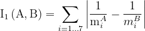
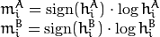
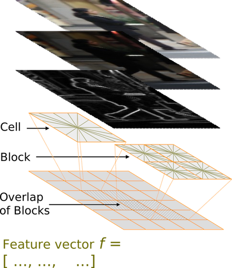
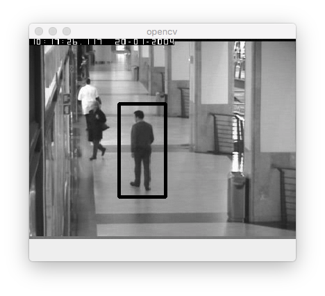
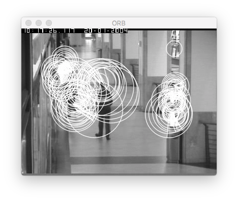
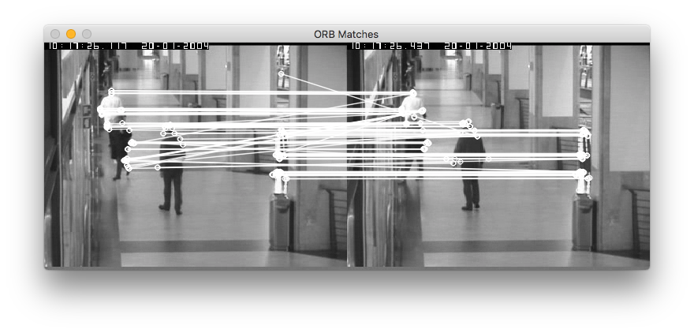

# T6- Características de imagen

En este tema aprenderemos a detectar y extraer características útiles que describen una imagen.

## Descriptores de contorno

Comenzaremos viendo las características que se usan para describir contornos. Estas características asumen que la imagen se ha binarizado previamente y tenemos el contorno de los objetos que queremos reconocer.

### Momentos

Una vez hemos extraido los contornos de una imagen, por ejemplo mediante la función `findContours`, podemos calcular sus momentos usando la función `moments`:

<!---
WM: false);
--->

```cpp
// Extraemos los momentos para cada contorno
vector<Moments> momentos(contours.size());  
for(int i = 0; i < contours.size(); i++) {
  momentos[i] = moments(contours[i], false); 
}
```

La función `moments` calcula todos los momentos del contorno. Para acceder a un momento determinado podemos indicar, por ejemplo: `momentos[i].m00`. Estos son todos los momentos que devuelve la función:

```cpp
// Momentos espaciales
double  m00, m10, m01, m20, m11, m02, m30, m21, m12, m03;
// Momentos centrales
double  mu20, mu11, mu02, mu30, mu21, mu12, mu03;
// Momentos centrales normalizados
double  nu20, nu11, nu02, nu30, nu21, nu12, nu03;
```

Como ves, no todos los momentos se calculan. Por ejemplo, como el momento mu00 es igual a m00, [OpenCV no lo extrae](https://docs.opencv.org/3.4/d8/d23/classcv_1_1Moments.html).

Si quieres conocer más detalles sobre la función `moments` puedes consultar  [este](https://docs.opencv.org/2.4/modules/imgproc/doc/structural_analysis_and_shape_descriptors.html?highlight=moments#moments) enlace.

### Momentos de Hu

Los 7 momentos de Hu se calculan con la función `HuMoments` a partir de los momentos centrales normalizados extraídos previamente con `moments`. Por ejemplo:

```cpp
Moments momentos = moments(contours[0]);
double hu[7];
HuMoments(momentos, hu); // El array hu contiene los 7 momentos.
```

La función [matchShapes](https://docs.opencv.org/2.4/modules/imgproc/doc/structural_analysis_and_shape_descriptors.html#double%20matchShapes(InputArray%20contour1,%20InputArray%20contour2,%20int%20method,%20double%20parameter)) de OpenCV usa internamente estos momentos de Hu para comparar contornos, como veremos más adelante.

### Cadenas Freeman

En OpenCV2 se usaba la función `approxChains` para extraer códigos de cadena, pero en OpenCV3 se ha eliminado esta funcionalidad por falta de demanda.

### Descriptor Shape Context (SC)

Para extraer y comparar contornos con `Shape Context` podemos usar el siguiente código:

```cpp
// Creamos una instancia de este descriptor
Ptr <ShapeContextDistanceExtractor> mysc = createShapeContextDistanceExtractor();

// Lo aplicamos a los vectores de puntos de dos imágenes para obtener su distancia.
float dis = mysc->computeDistance(pointsQuery, pointsRef);
```

En este ejemplo `pointsQuery` y `pointsRef` son vectores de puntos aleatorios del contorno de cada una de las imágenes que queremos comparar.

-----

## Ejercicio

En este ejercicio extraeremos una serie de descriptores de contorno a partir de imágenes binarizadas. El objetivo es encontrar las imágenes más similares a una imagen de referencia (a la que llamaremos `query`).

Se pide completar el siguiente código implementando los comentarios marcados con `TODO`. Crea el programa con el nombre `contourDescriptors.cpp`.

<!---
WM: Descriptors { (BS)
    return points; (BS)
    convexHull) (added 2 BS)
    "aleatorios" -> "al azar"
    - SC (BS)
    caja de Feret (BS)
    imageIndex = i+1;  (Removed BS)
    << ".png"; (added BS at the end in the two samples)
    - Rectangularidad: MRE no Feret
--->

```cpp
#include <opencv2/opencv.hpp>
#include <iostream>

using namespace std;
using namespace cv;

struct Descriptors { 
     vector<Point> SC;
     float perimetro, compactacion, elongacion, rectangularidad, areaCierreConvexo;
     Point centroide;
     float orientacion;
     double Hu[7];
};

// Funcion que recibe los contornos de una imagen y extrae de ellos n puntos al azar para calcular SC
vector<Point> SCPoints(const vector<vector<Point> > &contours, int n=300)
{
    // Cada contorno dentro de contours es un vector de puntos. Sacamos todos los puntos del contorno y los guardamos en allPointsFromImage
    vector<Point> allPointsFromImage;
    for (unsigned j=0; j<contours.size(); j++)
        for (int k=0; k< contours[j].size(); k++)
            allPointsFromImage.push_back(contours[j][k]);

    // "Barajamos" los puntos aleatoriamente, y nos quedamos como maximo con n=300 para usarlos con SC
    random_shuffle(allPointsFromImage.begin(), allPointsFromImage.end());
    vector<Point> points;
    for (int i=0; i<n && i<allPointsFromImage.size(); i++)
        points.push_back(allPointsFromImage[i]);

    return points; 
}

Descriptors extractDescriptors(const Mat &image) {
   Descriptors imgDescriptors;

   // Calculamos todos los contornos de la imagen
   vector<vector<Point> > contours;
   findContours(image, contours, RETR_LIST, CHAIN_APPROX_NONE);

   // Extraemos puntos aleatorios de estos contornos para SC y los guardamos en el descriptor
   imgDescriptors.SC = SCPoints(contours);

   // TODO: Extraemos el mayor contorno de la imagen (para esto puedes usar la función contourArea), y de este contorno calculamos y guardamos en el descriptor:
    // - Perimetro
    // - Compactacion
    // - Elongacion (usando caja de Feret) 
    // - Rectangularidad (usando Menor Rectángulo Envolvente, MRE)
    // - Area del cierre convexo (pista: funcion convexHull)  
    // - Centroide (X,Y) y orientacion (usando los momentos)
    // - Momentos de Hu

   return imgDescriptors;
}

void calcularDistancias(const Descriptors &queryDescriptors, const Descriptors &imgDescriptors) {

   float dSC, dPer, dComp, dElong, dRect, dCierre, dCent, dOr, dHu;
   dSC = dPer = dComp = dElong = dRect = dCierre = dCent = dOr = dHu=0;

   // TODO: Calcular y devolver la distancia de:
   // - SC 
   // - Perimetro
   // - Compactacion
   // - Elongacion
   // - Rectangularidad
   // - Area del cierre convexo
   // - Orientacion
   // - Centroide (distancia Euclidea entre los dos puntos con coordenadas u,v)
   // - Hu (formula explicada en los siguientes parrafos del libro)

   cout << " dSC = " << dSC << endl;   
   cout << " dPer = " << dPer << endl;
   cout << " dComp = " << dComp << endl;
   cout << " dElong = " << dElong << endl;
   cout << " dRect = " << dRect << endl;
   cout << " dCierre = " << dCierre << endl;
   cout << " dCent = " << dCent << endl;
   cout << " dOr = " << dOr << endl;
   cout << " dHu = " << dHu << endl;
}

int main(int argc, char* argv[])
{
    // Procesamos parámetros de entrada
    string path = "shape_sample/";

    int indexQuery = 5;
    if (argc==2)
        indexQuery = atoi(argv[1]);

    // Leemos imagen query
    stringstream queryName;
    queryName << path << indexQuery << ".png"; 
    Mat query=imread(queryName.str(), IMREAD_GRAYSCALE);

    // Calculamos sus descriptores
    Descriptors queryDescriptors = extractDescriptors(query);

    // Para las otras imágenes, calculamos sus descriptores y los comparamos con los de la query
    for (int i=0; i<20; i++) {
        int imageIndex = i+1;

        if (imageIndex==indexQuery) continue;  // Ignoramos esta imagen si es la misma que la de referencia

        // Leemos la imagen
        stringstream img;
        img << path << imageIndex << ".png"; 
        Mat image=imread(img.str(), IMREAD_GRAYSCALE);

        // Extraemos sus descriptores y los comparamos con los de la query
        cout << "-----------" << endl;
        cout << "Imagen " << imageIndex << ":" << endl;
        Descriptors imgDescriptors = extractDescriptors(image);
        calcularDistancias(queryDescriptors,imgDescriptors);
    }

    return 0;
}
```

Para este ejercicio necesitarás descargarte [estas imágenes](images/caracteristicas/shape_sample.zip), que debes descomprimir en un directorio llamado `shape_sample`.

La salida del programa debe ser como la siguiente (si no indicamos ningún parámetro, por defecto se usa la imagen número 5):

```bash
-----------
Imagen 1:
 dSC = 3.80077
 dPer = 182.51
 dComp = 0.00770215
 dElong = 0.291582
 dRect = 0.306735
 dCierre = 8402
 dCent = 16.0312
 dOr = 0.0885252
 dHu = 1.45363
-----------
Imagen 2:
 dSC = 12.0485
 dPer = 46.1005
 dComp = 0.0200697
 dElong = 0.164082
 dRect = 0.301422
 dCierre = 4529
 dCent = 40.4969
 dOr = 0.300745
 dHu = 1.36698
-----------
Imagen 3:
 dSC = 9721.32
 dPer = 1556.14
 dComp = 0.0214209
 dElong = 0.18013
 dRect = 0.0153487
 dCierre = 110849
 dCent = 258.258
 dOr = 0.224014
 dHu = 0.228529
-----------
Imagen 4:
 dSC = 16396.2
 dPer = 1531.7
 dComp = 0.0176636
 dElong = 0.463282
 dRect = 0.0691208
 dCierre = 107572
 dCent = 334.63
 dOr = 0.349207
 dHu = 1.65752
-----------
Imagen 6:
 dSC = 0.267693
 dPer = 114.953
 dComp = 0.00107794
 dElong = 0.0877844
 dRect = 0.00407889
 dCierre = 5869.5
 dCent = 37.1214
 dOr = 0.113083
 dHu = 0.184812
-----------
....
```

> Si tienes OpenCV para Mac, hay un bug en el comparador de SC que hará que salgan valores muy altos para la variable `dSC`. Si esto ocurre, prueba tu programa en Linux antes de la entrega.

Para extraer los descriptores puedes usar algunas de [estas funciones]( https://docs.opencv.org/2.4/modules/imgproc/doc/structural_analysis_and_shape_descriptors.html) de OpenCV.

Para calcular la arcotangente (en la orientación), usa la función _atan2_ en lugar de _atan_.

Cuando vayamos a calcular la distancia entre dos números `float`, debemos usar el valor absoluto de su diferencia. En el caso del centroide (que es un punto con sus coordenadas _u,v_), deberemos calcular la **distancia Euclídea** entre los dos puntos.

Para calcular las distancias de los descriptores Hu debes usar las siguientes ecuaciones:



donde `A` y `B` son las dos imágenes a comparar, y `m` se define como:



En este caso, `sign` es el signo (-1 si es negativo, 1 si es positivo, 0 si es 0), y `h` son los momentos Hu número `i`. Sólo debe sumarse un momento `i` si sus componentes son mayores que un umbral 1.e-5. Es decir, si el valor absoluto del descriptor Hu número `i` es mayor de 1.e-5 en ambas imágenes (con que en una sea menor, no se considera).

Este es el cálculo que hace internamente el método `matchShapes` de OpenCV (algoritmo `CV_CONTOURS_MATCH_I1`) para comparar contornos, pero en este ejercicio tienes que implementarlo a mano.

Revisa los resultados probando con distintas imágenes, cuando menor sea la distancia más se parecerán. Evidentemente habrá algunos descriptores que funcionarán mucho mejor que otros.

-----

## Textura

Los filtros de Gabor se implementan en OpenCV creando un kernel mediante la función `getGaborKernel`, y después convolucionándolo con `filter2D` como ocurre con cualquier otro filtro.

```cpp
double sigma = 1, theta = 0, lambda = 1.0, gm = 0.02, ps = 0;
Mat kernel = getGaborKernel(Size(ksize,ksize), sigma, theta, lambda, gm, ps);
filter2D(src_f, dest, CV_32F, kernel);
```

Como puedes ver, un filtro de Gabor se puede construir con muchos parámetros, pero los principales son estos:

* `ksize`: Tamaño del filtro
* `sigma`: Desviación típica de la envolvente gaussiana
* `theta`: Orientación de las bandas paralelas de la función Gabor
* `lambda`: Longitud de onda de la señal sinusoidal

## HOG

En OpenCV podemos extraer el descriptor HOG mediante `HOGDescriptor`:

```cpp
HOGDescriptor hog(Size(32,16), Size(8,8), Size(4,4), Size(4,4), 9);
```

La ayuda de OpenCV es bastante incompleta para este descriptor. Por simplificar, los parámetros principales del constructor (aunque hay más) son estos:

* `winSize`: Tamaño de la ventana
* `Size`: Tamaño del bloque
* `blockStride`: Desplazamiento del bloque
* `cellSize`: Tamaño de la celda

También podemos crear un descriptor HOG con los valores que vienen por defecto:

```cpp
HogDescriptor hog;
// Equivalente a: HOGDescriptor hog(Size(64,128), Size(16,16), Size(8,8), Size(8,8), 9);
```



Es necesario saber que, a diferencia del algoritmo que hemos visto en teoría, en la implementación de OpenCV hay una ventana que va moviéndose por toda la imagen para calcular los descriptores HOG. Como podemos ver, el tamaño de la ventana por defecto es de 64x128 píxeles, lo cual significa que los objetos a detectar deben tener al menos ese tamaño. Si trabajamos con resoluciones menores, deberemos cambiarlo.

La longitud por defecto del vector HOG (que podemos ver usando el método `hog.getDescriptorSize`) es de 3.780 elementos por cada descriptor. El método  `features.size` devuelve el tamaño del descriptor HOG para toda la imagen (el descriptor global).

Una vez creado el descriptor podemos aplicarlo a una imagen:

```cpp
vector<float> descriptorsValues;
vector<Point> locations;
d.compute(img_gray, descriptorsValues, Size(0,0), Size(0,0), locations);
```

La función `compute` devuelve en `locations` los puntos donde se han encontrado las   personas, y en `descriptorsValues` los valores del descriptor para cada punto. Para calcular esto se usa un sistema de detección de peatones, que veremos en el tema 7.

Si en lugar de extraer el descriptor queremos directamente hacer la detección de personas en una imagen (que es lo normal), se puede usar directamente este código:

<!---
WM: peatones -> personas
--->


```cpp
// La siguiente instrucción inicializa un detector de personas.
// No hemos visto este detector en teoría porque está basado en aprendizaje automático (algo que veremos más adelante), pero sí que hemos visto el descriptor.
hog.setSVMDetector(HOGDescriptor::getDefaultPeopleDetector());

// Aplicamos el detector sobre la imagen
hog.detectMultiScale(img, found, 0, Size(8,8), Size(32,32), 1.05, 2);
```

Desafortunadamente no hay ninguna forma sencilla de visualizar el descriptor HOG en OpenCV con sus gradientes, pero si tienes curiosidad puedes consultar [este otro enlace](http://www.juergenwiki.de/old_wiki/doku.php?id=public:hog_descriptor_computation_and_visualization).

### Ejercicio

Descarga el [siguiente fichero](images/caracteristicas/USCPedestrianSetB.zip) que contiene imágenes de peatones y sus correspondientes _bounding boxes_ en XML. Las  imágenes originales están descargadas de [esta]( http://iris.usc.edu/Vision-Users/OldUsers/bowu/DatasetWebpage/dataset.html) web.

Implementa un programa llamado `hog.cpp` que reciba una imagen por parámetro. El programa debe mostrar por pantalla una imagen que contiene los `bounding boxes` (en negro) de los peatones detectados, e imprimir también por pantalla el resultado de la detección con el formato de los XML del siguiente ejemplo.

Dada esta llamada:

```bash
$./hog USCPedestrianSetB/OSE1cor_1.bmp salida.jpg
```

El programa debería imprimir por pantalla algo parecido a esto:

```bash
<?xml version="1.0"?>
<ObjectList>
	<Object>
		<Rect x="129" y="93" width="67" height="134"/>
	</Object>
</ObjectList>
```

Finalmente, también debe guardarse la imagen resultante en el fichero con el nombre recibido como segundo parámetro:



Para realizar este ejercicio puedes usar como base [este código](http://www.magicandlove.com/blog/2011/12/04/people-detection-sample-from-opencv/), que implementa un ejemplo completo de detección HOG sobre vídeo (tendrás que adaptarlo para que lea una sola imagen).

<!---
Cuando hayas terminado, puedes intentar mejorar la precisión de los resultados para que tu programa funcione mejor con esta base de datos.
--->

----

## Características locales

Las características locales son fáciles de obtener en OpenCV, ya que esta librería implementa todo lo necesario para detectar _keypoints_ y extraer sus correspondientes descriptores.

### Detector

Ejemplo de detección usando MSER:

```cpp
#include <iostream>
#include <opencv2/opencv.hpp>

using namespace std;
using namespace cv;

int main(int argc, char* argv[])
{
  if( argc != 2 ) {
    cout << " Syntax: ." << argv[0] << " <image>" << endl;
    return -1;
  }

  Mat img = imread(argv[1], IMREAD_GRAYSCALE);

  if (!img.data){
    cout << "Error leyendo imagen " << argv[1] << endl;
    return -1;
  }

  // Detectamos los keypoints usando MSER. Los guardamos en el vector keypoints
  Ptr<FeatureDetector> detector = MSER::create();
  vector<KeyPoint> keypoints;
  detector->detect(img, keypoints);

  // Dibujamos los keypoints en la imagen
  Mat img_keypoints;

  drawKeypoints(img, keypoints, img_keypoints, Scalar::all(-1), DrawMatchesFlags::DEFAULT);

  // Mostramos la imagen con los keypoints
  imshow("Keypoints", img_keypoints);

  waitKey(0);

  return 0;
}
```

### Descriptor

Veamos otro ejemplo, esta vez usando ORB como detector y también como descriptor. En este código, además comparamos los descriptores binarios usando una distancia Hamming. Las correspondencias que devuelve _match_ en la variable _matches_ son las parejas de puntos más similares entre la primera y la segunda imagen.

```cpp
#include <iostream>
#include <vector>
#include <opencv2/opencv.hpp>

using namespace cv;
using namespace std;

int main(int argc, char *argv[])
{
    if (argc!=3) {
     cout << "Syntax: " << argv[0] << " <image1> <image2>" << endl;
     exit(-1);
    }

   // Leemos las imagenes
   Mat image1 = imread(argv[1], IMREAD_GRAYSCALE);
   Mat image2 = imread(argv[2], IMREAD_GRAYSCALE);

   // Creamos el detector ORB con 100 puntos como maximo
   Ptr<FeatureDetector> detector = ORB::create(100);

   // Usamos ORB para detectar los keypoints
   vector<KeyPoint> keypoints1, keypoints2;
   detector->detect(image1,keypoints1);
   detector->detect(image2,keypoints2);

   // Dibujamos los keypoints de la imagen1
   Mat featImage;
   drawKeypoints(image1, keypoints1, featImage, Scalar(255,255,255), DrawMatchesFlags::DRAW_RICH_KEYPOINTS);
   namedWindow("ORB");
   imshow("ORB",featImage);

   // Ademas del detector, ORB incluye el descriptor, que aplicamos a continuacion
   Ptr<DescriptorExtractor> descriptor = detector;
   Mat descriptors1, descriptors2;
   descriptor->compute(image1, keypoints1, descriptors1);
   descriptor->compute(image2, keypoints2, descriptors2);

   // En este punto hacemos matching (mirar los keypoints coincidentes en ambas imagenes). Creamos el matcher.
   BFMatcher matcher(NORM_HAMMING); // Al ser un descriptor binario, debemos usar la distancia de Hamming

   // Lo aplicamos a los descriptores para obtener el vector matches.
   vector<DMatch> matches;
   matcher.match(descriptors1, descriptors2, matches);

   // Dibujamos los matches
   Mat imageMatches;
   drawMatches(image1, keypoints1, image2, keypoints2, matches,
              imageMatches,  // Imagen donde guardamos el resultado
              Scalar(255,255,255),  // color de las lineas
              Scalar(255,255,255)); // color de los puntos

   // Mostramos el resultado
   namedWindow("ORB Matches");
   imshow("ORB Matches", imageMatches);
   cout << "Numero de matches: " << matches.size() << endl;

   waitKey();
   return 0;
}
```

Resultado de ejecución:

```bash
./binary USCPedestrianSetB/OSE1cor_1.bmp USCPedestrianSetB/OSE1cor_2.bmp
```





Como puedes ver, usamos `Ptr<FeatureDetector>` para crear un detector, y a continuación la función `detect` para realizar la detección. Análogamente, podemos usar `Ptr<DescriptorExtractor>` para crear un descriptor, seguido de una llamada a `compute` para calcularlo.

Puedes consultar en la [ayuda](https://docs.opencv.org/3.0-beta/modules/features2d/doc/feature_detection_and_description.html) todos los detectores y descriptores que implementa OpenCV.

Además de estos, podemos usar otros detectores o descriptores externos como SURF. Tanto SIFT como SURF están patentados, por lo que para usarlos necesitamos importar el módulo `opencv_contrib/xfeatures2d` y aceptar su licencia.


-----

## Descriptores neuronales

Como hemos visto en teoría, también podemos usar una red neuronal convolucional (CNN) para extraer una representación vectorial de una imagen.

Para ver cómo funciona una red neuronal de la librería Caffe (una de las muchas librerías de redes) en OpenCV se puede consultar [este código de ejemplo](https://github.com/latelee/opencv/tree/master/dnn_caffe_googlenet). 


Para poder usarlo, también necesitamos descargar los [pesos de la red neuronal](http://dl.caffe.berkeleyvision.org/bvlc_googlenet.caffemodel).

Si compilamos _caffe_googlenet.cpp_ y lo ejecutamos, se cargará una red de tipo [GoogleNet](https://ai.google/research/pubs/pub43022) ya entrenada con millones de imágenes de [ImageNet](http://www.image-net.org). Dada una nueva imagen de entrada, esta se rescala y se proporciona a la red neuronal que predice la clase de dicha imagen. 

Las clases que pueden obtenerse son sólo aquellas para las que se ha entrenado la red, que pueden consultarse en el fichero [synset_words.txt](https://github.com/latelee/opencv/blob/master/dnn_caffe_googlenet/synset_words.txt).

Sin embargo, también podemos usar la red como extractor de características. Para ello, en lugar de usar la última capa (la que realiza la clasificación), debemos quedarnos con los valores de la penúltima capa, que en este caso se llama _pool5/7x7_s1_.

Por tanto, podemos remplazar la instrucción:

```cpp
prob = net.forward("prob");
```

por:

```cpp
Mat neuralCodes = net.forward("pool5/7x7_s1");
```

Después hay que convertir la matriz _neuralCodes_ a un vector de float (por ejemplo usando la siguiente función), y ya tendremos nuestro descriptor neuronal que podemos usar como entrada a otro sistema de aprendizaje automático como  kNN o SVM.

```cpp
vector <float> matToFloatVector(Mat matToConvert)
{
    vector< float> convert;
    convert.assign((float*)matToConvert.datastart, (float*)matToConvert.dataend);

    return convert;
}
```
