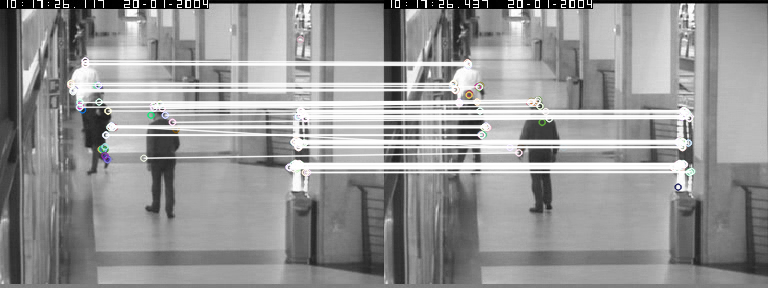

# T6- Características de imagen

En este tema aprenderemos a detectar y extraer características útiles que describen una imagen.

## Descriptores de contorno

Comenzaremos viendo las características que se usan para describir contornos. Estas características asumen que la imagen se ha binarizado previamente y tenemos el contorno de los objetos que queremos reconocer.

### Momentos

Una vez hemos extraido los contornos de una imagen, por ejemplo mediante la función `findContours` cuya sintaxis vimos en el tema anterior, podemos calcular el momento de un contorno usando la función `moments`:

```python
momentos = cv.moments(contour)
```

Esta función calcula todos los momentos del contorno. Para acceder a un momento determinado podemos indicar, por ejemplo: `momentos['m00']`. Estos son todos los momentos que devuelve la función:

```python
# Momentos espaciales
m00, m10, m01, m20, m11, m02, m30, m21, m12, m03
# Momentos centrales
mu20, mu11, mu02, mu30, mu21, mu12, mu03
# Momentos centrales normalizados
nu20, nu11, nu02, nu30, nu21, nu12, nu03
```

Como ves, no todos los momentos se calculan. Por ejemplo, como el momento mu00 es igual a m00, [OpenCV no lo extrae](https://docs.opencv.org/3.4/d8/d23/classcv_1_1Moments.html).

Si quieres conocer más detalles sobre la función `moments` puedes consultar [este](https://docs.opencv.org/2.4/modules/imgproc/doc/structural_analysis_and_shape_descriptors.html?highlight=moments#moments) enlace.

### Momentos de Hu

Los 7 momentos de Hu se calculan con la función `HuMoments` a partir de los momentos centrales normalizados extraídos previamente con `moments`. Por ejemplo:

```python
hu = cv.HuMoments(momentos)  # El array hu contiene los 7 momentos de Hu
```

La función [matchShapes](https://docs.opencv.org/2.4/modules/imgproc/doc/structural_analysis_and_shape_descriptors.html#double%20matchShapes(InputArray%20contour1,%20InputArray%20contour2,%20int%20method,%20double%20parameter)) de OpenCV usa internamente estos momentos de Hu para comparar contornos, como veremos más adelante.

### Cadenas Freeman

En las primeras versiones de OpenCV se usaba la función `approxChains` para extraer códigos de cadena, pero a partir de la versión 3 OpenCV ha eliminado esta funcionalidad por falta de demanda.

### Descriptor Shape Context (SC)

Para extraer y comparar contornos con `Shape Context` podemos usar el siguiente código:

```python
# Creamos una instancia de este descriptor
mySC = cv.createShapeContextDistanceExtractor()

# Lo aplicamos a dos contornos para obtener su distancia.
distance = mySC.computeDistance(contour1, contour2) 
```

-----

### Ejercicio

En este ejercicio extraeremos una serie de descriptores de contorno a partir de imágenes binarizadas. El objetivo es encontrar las imágenes más similares a una imagen de referencia (a la que llamaremos `query`).

Se pide completar el siguiente código implementando los comentarios marcados con `TODO`. Crea el programa con el nombre `contourDescriptors.py`. Si miras el `main`, se recibe el número de una imagen (hay 20 en la carpeta) y ésta se usa como `query`. Se extraen los descriptores de la imagen y a continuación se comparan con todos los descriptores obtenidos para el resto de imágenes, obteniendo una distancia (un valor de similitud) por cada descriptor implementado.

```python
import cv2 as cv
import argparse
import numpy as np
import math

def extractDescriptors(image):
    # Creamos un diccionario donde guardaremos los valores calculados
    imgDescriptors = {}

    # Calculamos todos los contornos de la imagen  
    contours, hierarchy = cv.findContours(image, cv.RETR_LIST, cv.CHAIN_APPROX_SIMPLE)

    # Extraemos el mayor contorno de la imagen, del que obtendremos todos los descriptores:
    contour = max(contours, key=cv.contourArea)

    # TODO: Guardamos el mayor contorno para el descriptor SC
    imgDescriptors['contour'] = None

    # TODO: Calculamos el perimetro
    imgDescriptors['perimetro'] = None

    # TODO: Calculamos la compactacion
    imgDescriptors['compactacion'] = None

    # TODO: Calculamos la elongacion
    imgDescriptors['elongacion'] = None

    # TODO: Calculamos la tectangularidad
    imgDescriptors['rectangularidad'] = None

    # TODO: calculamos el área del cierre convexo (pista: funcion convexHull)
    imgDescriptors['areaCierreConvexo'] = None

    # TODO: Calculamos el centroide (X,Y) y orientacion usando los momentos
    imgDescriptors['centroide'] = None
    imgDescriptors['orientacion'] = None

    # TODO: Calculamos los Momentos de Hu
    imgDescriptors['Hu'] = None

    return imgDescriptors


def calcularDistancias(queryDescriptors, imgDescriptors):
    # Calcular y devolver la distancia entre queryDescriptors e imgDescriptors para las siguientes características:

    # TODO: Shape Context
    dSC = 0

    # TODO: Perímetro
    dPer = 0

    # TODO: Compactación
    dComp = 0

    # TODO: Elongación
    dElong = 0

    # TODO: Rectangularidad
    dRect = 0

    # TODO: Área del cierre convexo
    dCierre = 0

    # TODO: Distancia euclídea del centroide
    dCent = 0
    
    # TODO: Orientacion
    dOr = 0

    # TODO: Momentos de Hu (ver fórmula que se describe debajo)
    dHu = 0

    print(' dSC = %.3f' % dSC)
    print(' dPer = %.3f' % dPer)
    print(' dComp = %.3f' % dComp)
    print(' dElong = %.3f' % dElong)
    print(' dRect = %.3f' % dRect)
    print(' dCierre = %.3f' % dCierre)
    print(' dCent = %.3f' % dCent)
    print(' dOr = %.3f' % dOr)
    print(' dHu = %.3f' % dHu)


def main(args):
    # Procesamos parámetros de entrada
    path = 'shape_sample/'
    indexQuery = args.indexQuery

    # Leemos imagen query
    queryName = path + str(indexQuery) + '.png'
    query = cv.imread(queryName, cv.IMREAD_GRAYSCALE)

    # Comprobamos que la imagen se ha podido leer
    if query is None:
        print('Error al cargar la imagen')
        quit()
    
    queryDescriptors = extractDescriptors(query)

    # Para las otras imágenes, calculamos sus descriptores y los comparamos con los de la query
    for i in range(0,20):
        imageIndex = i+1
        # Ignoramos esta imagen si es la misma que la de referencia
        if (imageIndex != indexQuery):
            # Leemos la imagen
            imageName = path + str(imageIndex) + '.png'
            image = cv.imread(imageName, cv.IMREAD_GRAYSCALE)

            # Extraemos sus características y las comparamos con las de la query
            print('----------')
            print('Imagen', imageIndex, ':')
            imgDescriptors = extractDescriptors(image)
            calcularDistancias(queryDescriptors, imgDescriptors)

    return 0


if __name__ == '__main__':
    parser = argparse.ArgumentParser(description = 'Programa para calcular y comparar características')
    parser.add_argument('--indexQuery', '-i', type=int, default=5)
    args = parser.parse_args()
    main(args)
```

En este ejercicio necesitarás descargarte [estas imágenes](images/caracteristicas/shape_sample.zip), que debes descomprimir en un directorio llamado `shape_sample`.

Para extraer los descriptores puedes usar algunas de [estas funciones]( https://docs.opencv.org/2.4/modules/imgproc/doc/structural_analysis_and_shape_descriptors.html) de OpenCV.

En el cálculo de la arcotangente (para la orientación) debes usar [la función _atan2_](https://www.w3schools.com/python/ref_math_atan2.asp) de la librería `math`.

Para calcular la distancia entre dos números reales debemos usar el valor absoluto de su diferencia. 

En el caso del centroide (que es un punto con sus coordenadas _u,v_), deberemos calcular la **distancia Euclídea** entre los dos puntos.

Para calcular las distancias de los descriptores Hu debes usar las siguientes ecuaciones:


donde `A` y `B` son las dos imágenes a comparar, y `m` se define como:


En este caso, `sign` es el signo (-1 si es negativo, 1 si es positivo, 0 si es 0), y `h` son los momentos Hu número `i`. Sólo debe sumarse un momento `i` si sus componentes son mayores que un umbral `1.e-5`. Es decir, si el valor absoluto del descriptor Hu número `i` es mayor de `1.e-5` en ambas imágenes (con que en una sea menor, no se considera). En python este logaritmo se calcula con la función `math.log10`.

Este es el cálculo que hace internamente el método `matchShapes` de OpenCV (algoritmo `cv.CONTOURS_MATCH_I1`) para comparar contornos, pero en este ejercicio tienes que implementarlo a mano.

La salida del programa debe ser como la siguiente (si no indicamos ningún parámetro, por defecto se usa la imagen número 5 como `query`):

```bash
----------
Imagen 1 :
 dSC = 2.239
 dPer = 182.510
 dComp = 0.008
 dElong = 0.292
 dRect = 0.307
 dCierre = 8402.000
 dCent = 15.544
 dOr = 0.089
 dHu = 1.454
----------
Imagen 2 :
 dSC = 16.326
 dPer = 46.101
 dComp = 0.020
 dElong = 0.164
 dRect = 0.301
 dCierre = 4529.000
 dCent = 40.890
 dOr = 0.301
 dHu = 1.367
----------
Imagen 3 :
 dSC = 1211.006
 dPer = 1556.140
 dComp = 0.021
 dElong = 0.180
 dRect = 0.015
 dCierre = 110849.000
 dCent = 259.311
 dOr = 0.224
 dHu = 0.229
----------
Imagen 4 :
 dSC = 4449.109
 dPer = 1531.697
 dComp = 0.018
 dElong = 0.463
 dRect = 0.069
 dCierre = 107572.500
 dCent = 334.972
 dOr = 0.349
 dHu = 1.658
----------
Imagen 6 :
 dSC = 0.125
 dPer = 114.953
 dComp = 0.001
 dElong = 0.088
 dRect = 0.004
 dCierre = 5869.500
 dCent = 38.045
 dOr = 0.113
 dHu = 0.185
----------
....
```

Revisa los resultados probando con distintas imágenes, cuanto menor sea la distancia más deben parecerse. Evidentemente, para comparar formas similares algunos descriptores obtendrán mejores resultados que otros. 

-----

## Textura

Los filtros de Gabor se implementan en OpenCV creando un kernel mediante la función `getGaborKernel`, que después puede convolucionarse con una imagen mediante `filter2D` como ocurre con cualquier otro filtro.

```python
ksize = 32
sigma = 1
theta = 0
lambd = 1.0
gamma = 0.02
psi = 0

kernel = cv.getGaborKernel((ksize,ksize), sigma, theta, lambd, gamma, psi)

dst = cv.filter2D(img,-1,kernel)
```

Como puedes ver, un filtro de Gabor se puede construir con muchos parámetros, pero los principales son estos:

* `ksize`: Tamaño del filtro
* `sigma`: Desviación típica de la envolvente gaussiana
* `theta`: Orientación de las bandas paralelas de la función Gabor
* `lambd`: Longitud de onda de la señal sinusoidal

## HOG

En OpenCV podemos extraer el descriptor HOG mediante `HOGDescriptor`:

```python
winSize = (32,16)
blockSize = (8,8)
blockStride = (4,4)
cellSize = (4,4)
nbins = 9

hog = cv.HOGDescriptor(winSize, blockSize, blockStride, cellSize, nbins)
```

La ayuda de OpenCV es bastante incompleta para este descriptor y es mejor usar desde el código `help(cv.HOGDescriptor)`. Por simplificar, los parámetros principales del constructor (aunque hay más) son estos:

* `winSize`: Tamaño de la ventana
* `blockSize`: Tamaño del bloque
* `blockStride`: Desplazamiento del bloque
* `cellSize`: Tamaño de la celda
* `nbins`: Número de bins usados para calcular el histograma de gradientes

También podemos crear un descriptor HOG con los valores que vienen por defecto:

```python
hog = cv.HogDescriptor()
# Equivalente a: cv.HOGDescriptor((64,128), (16,16), (8,8), (8,8), 9)
```


Es necesario saber que, a diferencia del algoritmo que hemos visto en teoría, en la implementación de OpenCV hay una ventana que va moviéndose por toda la imagen para calcular los descriptores HOG. Como hemos podido ver, el tamaño de la ventana por defecto es de 64x128 píxeles, lo cual significa que los objetos a detectar deben tener al menos ese tamaño. Si trabajamos con resoluciones menores, debemos cambiarlo.

La longitud por defecto del vector HOG (que podemos ver usando el método `hog.getDescriptorSize()`) es de 3.780 elementos por cada descriptor. 

Una vez creado el descriptor podemos aplicarlo a una imagen de esta forma:

```python
winStride = (0,0)
padding = (0,0)

descriptors = hog.compute(img, winStride, padding, locations)
```

La función `compute` guarda en `locations` los puntos donde se han encontrado las  personas en la imagen, y en `descriptors` los valores del descriptor para cada punto. Para calcular esto se usa un sistema de detección de peatones, que veremos en el tema 7.

Si en lugar de extraer el descriptor queremos directamente hacer la detección de personas en una imagen (que es lo  más normal), se puede usar directamente este código:


```python
# La siguiente instrucción inicializa un detector de personas.
# No hemos visto este detector en teoría porque está basado en aprendizaje automático (algo que veremos más adelante), pero sí que hemos visto el descriptor.
hog.setSVMDetector(cv.HOGDescriptor_getDefaultPeopleDetector())

# Aplicamos el detector sobre la imagen
hog.detectMultiScale(img)
```

Para obtener más ayuda sobre las opciones de detectMultiScale puedes consultar [este enlace](https://www.pyimagesearch.com/2015/11/16/hog-detectmultiscale-parameters-explained/). Puedes ver un ejemplo completo de detección de peatones en vídeos usando HOG [aquí](https://thedatafrog.com/en/articles/human-detection-video/).

En OpenCV desafortunadamente no hay ninguna forma sencilla de visualizar los gradientes del descriptor HOG, pero la librería `scikit-image` sí que tiene funciones muy cómodas para calcular y visualizar HOG como puede verse en [este código de ejemplo](https://scikit-image.org/docs/dev/auto_examples/features_detection/plot_hog.html) que produce este resultado:


----

## Características locales

Las características locales son fáciles de obtener en OpenCV, ya que esta librería implementa todo lo necesario para detectar _keypoints_ y extraer sus correspondientes descriptores.

### Detector

Ejemplo de detección usando MSER:

```python
import cv2 as cv
import argparse
import numpy as np

parser = argparse.ArgumentParser(description = 'Programa para detectar keypoints con MSER')
parser.add_argument('--imagen', '-i', type=str, default='lena.jpg')
args = parser.parse_args()

# Cargamos la imagen
img = cv.imread(args.imagen)

# Comprobamos que la imagen se ha podido leer
if img is None:
    print('Error al cargar la imagen')
    quit()

# Hacemos una copia en escala de grises para calcular los keypoints
gray = img.copy()
gray = cv.cvtColor(gray, cv.COLOR_BGR2GRAY)

# Creamos el detector
detector = cv.MSER_create()

# Aplicamos el detector para obtener los keypoints
keypoints = detector.detect(gray, None)

# Dibujamos los keypoints sobre la imagen. La última opción es para que los círculos salgan con su tamaño correspondiente.
output = cv.drawKeypoints(gray, keypoints, None, flags=cv.DRAW_MATCHES_FLAGS_DRAW_RICH_KEYPOINTS)

# Visualizamos el resultado
cv.imshow('Keypoints', output)
cv.waitKey(0)
```

La salida sería la siguiente:


Si remplazamos `MSER_create` por `SIFT_create` para usar una detector [SIFT](https://docs.opencv.org/master/da/df5/tutorial_py_sift_intro.html) obtendremos el siguiente resultado:


### Descriptor

Veamos otro ejemplo, esta vez usando ORB como detector y también como descriptor. En este código, además comparamos los descriptores binarios usando una distancia Hamming. Las correspondencias que devuelve `match` en la variable `matches` son las parejas de puntos más similares entre la primera y la segunda imagen.

```python
import cv2 as cv
import argparse
import numpy as np

parser = argparse.ArgumentParser(description = 'Programa para calcular descriptores MSER y compararlos')
parser.add_argument('--queryImage', '-q', type=str, default='OSE1cor_1.png')
parser.add_argument('--trainImage', '-t', type=str, default='OSE1cor_2.png')

args = parser.parse_args()

# Cargamos las imágenes en escala de grises
image1 = cv.imread(args.queryImage, cv.IMREAD_GRAYSCALE)
image2 = cv.imread(args.trainImage, cv.IMREAD_GRAYSCALE)

# Comprobamos que se han podido leer
if image1 is None or image2 is None:
    print('Error al cargar la imagen')
    quit()

# Creamos el detector ORB con 100 puntos como máximo
orb = cv.ORB_create(100)

# Usamos ORB para detectar los keypoints y calcular sus descriptores
keypoints1, descriptors1 = orb.detectAndCompute(image1, None)
keypoints2, descriptors2 = orb.detectAndCompute(image2, None)

# Creamos el matcher y lo aplicamos
bf = cv.BFMatcher(cv.NORM_HAMMING, crossCheck=True)
matches = bf.match(descriptors1, descriptors2)
print('Número de matches encontrados:', len(matches))

# Dibujamos el resultado
imageMatches = cv.drawMatches(image1, keypoints1, image2, keypoints2, matches, (255,255,255), (255,255,255))
cv.imshow('ORB Matches', imageMatches)

cv.waitKey(0)
```

Usando como entrada estas dos imágenes:


El resultado de la ejecución sería el siguiente:



En este caso hemos utilizado el método `detectAndCompute`, pero también pueden usarse por separado `detect` y `compute`.

Al igual que en el ejemplo anterior, podemos remplazar ORB por SIFT para obtener las correspondencias con ese descriptor. En general, tenemos muchas combinaciones en OpenCV para usar detectores y descriptores, como puede consultarse en el siguiente [listado](https://docs.opencv.org/master/d5/d51/group__features2d__main.html).

SIFT está patentado pero sus derechos han expirado en 2020 y por tanto ahora puede usarse sin problema en OpenCV. Sin embargo, [SURF](https://docs.opencv.org/master/df/dd2/tutorial_py_surf_intro.html) sigue con derechos de patente vigentes y desde OpenCV4.2 se dejó fuera de la librería ya que su filosofía es que todo lo que contenga sea de código abierto. 

En [este enlace](https://github.com/methylDragon/opencv-python-reference/blob/master/02%20OpenCV%20Feature%20Detection%20and%20Description.md) puedes consultar muchos ejemplos de código que usan detectores y descriptores de OpenCV.

-----


## Descriptores neuronales

Como hemos visto en teoría, también podemos usar una red neuronal convolucional (CNN) para extraer una representación vectorial de una imagen.

Vamos a usar una red neuronal estándar de la librería `Caffe` (una de las librerías que existen dedicadas a las redes neuronales profundas) en OpenCV para extraer descriptores neuronales:

```python
import cv2 as cv
import argparse
import numpy as np

parser = argparse.ArgumentParser(description = 'Programa para extraer descriptores neuronales')
parser.add_argument('--imagen', '-i', type=str, default='space_shuttle.jpg')

args = parser.parse_args()

# Cargamos las imágenes en escala de grises
image = cv.imread(args.imagen)

# Comprobamos que la imagen se ha podido leer
if image is None:
    print('Error al cargar la imagen')
    quit()

# Cargamos una red de Caffe.
protoFile = 'bvlc_googlenet.prototxt'
weightsFile = 'bvlc_googlenet.caffemodel'
net = cv.dnn.readNetFromCaffe(protoFile, weightsFile)

# Preparamos la imagen para la entrada de la red, que recibe un blob de un tamaño fijo (en este caso, 224x224)
inWidth = 224
inHeight = 224
inputBlob = cv.dnn.blobFromImage(image, 1.0 / 255, (inWidth, inHeight), (0, 0, 0), swapRB=False, crop=False)

# Pasamos la imagen a la red
net.setInput(inputBlob)

# Hacemos una pasada forward hasta la capa de la cual queremos obtener los descriptores neuronales
out = net.forward('pool5/7x7_s1')

# Convertimos la salida en un array unidimensional
nc = out.flatten()

# Lo imprimimos en una lista (para ver todos sus elementos)
print(nc.tolist())
```

Para poder usar este código necesitaremos descargar los [pesos de la red neuronal](http://dl.caffe.berkeleyvision.org/bvlc_googlenet.caffemodel) y la [definición de su arquitectura](https://raw.githubusercontent.com/opencv/opencv_extra/master/testdata/dnn/bvlc_googlenet.prototxt).

Si ejecutamos este código se cargará una red de tipo [GoogleNet](https://ai.google/research/pubs/pub43022) ya entrenada con millones de imágenes de [ImageNet](http://www.image-net.org). Dada una nueva imagen de entrada, esta se rescala y se proporciona a la red neuronal. Escogemos como descriptor los valores de la penúltima capa que en este caso se llama `pool5/7x7_s1`.

Con este programa ya tendremos nuestro descriptor neuronal que podemos usar como entrada a otro sistema de aprendizaje automático como kNN o SVM.
