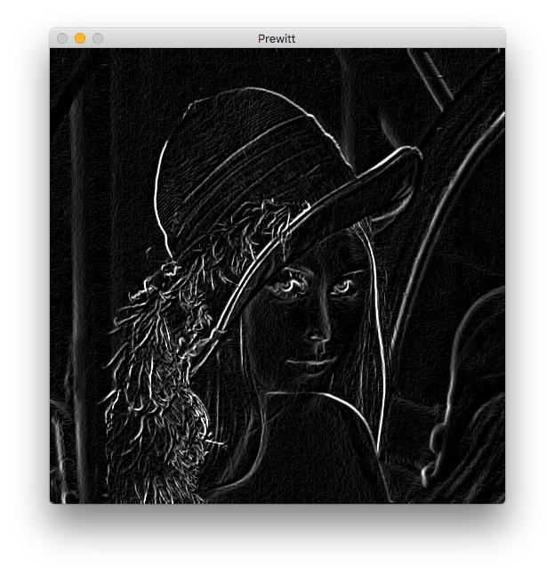
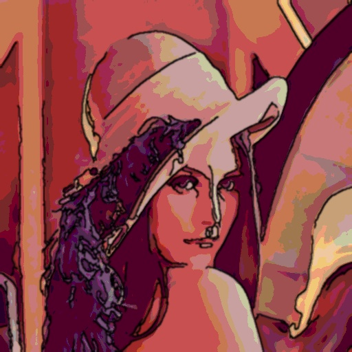
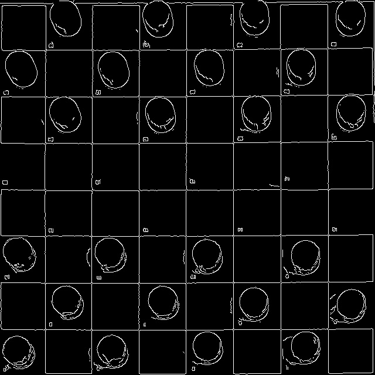
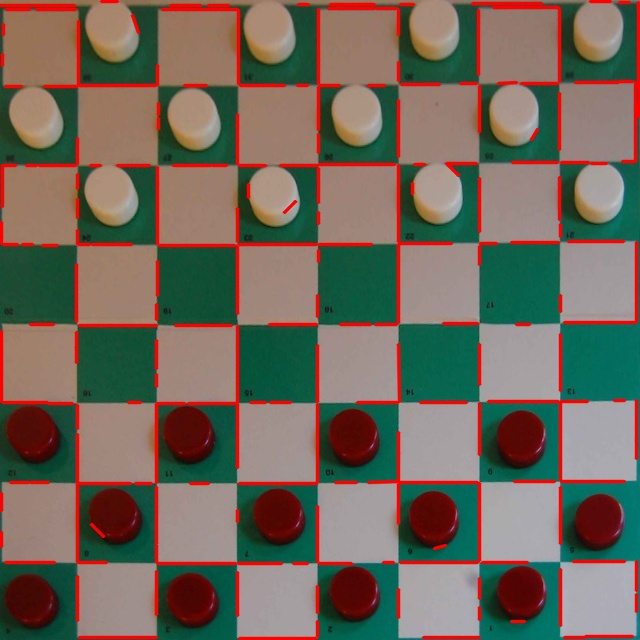
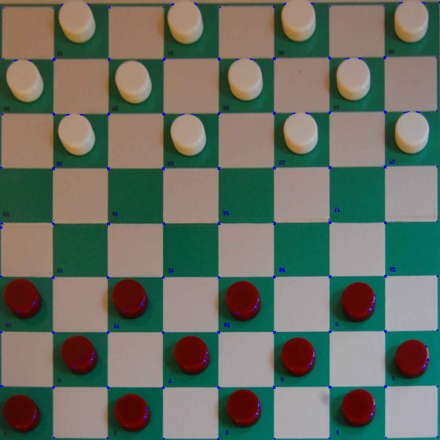

# Tema 4 - Procesamiento de imagen: Filtrado y detección de bordes, líneas, puntos aislados y esquinas

En este tema aprenderemos a detectar zonas de interés en imágenes.

## Detección de bordes

<!---
Alternativa: Que lo implementen ellos. OJO: También se puede implementar con Sobel!!
-->

OpenCV tiene una función que implementa directamente el gradiente de **Sobel** en ambas direcciones usando un kernel de tamaño 3x3 (este es el valor por defecto si no se indica _ksize_): 

```python
# Gradiente X
sobelx = cv.Sobel(img, cv.CV_64F, 1, 0, ksize=3)

# Gradiente y
sobely = cv.Sobel(img, cv.CV_64F, 0, 1, ksize=3)
```

<!----ANTIGUO: Ejemplo de [uso](http://docs.opencv.org/2.4/doc/tutorials/imgproc/imgtrans/sobel_derivatives/sobel_derivatives.html):
--->

### Ejemplo de uso:

<!--- adaptado desde [este enlace](https://docs.opencv.org/3.4/d2/d2c/tutorial_sobel_derivatives.html): --->

```python
import cv2 as cv
import numpy as np

img = cv.imread('lena.jpg', cv.IMREAD_GRAYSCALE);

# Comprobamos que la imagen se ha podido leer
if img is None:
    print('Error al cargar la imagen')
    quit()

# Calculamos gradiente horizontal y vertical
dx = cv.Sobel(img, cv.CV_64F, 1, 0)
dy = cv.Sobel(img, cv.CV_64F, 0, 1)

# Calculamos la magnitud
magn = cv.magnitude(dx, dy)

# Convertimos de float a uint para poder mostrar el resultado
dst = np.uint8(magn)

# Mostramos el resultado
cv.imshow('Sobel', dst)
cv.waitKey(0)
```

Para convolucionar una imagen con un filtro hay que usar el método `filter2D`. Ejemplo:

```python
filtered = cv.filter2D(img, -1, kernel)
```

Donde kernel es la matriz que convolucionaremos con la imagen `img`. Hemos visto la sintaxis completa de este método en el tema de [transformaciones](https://pertusa.github.io/VisionPorComputador/transformaciones.html#transformaciones-en-entorno-de-vecindad), aunque puedes consultar un ejemplo completo de uso en este otro [enlace](https://docs.opencv.org/master/d4/d13/tutorial_py_filtering.html).

Se puede usar OpenCV para extraer los gradientes en ambas direcciones de una imagen en escala de grises usando convoluciones mediante las fórmulas vistas en teoría, y esto es lo que haremos en el siguiente ejercicio.

### Ejercicio

Podemos usar distintos kernels para implementar gradientes mediante convolución. Crea un programa llamado `prewitt.py` a partir del siguiente código, realizando las convoluciones correspondientes de los filtros Prewitt en horizontal y vertical y completando las partes indicadas con **TODO**:

<!---
**OPCION: QUE HAGAN EL PROGRAMA COMPLETO!!!? TIENEN INFO DE CONVERSION DE TIPOS EN EL TEMA ANTERIOR***
--->

<!--
# 2023/24
WM: obtener
description='Programa
# Comprobamos que la imagen se ha podido leer -> # Comprobamos que la imagen se ha podido cargar
# Normalizamos. Este paso es necesario para convertir de float a uint sin tener valores fuera de rango -> # Normalizamos para poder convertir de float a uint sin tener valores fuera de rango

# 2024/25
WM: default = 'lena.jpg' (antes, "default='lena.jpg'")
WM: default = 'prewitt.jpg' (antes, "default='prewitt.jpg'")
WM: # Comprobamos que la imagen se ha importado correctamente (antes, "# Comprobamos que la imagen se ha podido cargar")
WM: # TODO: Obtenemos gradiente horizontal mediante convolución (antes, "# TODO: Calculamos gradiente horizontal mediante convolución")
WM: # TODO: Obtenemos gradiente vertical mediante convolución (antes, "# TODO: Calculamos gradiente vertical mediante convolución")
WM: # TODO: Obtenemos la magnitud y la guardamos en magn (antes, "# TODO: Calculamos la magnitud y la guardamos en la variable magn")
WM: Normalizamos para posteriormente poder (antes, "Normalizamos para poder)
WM: # TODO: Convertimos de float a uint para visualizar (antes, "# TODO: Convertimos de float a uint para poder visualizar")
WM: como parámetro de salida (antes, "como parámetro de salida.")
-->

```python
import cv2 as cv
import numpy as np
import argparse

parser = argparse.ArgumentParser(description='Programa para obtener el filtro de Prewitt.')
parser.add_argument('--imagen', '-i', type=str, default = 'lena.jpg')
parser.add_argument('--salida', '-s', type=str, default = 'prewitt.jpg')
args = parser.parse_args()

# Cargamos la imagen
img = cv.imread(args.imagen, cv.IMREAD_GRAYSCALE)

# Comprobamos que la imagen se ha importado correctamente
if img is None:
    print('Error al cargar la imagen ')
    quit()

# TODO: Obtenemos gradiente horizontal mediante convolución

# TODO: Obtenemos gradiente vertical mediante convolución

# TODO: Pasamos a float ambos gradientes

# TODO: Obtenemos la magnitud y la guardamos en magn

# Normalizamos para posteriormente poder convertir de float a uint sin tener valores fuera de rango
magn = magn-magn.min()
magn = magn/magn.max()*255

# TODO: Convertimos de float a uint para visualizar el resultado y lo guardamos en dst

# TODO: Guardamos dst en el fichero pasado como parámetro de salida

# Mostramos el resultado
cv.imshow('Prewitt', dst)
cv.waitKey(0)
```

El programa lee en escala de grises la imagen de entrada y debe calcular la magnitud del gradiente, mostrarlo y guardarlo en la imagen pasada como parámetro. En el caso de _lena.jpg_ debería obtenerse la siguiente imagen:



Verás que el resultado de ejecutar ambos programas es distinto y que en este caso particular los bordes se detectan mejor con Sobel que con Prewitt.

---

### Reducción de ruido

Como hemos visto en teoría, los filtros **Gausianos** sirven para suavizar la imagen y eliminar ruido. Se suelen usar como paso previo a los sistemas de detección de bordes para evitar que el ruido les afecte.

En OpenCV tenemos una implementación del filtro Gaussiano en la función `GaussianBlur`, que requiere que indiquemos el tamaño del filtro y su desviación típica:

<!---
https://opencv-python-tutroals.readthedocs.io/en/latest/py_tutorials/py_imgproc/py_filtering/py_filtering.html
---->

```python
dst = cv.GaussianBlur(src, (3,3), 0) # Realiza un filtrado gaussiano con un kernel de 3x3 píxeles y desviación típica 0
```

Esta función admite [más parámetros](https://docs.opencv.org/master/d4/d86/group__imgproc__filter.html#gaabe8c836e97159a9193fb0b11ac52cf1), como la desviación típica en el eje Y (si se omite es la misma que en el eje X) o el tipo de interpolación en los bordes (por defecto, `cv.BORDER_DEFAULT`).

También podemos aplicar un filtro **bilateral** del siguiente modo:


```python
dst = cv.bilateralFilter(src, 15, 80, 80) #  Aplica un filtro bilateral con un diámetro de 15 pixeles vecinos y una intensidad mínima 80.
```

Como ves, los últimos parámetros son dos umbrales en lugar de uno (es algo complicado de explicar, pero se usan para las imágenes en color). Normalmente se utiliza el mismo valor para ambos umbrales. Si es pequeño (< 10), el filtro no tendrá mucho efecto. Si es grande (> 150) tendrá un efecto fuerte, haciendo que la imagen tenga un estilo de cómic (_cartoon_). Para más información se puede consultar la [referencia](https://docs.opencv.org/master/d4/d86/group__imgproc__filter.html#ga9d7064d478c95d60003cf839430737ed) de la función.

Por último, en OpenCV podemos usar un filtro **Canny** de la siguiente forma:


```python
dst = cv.Canny(src, 100, 200) # Filtro canny con los umbrales minimo y maximo (hysteresis) proporcionados
```

Para más información sobre Canny en OpenCV puedes consultar [este enlace](https://docs.opencv.org/master/d4/d86/group__imgproc__filter.html#ga9d7064d478c95d60003cf839430737ed). Tal como ocurre con las funciones anteriores, los filtros Canny también pueden tener más parámetros.

---
### Ejercicio

Vamos a hacer un ejercicio usando todos los filtros anteriores. En este caso partiremos del siguiente código que debes descargar, completando las instrucciones indicadas con **TODO**. Se trata de un ejercicio para _cartoonizar_ una imagen. Llama al siguiente programa `cartoonize.py`.

<!---
# 2023/24
WM: un fichero.
description='Programa
# Detectamos los bordes con Canny, -> # Usamos Canny para detectar los bordes
cuadrado de 2x2 -> cuadrado de tamaño 2x2
imagen de 8 bits -> imagen de 8 bits (uint8)

# 2024/25
WM: default = 'lena.jpg' (antes, "default='lena.jpg'")
WM: default = 'cartoonized.jpg' (antes, "default='cartoonized.jpg'")
WM: cartoonizar una imagen de entrada (antes, "cartoonizar un fichero")
WM: # Comprobamos que la imagen se ha podido importar (antes, "# Comprobamos que la imagen se ha podido leer")
WM: con umbral en el rango [50, 150] (antes, "con umbral inferior 50 y superior 150")
WM: Dilatamos los bordes con el comando dilate (antes, "Dilatamos los bordes. Para esto aplicamos dilate")
--->

```python
import cv2 as cv
import numpy as np
import argparse

parser = argparse.ArgumentParser(description='Programa para cartoonizar una imagen de entrada.')
parser.add_argument('--imagen', '-i', type=str, default = 'lena.jpg')
parser.add_argument('--salida', '-s', type=str, default = 'cartoonized.jpg')
args = parser.parse_args()

# Cargamos la imagen
img = cv.imread(args.imagen)

# Comprobamos que la imagen se ha podido importar
if img is None:
    print('Error al cargar la imagen')
    quit()

########## BORDES ############

# Aplicamos un filtro de mediana (cv.medianBlur) de tamaño 7x7 para suavizar la imagen
# TODO

# Usamos Canny para detectar los bordes con umbral en el rango [50, 150]
# TODO

# Dilatamos los bordes con el comando dilate con un filtro cuadrado de tamaño 2x2
# TODO (guardar en imgCanny)

# Escalamos los valores resultantes en el rango [0...1] y los invertimos. 
# Esta operación implícitamente convierte el resultado (imgCannyf) a float64
imgCannyf = 1 - (imgCanny / 255)

# Sobre el resultado anterior aplicamos un filtro gaussiano de 5x5 pixels con desviacion tipica 0
# TODO: Guardar en bordesf

# Mostramos los bordes
cv.imshow('Bordes', bordesf)

########## COLOR ############

# Sobre la imagen original (img), aplicamos un filtro bilateral de diametro 9 con umbrales 150 y 150 
# TODO: Guardar en imgBF

# Truncamos los colores. En este caso usamos un valor de 40, cuanto más alto más "cartoonizado" 
div = 40
quantized = (imgBF // div) * div

# Mostramos el resultado de color
cv.imshow('Color', quantized)

# Lo convertimos a float64 para las siguientes operaciones
# TODO: Guardar en resultf

########## UNIÓN DE BORDES Y COLOR ############

# Usamos merge para crear una imagen de 3 canales con los bordes
imgCanny3c = cv.merge((bordesf, bordesf, bordesf))

# Multiplicamos las matrices de color y bordes para obtener la imagen final
# TODO

# Convertimos el resultado anterior en una imagen de 8 bits (uint8)
# TODO: Guardar en result 

# Mostramos la imagen final y la guardamos
cv.imshow('Result', result)
cv.imwrite(args.salida, result)

cv.waitKey(0)
```

El programa debería obtener **exactamente** esta salida:



> Pista: Si en algún momento se muestran errores relacionados con los tipos de datos de las imágenes, puedes usar las siguientes `shape` y `dtype` para consultar de qué tamaño y tipo son:

```python
print(imagen.shape, imagen.dtype)
```

---

## Detección de líneas

La forma más sencilla para ejecutar la transformada de **Hough** para detectar líneas es la siguiente:

```python
lines = cv.HoughLinesP(src, lines, rho, theta, threshold)
```

* `src`: Imagen de un canal en escala de grises (aunque realmente suele ser binaria, ya que Hough se usa tras applicar Canny).
* `rho`: Resolución de la distancia del acumulador (en píxeles).
* `theta`: Resolución del ángulo del acumulador (en píxeles).
* `threshold`: Umbral del acumulador. Sólo se devuelven aquellas líneas que tienen más votos que este umbral.

El resultado se guarda en `lines`, que es un vector de líneas. A su vez, cada línea es otro vector de 4 elementos `(x1, y1, x2, y2)`, donde `(x1,y1)` y `(x2, y2)` son los puntos extremos de la línea.

Además de estos parámetros, hay otros dos opcionales: `minLineLength`, que indica la mínima longitud de una línea para descartar los segmentos más cortos que esta longitud, y `maxLineGap`, que es el máximo salto permitido entre puntos de la misma línea para enlazarlos.


Como hemos visto, la función `Hough` debe usarse siempre tras un detector de bordes. Por ejemplo:

```python
edges = cv.Canny(src, 50, 200, None, 3)
lines = cv.HoughLinesP(edges, 1, np.pi/180, 50, None, 50, 10)
```

Veamos un programa completo que usa `Hough` y muestra las líneas detectadas sobre la imagen:

```python
import cv2 as cv
import argparse
import numpy as np

parser = argparse.ArgumentParser(description = 'Programa para obtener las líneas usando la transformada de Douglas Peucker')
parser.add_argument('--imagen', '-i', type=str, default='damas_corrected.jpg')
args = parser.parse_args()

# Cargamos la imagen
img = cv.imread(args.imagen)

# Comprobamos que la imagen se ha podido leer
if img is None:
    print('Error al cargar la imagen')
    quit()
    
# Detectamos bordes    
edges = cv.Canny(img, 20, 100, 3)
cv.imshow('Bordes', edges)

# Ejecutamos Hough
lines = cv.HoughLinesP(edges, 1, np.pi/180, 20, None, 10, 0)

# Dibujamos las líneas resultantes sobre una copia de la imagen original
dst = img.copy()
if lines is not None:
    for i in range(0, len(lines)):
        l = lines[i][0]
        cv.line(dst, (l[0], l[1]), (l[2], l[3]), (0,0,255), 2, cv.LINE_AA)

cv.imshow('Lineas', dst)
cv.waitKey(0)
```

La salida tras aplicar el filtro Canny:



Las líneas detectadas usando Hough:



La transformada de Hough también se puede utilizar para detección de otras formas geométricas, por ejemplo  círculos. A continuación podemos ver un ejemplo de llamada a la función `HoughCircles`:

```python
circles = cv.HoughCircles(img,cv.HOUGH_GRADIENT, 1, 20,
                            param1=50, param2=30, minRadius=0, maxRadius=0)
```

Puedes consultar la [documentación de HoughCircles](https://docs.opencv.org/3.4/da/d53/tutorial_py_houghcircles.html) para obtener más información sobre estos parámetros.

<!---
Hacer un programa llamado `hough.cpp` que escriba las líneas detectadas de la imagen  `damas_corrected.jpg` obtenida en el tema anterior?
-->


La función `approxPolyDP` aproxima una curva o un polígono mediante otra curva/polígono con menos vértices, de forma que la distancia entre ambas sea menor o igual que la precisión especificada. Se implementa usando el algoritmo de **Douglas-Peucker**:

```python
closed = True
epsilon = 0.1*cv.arcLength(contour, closed)
approx = cv.approxPolyDP(contour, epsilon, closed)
```

El parámetro `epsilon` es la máxima distancia del contorno al contorno aproximado, y `closed` indica si el contorno es o no cerrado.

Esta función suele usarse tras extraer los contornos de una imagen mediante la función `findContours`, la cual veremos en detalle en el siguiente tema de segmentación.

## Detección de puntos aislados

Como hemos visto en teoría, la Laplaciana es la derivada del gradiente y se puede usar para detectar puntos aislados. Puede implementarse mediante una convolución con un kernel laplaciano, pero OpenCV proporciona directamente la función [Laplacian](https://docs.opencv.org/4.5.2/d5/db5/tutorial_laplace_operator.html), que internamente llama a Sobel para calcular los gradientes. Ejemplo de uso:

```python
ddepth = cv.CV_16S
kernel_size = 3
dst = cv.Laplacian(src, ddepth, ksize=kernel_size)
```

## Detección de esquinas

En OpenCV podemos detectar esquinas usando **Harris** mediante la función `cornerHarris`. Necesita como entrada una imagen en escala de grises y además los siguientes parámetros: el número de píxeles vecinos a tener en cuenta, el tamaño del filtro (_apertureSize_) para calcular los gradientes con Sobel, y el umbral de detección _k_, que es el único parámetro libre del algoritmo Harris:

<!--

```python
cornerHarris(src_gray, dst, blockSize, apertureSize, k)
```
-->

```python
blockSize = 2 # Tamaño del vecindario considerado para la detección de esquinas
apertureSize = 3 # Tamaño del kernel para el filtro de Sobel
k = 0.04 # Umbral de Harris

dst = cv.cornerHarris(src, blockSize, apertureSize, k)
```

<!---
> **TODO Teoría**: Explicación buena de HARRIS: https://opencv24-python-tutorials.readthedocs.io/en/latest/py_tutorials/py_feature2d/py_features_harris/py_features_harris.html
--->

<!--
# 2023/24
WM: description='Programa 
Parámetros: blockSize=2, apertureSize=3, k=0.04. -> Parámetros: blockSize=2, apertureSize=3 y k=0.04.
mayor o igual -> superior o igual

# 2024/25
WM: default = 'corrected.jpg' (antes, "default='corrected.jpg'")
WM: default = 'damasHarris.jpg' (antes, "default='damasHarris.jpg'")
WM: # Importamos la imagen (antes, "# Cargamos la imagen")
WM: # Comprobamos que la imagen se ha podido importar (antes, "# Comprobamos que la imagen se ha podido leer")
WM: tiene un valor no inferior (antes, "tiene un valor superior o igual")
--->

---

### Ejercicio

Escribe el siguiente código, llámalo `harris.py` y completa las instrucciones marcadas con **TODO**:

```python
import cv2 as cv
import argparse
import numpy as np

parser = argparse.ArgumentParser(description='Programa para calcular esquinas con Harris.')
parser.add_argument('--imagen', '-i', type=str, default = 'corrected.jpg')
parser.add_argument('--salida', '-s', type=str, default = 'damasHarris.jpg')
args = parser.parse_args()

#Importamos la imagen
img = cv.imread(args.imagen)

# Comprobamos que la imagen se ha podido importar
if img is None:
    print('Error al cargar la imagen')
    quit()

# Pasamos la imagen a escala de grises, y después a float32
# TODO (guardar en img_gray)

# Detectar las esquinas con Harris. Parámetros: blockSize=2, apertureSize=3, k=0.04.
# TODO (guardar en dst)

# Sobre la imagen original, poner en color azul los píxeles detectados como borde.
# Son aquellos que en los que dst(i,j) tiene un valor no inferior a 10000.
# TODO (guardar en src).

# Mostrar por pantalla la imagen src y además guardarla en el fichero que se pasa como segundo argumento al programa
# TODO
```

La imagen resultante debe ser como esta:



---
