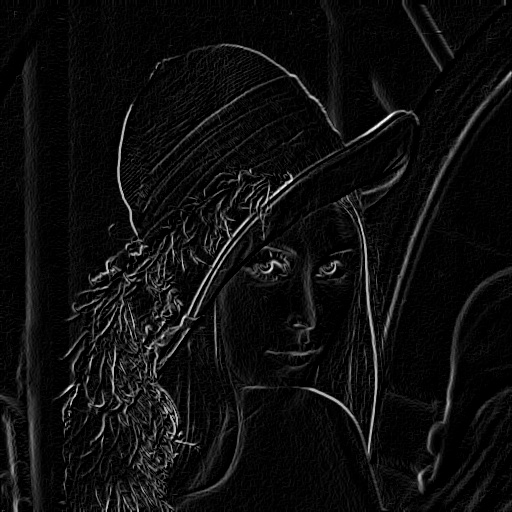

# Tema 4 - Procesamiento de imagen: Filtrado y detección de bordes, líneas, puntos aislados y esquinas

En este tema aprenderemos a detectar zonas de interés en imágenes.

## Detección de bordes

<!---
Alternativa: Que lo implementen ellos. OJO: También se puede implementar con Sobel!!
-->

OpenCV tiene una función que implementa directamente el gradiente de **Sobel** en ambas direcciones:

```cpp
// Gradiente X
Sobel(src, grad_x, CV_32F, 1, 0, 3);
// Gradiente Y
Sobel(src, grad_y, CV_32F, 0, 1, 3);
```

Ejemplo de [uso](http://docs.opencv.org/2.4/doc/tutorials/imgproc/imgtrans/sobel_derivatives/sobel_derivatives.html):

```cpp
#include "opencv2/opencv.hpp"
#include <iostream>

using namespace cv;

int main()  {

  Mat m = imread("lena.jpg", IMREAD_GRAYSCALE);

  if (image.data) {

    // Calculamos gradiente horizontal y vertical
    Mat dx, dy;
    Sobel(m, dx, CV_32F, 1, 0);
    Sobel(m, dy, CV_32F, 0, 1);

    // Calculamos la magnitud
    Mat magn;
    magnitude(dx, dy, magn);

    // Convertimos de float a uchar y mostramos el resultado
    magn.convertTo(magn, CV_8UC1);
    imshow("Sobel", magn);
    waitKey(0);
  }
  else cout << "Error opening lena.jpg" << endl;  
}
```

También podemos usar OpenCV para extraer los gradientes en ambas direcciones de una imagen en **escala de grises** usando las fórmulas vistas en teoría, y esto es lo que haremos en el siguiente ejercicio.

### Ejercicio

Podemos usar distintos kernels para implementar otros gradientes mediante convolución. Crea un programa llamado `prewitt.cpp` a partir del siguiente código, realizando las convoluciones correspondientes de los filtros Prewitt en horizontal y vertical y completando las partes marcadas con **TODO**:

```cpp
#include <opencv2/opencv.hpp>
#include <iostream>

using namespace std;
using namespace cv;

int main() {
    Mat image = imread("lena.jpg", IMREAD_GRAYSCALE);
    Mat gu, gv;

    if (image.data) {

      // TODO: Calculamos gradiente horizontal gu mediante convolución
                                  
      // TODO: Calculamos gradiente vertical gv mediante convolución
      
      // Pasamos a float el resultado (la imagen original es uchar) para que los calculos no saturen en la funcion magnitude
      gu.convertTo(gu, CV_32F);
      gv.convertTo(gv, CV_32F);

      // TODO: Calculamos la magnitud usando la función magnitude de OpenCV y guardamos el resultado en magn:
      Mat magn;

      // Convertimos de float a uchar para poder visualizar la imagen
      magn.convertTo(magn, CV_8UC1);

      // TODO: Guardar resultado en lena_prewitt.jpg

      imshow("Magnitud", magn);
      waitKey(0);
    }
    else cout << "Error opening lena.jpg" << endl;
}
```

Como puedes ver, usamos una resolución radiométrica `CV_32F` para evitar _overflow_. Después devolvemos el resultado a su resolución  original mediante `convertTo`.

El programa debe leer en escala de grises la imagen `lena.jpg`, calcular la magnitud del gradiente, mostrarlo y guardarlo en la imagen `lena_prewitt.jpg`. El resultado debería ser como la siguiente imagen:



Verás que el resultado de ejecutar ambos programas es distinto y que Sobel detecta los bordes mejor que Prewitt.

---

### Reducción de ruido

Como hemos visto en teoría, los filtros **gaussianos** sirven para suavizar la imagen y eliminar ruido. Se suelen usar como paso previo a los sistemas de detección de bordes para evitar que el ruido les afecte.

En OpenCV tenemos una implementación del filtro gaussiano en la función `GaussianBlur`, que requiere el tamaño del filtro y su desviación típica:

```cpp
GaussianBlur(src, dst, Size(3,3), 0); // Realiza un filtrado gaussiano con un kernel de 3x3 píxeles y desviación típica 0
```

Esta función admite [más parámetros](http://docs.opencv.org/2.4/modules/imgproc/doc/filtering.html#void%20GaussianBlur(InputArray%20src,%20OutputArray%20dst,%20Size%20ksize,%20double%20sigmaX,%20double%20sigmaY,%20int%20borderType)), como la desviación típica en el eje Y (si se omite es la misma que en el eje X) o el tipo de interpolación en los bordes (por defecto, `BORDER_DEFAULT`).

También podemos aplicar un filtro **bilateral**:

```cpp
bilateralFilter(src, dst, 15, 80, 80); // Aplica un filtro bilateral con un diámetro de 15 pixeles vecinos y una intensidad mínima 80.
```

Como ves, los últimos parámetros son dos umbrales en lugar de uno (es algo complicado de explicar, pero sirven para las imágenes en color). Normalmente se usa el mismo valor para estos dos umbrales. Si es pequeño (< 10), el filtro no tendrá mucho efecto. Si es grande (> 150) tendrá un efecto fuerte, haciendo que la imagen tenga un estilo de cómic (_cartoon_). Para más información se puede consultar la  [referencia](http://docs.opencv.org/2.4/modules/imgproc/doc/filtering.html?highlight=bilateralfilter#void%20bilateralFilter\(InputArray%20src,%20OutputArray%20dst,%20int%20d,%20double%20sigmaColor,%20double%20sigmaSpace,%20int%20borderType) de la función.

Por último, en OpenCV podemos usar un filtro **Canny** de la siguiente forma:

```cpp
int lowThreshold = 30;
int ratio = 3;

Canny (src, dst, lowThreshold, lowThreshold*ratio); // Filtro canny con los umbrales minimo y maximo (hysteresis) proporcionados
```

Como ocurre con las funciones anteriores, los filtros Canny también pueden tener [más parámetros](http://docs.opencv.org/2.4/modules/imgproc/doc/feature_detection.html).

---
### Ejercicio

Vamos a hacer un ejercicio usando todos los filtros anteriores. En este caso, partiremos de este código que tendrás que descargar, completando las instrucciones indicadas con **TODO**. Se trata de un ejercicio para _cartoonizar_ una imagen. Llama al siguiente programa `cartoonize.cpp`.

<!---
WM: 150. -> 150
WM: Canny -> canny
WM: BS tras "Con los bordes"
WM: En imwrite ,BSresult
--->

```cpp
#include <opencv2/opencv.hpp>
#include <iostream>

using namespace cv;
using namespace std;

int main(int argc, const char* argv[])
{
	if (argc!=2) {
		cerr << "Syntax: " << argv[0] << " <image>" << endl;
		exit(-1);
	}

	Mat img = imread(argv[1]);
	Mat imgCanny, imgCannyf, imgBF, imgCanny3c, result, resultf;


/** BORDES **/
	// Aplicamos un filtro de mediana de tamaño 7x7 para quitar ruido.
	// TODO

	// Detectamos los bordes con canny, umbral inferior 50 y superior 150
	// TODO

	// Dilatamos los bordes mediante un filtro cuadrado de 2x2
	// TODO (guardar en imgCanny)

	// Escalamos los valores resultantes a 1 y los invertimos
	imgCanny = 1 - (imgCanny / 255);

	// Convertimos la imagen a float para permitir multiplicaciones con valores entre 0 y 1
	imgCanny.convertTo(imgCannyf, CV_32FC3);

	// Aplicamos un filtro gaussiano de 5x5 pixels con desviacion tipica 0
	// TODO	(guardar en imgCannyf)


/** COLOR **/
	// Sobre la imagen original, aplicamos un filtro bilateral de diametro 9 con umbrales 150 y 150. 
	// TODO (guardar en imgBF)

	// Truncamos los colores. En este caso usamos un valor de 25 (cuanto mas alto mas "cartoonizado")
        result = imgBF / 25;
        result = result * 25;

	// Convertimos la imagen a float, igual que hemos hecho con los bordes 
	// TODO (guardar en resultf)


/** UNIMOS COLOR Y BORDES **/
	Mat cannyChannels[] = { imgCannyf, imgCannyf, imgCannyf };
	merge(cannyChannels, 3, imgCanny3c);

	// Multiplicamos las matrices de color (resultf) y bordes (imgCanny3c)
	// TODO (guardar en resultf). Importante: Para multiplicar se debe usar la funcion multiply de OpenCV. La operacion c=a*b se implementa con multiply(a,b,c);

	// convertimos el resultado a una imagen estandar (color de 8 bits)
	// TODO (guardar en result)

	// Mostramos el resultado
	imshow("Input", img);
	imshow("Result", result);

	imwrite("cartoonized.jpg", result);

	waitKey(0);

	return 0;
}
```

El resultado del programa debería ser idéntico a este:


---

## Detección de líneas

La llamada más sencilla para ejecutar **Hough** como detector de líneas es:

```cpp
HoughLinesP(src, lines, rho, theta, threshold);
```

* `src`: Imagen de un canal en escala de grises.
* `lines`: Vector de líneas. Cada línea es otro vector de 4 elementos (x1, y1, x2, y2), donde (x1,y1) y (x2, y2) son los puntos extremos de la línea.
* `rho`: Resolución de la distancia del acumulador (en píxeles).
* `theta`: Resolución del ángulo del acumulador (en píxeles).
* `threshold`: Umbral del acumulador. Sólo se devuelven aquellas líneas que tienen más votos que este umbral.
* `minLineLength` (opcional): Mínima longitud de una línea. Los segmentos más cortos que esta longitud se descartan.
* `maxLineGap` (opcional): Máximo salto permitido entre puntos de la misma línea para enlazarlos.

La función `Hough` debe usarse siempre tras un detector de bordes. Por ejemplo:

```cpp
vector<Vec4i> lines;
Mat dst;

Canny(src, dst, 50, 200, 3);
HoughLinesP(dst, lines, 1, CV_PI/180, 80, 30, 10 );
```

Veamos un programa completo que usa `Hough` y muestra las líneas detectadas sobre la imagen:

```cpp
#include <opencv2/opencv.hpp>
#include <iostream>

using namespace cv;
using namespace std;

int main()
{
    Mat src = imread("damas_corrected.jpg");
    Mat dst;

    vector<Vec4i> lines;

    Canny(src, dst, 20, 100, 3);
    imshow("Canny",dst); // Mostramos la salida de Canny

    HoughLinesP(dst, lines, 1, CV_PI/180, 20, 10, 0);

    Mat color_dst(src); // imagen de salida
    for (unsigned i = 0; i < lines.size(); i++) { // Dibujamos las lineas detectadas
       line(color_dst, Point(lines[i][0], lines[i][1]), Point(lines[i][2], lines[i][3]), Scalar(0,0,255), 3);
    }

    imshow("Lineas", color_dst); // Mostramos las líneas detectadas

    waitKey(0);
}
```

La salida tras aplicar el filtro Canny:


Las líneas detectadas usando Hough:


La transformada de Hough también se puede utilizar para detección de otras formas geométricas como círculos. La llamada más sencilla a la función `HoughCircles` es:

```cpp
HoughCircles(gray, circles, CV_HOUGH_GRADIENT, 1, src_gray.rows/8, 200, 100);
```

Puedes usar la [documentación de HoughCircles](http://docs.opencv.org/2.4/doc/tutorials/imgproc/imgtrans/hough_circle/hough_circle.html) para obtener más información sobre estos parámetros.

<!---
Hacer un programa llamado `hough.cpp` que escriba las líneas detectadas de la imagen  `damas_corrected.jpg` obtenida en el tema anterior?
-->

La función `approxPolyDP` aproxima una curva o un polígono con otra curva/polígono con menos vértices de forma que la distancia entre ambas sea menor o igual que la precisión especificada. Se implementa usando el algoritmo de **Douglas-Peucker**:

```cpp
approxPolyDP(InputArray curve, OutputArray approxCurve, double epsilon, bool closed);
```

Esta función suele usarse tras extraer las curvas/polígonos de una imagen mediante la función `findContours`, que veremos en el siguiente tema sobre segmentación.

## Detección de puntos aislados

Como hemos visto en teoría, la Laplaciana es la derivada del gradiente y se puede usar para detectar puntos aislados. Puede implementarse mediante una convolución con un kernel laplaciano, pero OpenCV proporciona directamente la función [Laplacian](http://docs.opencv.org/2.4/doc/tutorials/imgproc/imgtrans/laplace_operator/laplace_operator.html), que internamente llama a Sobel para calcular los gradientes:

```cpp
Laplacian(src, dst, ddepth, kernel_size, scale, delta, BORDER_DEFAULT );
```

## Detección de esquinas: Harris

Podemos detectar esquinas en OpenCV mediante la función `cornerHarris`. Necesita como entrada una imagen de tipo `float` en escala de grises y recibe como parámetros: el número de píxeles vecinos a tener en cuenta, el tamaño del filtro (apertura) para calcular los gradientes con Sobel, y el umbral de detección _k_, que es el único parámetro libre del algoritmo Harris:

```cpp
cornerHarris(src_gray, dst, blockSize, apertureSize, k);
```

Puedes encontrar un buen ejemplo de Harris [en este enlace](http://docs.opencv.org/2.4/doc/tutorials/features2d/trackingmotion/harris_detector/harris_detector.html).

---

### Ejercicio

Escribe el siguiente código, llámalo `harris.cpp` y complétalo como se indica:

<!---
WM: 10000. -> 10000
WM: damasHarris.jpg -> Added .
WM: 
--->

```cpp
#include <opencv2/opencv.hpp>
#include <iostream>

using namespace std;
using namespace cv;

int main() {
    Mat src = imread("damas_corrected.jpg");
    Mat src_gray, dst;

    // Pasar la imagen a tipo float y escala de grises
    // TODO (guardar en src_gray)

    // Detectar las esquinas con Harris. Parametros: blockSize=2, apertureSize=3, k=0.04.
    // TODO (guardar en dst)

    // Sobre la imagen original, poner en color azul los píxeles detectados como borde.
    // Son aquellos que en los que dst(i,j) tiene un valor mayor de 10000
    // TODO (guardar en src)

    // Mostrar por pantalla src y ademas guardarlo en el fichero llamado  "damasHarris.jpg".
    // TODO
}
```

La imagen resultante debe ser como esta:


---
