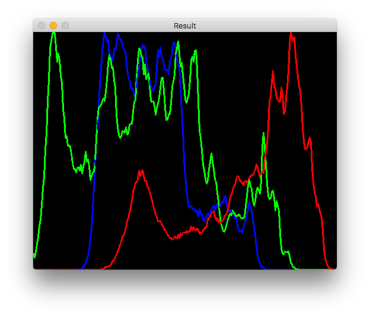

# Tema 2- Imagen digital y vídeo

En este tema usaremos OpenCV para trabajar con cambios de resolución de imágenes, histogramas, brillo/contraste y conversión entre espacios de color.

## Cambios de resolución espacial y radiométrica

En OpenCV podemos cambiar la resolución espacial (es decir, el tamaño de la imagen) con la función `resize`:

```cpp
// Guardamos la imagen en destino con el 75% de su tamaño original
resize(origen, destino, Size(), 0.75, 0.75);

// Guardamos la imagen en destino con un tamanyo de 640(ancho)x480(alto)
resize(origen, destino, Size(640,480));
```

Para cambiar sólo la resolución radiométrica (el número de bits usados para representar el valor de un píxel), también llamada _depth_, podemos usar el método `convertTo` indicando el nombre de la nueva imagen y su resolución:

```cpp
Mat destino;
origen.convertTo(destino, CV_8U); // Convertir a 8 bits y guardar en destino
```


## Brillo/contraste

Tal como puedes ver en las transparencias de teoría, el brillo y contraste de una imagen se definen con las siguientes ecuaciones:


---

### Ejercicio

Implementa un programa en OpenCV llamado `bc.cpp` que reciba por parámetro el nombre de una imagen (la cargaremos en escala de grises) y muestre por el terminal su brillo y contraste. Ejemplo de ejecución:

```bash
./bc lena.jpg
b=120.445
c=48.2231
```

> Importante: Como la corrección de prácticas es automática, la salida del programa debe tener exactamente el formato que se indica, por lo que la última línea del código debería ser como la siguiente:

```cpp
 cout << "b=" << brillo << endl << "c=" << contraste << endl;
```

> Las variables _brillo_ y _contraste_ deben ser de tipo _float_.

<!---
_Pista_: Para implementar el brillo se puede usar la función `mean` de OpenCV, que devuelve la media de los valores de una matriz:

```cpp
Scalar meanI = mean(image);
cout << "b= " << meanI << endl;
```

Sin embargo esto no serviría para el contraste por lo que en este ejercicio hay que implementar el bucle a mano.
--->

---

<!--
Mat dx,dy;
Sobel(img,dx,1,0,3,CV_32F);
Sobel(img,dy,0,1,3,CV_32F);
G= sqrt(G2^2+G2^2)
-->


## Histogramas

Podemos calcular el histograma de una imagen con la función `calcHist`. Esta función recibe muchos parámetros porque está pensada para calcular a la vez todos los histogramas de un array de imágenes.

Parámetros de `calcHist`:

* `images`: Array de imágenes, deben tener la misma resolución, CV_8U, CV_16U o CV_32F, y el mismo tamaño, aunque pueden tener un número distinto de canales.
* `nimages`: Número de imágenes en este array
* `channels`: Lista de los canales usados para calcular el histograma, comenzando por el número de canal 0.
* `mask`: Matriz opcional para usar una máscara binaria. Si no está vacía debe ser un array de 8 bits del mismo tamaño que images[i].
* `hist`: Matriz donde guardaremos el histograma.
* `dims`: Dimensionalidad del histograma
* `histSize`: Array de tamaños de histogramas para cada dimensión.
* `ranges`: Array de los valores mínimos y máximos para cada imagen. Cuando es el mismo para todas las imágenes (`uniform=true`), sólo hay que especificar un array de dos elementos.
* `uniform` (opcional): Indica si el histograma es uniforme (por defecto, true).
* `accumulate` (opcional): Si es true, el histograma no se resetea cuando se analiza otra imagen, de forma que podemos tener un histograma global de varias imágenes (por defecto, false).

Veamos un ejemplo que calcula el histograma de una imagen en escala de  grises, lo muestra por el terminal y crea una gráfica en una ventana:

<!---
WM: 
 Variable donde guardaremos el histograma -> En esta variable guardaremos el histograma
 Primer bucle for: Eliminados espacios al principio y al final
 Ultimo bucle for: Lo mismo
 int hist_h = 400; en línea separada (antes iba justo tras la instrucción anterior)
 Removed WS after waitKey
--->

```cpp

#include <opencv2/opencv.hpp>
#include <iostream>

using namespace std;
using namespace cv;

int main() {
    Mat image = imread("lena.jpg", IMREAD_GRAYSCALE); 

    if (!image.data) {
        cout << "Error opening image" << endl;
        return -1;
    }

    Mat hist;  // En esta variable guardaremos el histograma
    int histSize = 256;  // Numero de bins del histograma
    calcHist(&image, 1, 0, Mat(), hist, 1, &histSize, 0); // Calculamos el histograma

    // Mostramos los valores por pantalla
    for (int i = 0; i < histSize; i++)
        cout << " " <<  hist.at<float>(i);
    cout << endl;

    // Mostramos una grafica con el histograma
    int hist_w = 512;
    int hist_h = 400;
    int bin_w = cvRound((double)hist_w/histSize);

    Mat histImage(hist_h, hist_w, CV_8UC1, Scalar(0,0,0));

    // Normalizamos el histograma entre 0 y histImage.rows
    normalize(hist, hist, 0, histImage.rows, NORM_MINMAX, -1, Mat());

    // Dibujamos la grafica del histograma usando line, que crea una linea entre dos puntos.
    for (int i=1; i<histSize; i++) {
      line( histImage, Point(bin_w*(i-1), hist_h - cvRound(hist.at<float>(i-1))),
                       Point(bin_w*(i), hist_h - cvRound(hist.at<float>(i))),
                       Scalar(255,0,0), 2, 8, 0);
    }

    namedWindow("Result", WINDOW_AUTOSIZE);
    imshow("Result", histImage);

    waitKey(0);
}
```

Cuando hay tres canales lo más frecuente es construir un histograma para cada uno de ellos. Para separar los canales de una imagen podemos usar la función `split`:

```cpp

#include <opencv2/opencv.hpp>
#include <iostream>

using namespace std;
using namespace cv;

int main() {
    Mat color_image = imread("lena.jpg");
    vector<Mat> channels;
    split(color_image, channels);

    imshow("Blue", channels[0]);
    imshow("Green", channels[1]);
    imshow("Red", channels[2]);

    waitKey(0);
}
```

---

### Ejercicio

Haz un programa llamado `histograma_color.cpp` que reciba por parámetro el nombre de fichero de una imagen y el nombre de otra imagen donde guardaremos el resultado. El programa debe mostrar en una ventana el histograma de sus tres colores básicos, y además guardarlo en el fichero de salida. Ejemplo de ejecución:

```bash
./histograma_color lena.jpg histograma.jpg
```



Tendrás que usar como base el código anterior para calcular el histograma en un canal, y duplicar algunas líneas para hacerlo en BGR. Una vez divididos los canales con `split` puedes calcular el histograma de cada canal de este modo:

```cpp
calcHist(&bgr_planes[0], 1, 0, Mat(), b_hist, 1, &histSize, 0); // Calculamos el histograma B.
```

<!---
WM: añadido el punto al final
--->

---

<!--
Opción B: Dar este código e implementar el histograma de grayscale a mano.
-->

## Conversión de espacios de color

OpenCV soporta más de 150 espacios de color. La función que realiza las conversiones entre ellos es `cvtColor`, y admite hasta 4 parámetros:

* `src`: Imagen de entrada
* `dst`: Imagen de salida con el mismo tamaño y resolución (`depth`) que la imagen de entrada.
* `code`: Código de conversión del espacio de color. Su estructura es `COLOR_SPACEsrc2SPACEdst`. Ejemplos: `COLOR_BGR2GRAY`, `COLOR_YCrCb2BGR`.
* `dstCn` (opcional): El número de canales en la imagen destino. Si se omite el parámetro, se infiere del número de canales de la imagen `src`.

Ejemplo de uso:

```cpp
cvtColor(input_image, output_image, COLOR_BGR2GRAY);
```

> Importante: La función `cvtColor` sólo convierte de RGB a otro espacio de color o viceversa, por lo que si queremos convertir una imagen entre dos espacios distintos a RGB, primero tenemos que pasarla a RGB y después al espacio destino.

Ejemplos de conversión:

```cpp
Mat converted;
cvtColor(image, converted, COLOR_BGR2GRAY); // Convertir RGB a escala de grises
cvtColor(image, converted, COLOR_BGR2Luv); // Convertir a LUV
cvtColor(image, converted, COLOR_BGR2XYZ); // Convertir a CIEXYZ
```

Puedes consultar [en este enlace](http://docs.opencv.org/2.4/modules/imgproc/doc/miscellaneous_transformations.html) todas las fórmulas que usa OpenCV para conversión entre espacios. Por ejemplo, para convertir un valor RGB en escala de grises se usa la siguiente fórmula: 0.299*R + 0.587*G+ 0.114*B.

Ten en cuenta que OpenCV a veces no usa el mismo orden de canales del estándar del espacio de color. Por ejemplo, RGB se codifica en OpenCV como BGR, y HSL se codifica como HLS, por lo que el último canal que almacena en este caso es S en lugar de L.

---

### Ejercicio

Haz un programa llamado `colorLight.cpp` que reciba por parámetro el nombre de una imagen y extraiga los canales que se muestran a continuación, guardándolos **exactamente** con el siguiente nombre de fichero:

* El canal **L** de CIELab, fichero `cielab_l.jpg`.
* El canal **V** de HSV, fichero  `hsv_v.jpg`.
* El canal **L** de HSL, fichero  `hsl_l.jpg`.
* El canal **Y** de YCbCr, fichero  `ycrcb_y.jpg`.

Para hacer pruebas puedes usar la siguiente imagen de entrada:

<!---

--->


<a href="https://commons.wikimedia.org/wiki/File:Fire_breathing_2_Luc_Viatour.jpg#/media/File:Fire_breathing_2_Luc_Viatour.jpg"></a><br>By I, <a href="//commons.wikimedia.org/wiki/User:Lviatour" title="User:Lviatour">Luc Viatour</a>, <a href="http://creativecommons.org/licenses/by-sa/3.0/" title="Creative Commons Attribution-Share Alike 3.0">CC BY-SA 3.0</a>, <a href="https://commons.wikimedia.org/w/index.php?curid=4632541"></a>.

Ejemplo de ejecución:

```bash
./colorLight Fire_breathing_2_Luc_Viatour.jpg
```

> Pista: Tras convertir las imágenes con `cvtColor` puedes usar `split` para separar sus canales.

---

## Pseudocolor

Mediante la función `applyColorMap` también podemos pseudocolorear imágenes en escala de grises usando los [mapas de color predefinidos](http://docs.opencv.org/2.4.8/modules/contrib/doc/facerec/colormaps.html) en OpenCV. Por ejemplo:

```cpp
Mat im_gray = imread("pluto.jpg", IMREAD_GRAYSCALE);
Mat im_color;
applyColorMap(im_gray, im_color, COLORMAP_JET);
```

Escribe un programa completo que contenga este código de ejemplo (no hay que entregarlo) para visualizar el resultado de pseudocolorear la siguiente imagen de Plutón obtenida por la sonda New Horizons:


