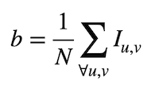
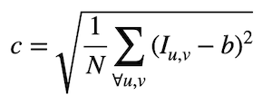
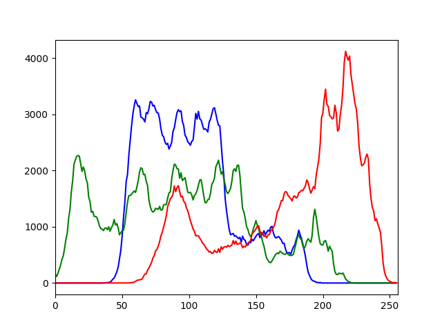
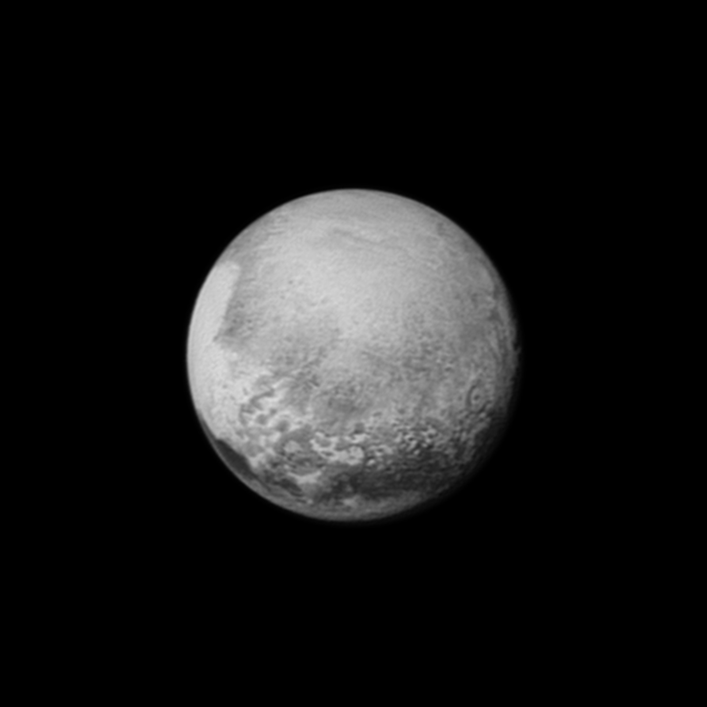

# Tema 2- Imagen digital y vídeo

En este tema trabajaremos con cambios de resolución de imágenes, histogramas, brillo/contraste y conversión entre espacios de color.

## Cambios de resolución espacial y radiométrica

En OpenCV podemos cambiar la resolución espacial (es decir, el tamaño de la imagen) con la función `resize`:

```python
# Guardamos la imagen img en dst con el 75% de su tamaño original
dst = cv.resize(img, (0,0), fx=0.75, fy=0.75)

# Guardamos la imagen en destino con un tamaño de 640 x 480 (ancho x alto)
dst = cv.resize(img, (640,480))
```

Para cambiar sólo el tipo de dato de la imagen, que está relacionado con la resolución radiométrica o _depth_ (el número de bits usados para representar el valor de un píxel), podemos realizar una conversión con `numpy`:

```python
converted = np.float32(img) # Convertir a float y guardar en dst
```

## Brillo/contraste

Tal como puedes ver en las transparencias de teoría, el brillo y contraste de una imagen se definen con las siguientes ecuaciones:





---

### Ejercicio

Implementa un programa en OpenCV llamado `bc.py` que reciba por parámetro el nombre de una imagen (que debemos cargar en escala de grises) y muestre por el terminal su brillo y contraste. Los parámetros de entrada deben indicarse de la siguiente forma:

```python
parser = argparse.ArgumentParser(description = 'Programa para calcular el brillo y contraste de una imagen')
parser.add_argument('--imagen', '-i', type=str, default='lena.jpg')
```

Ejemplo de ejecución:

```bash
python bc.py
b= 120.444
c= 48.221
```

> Importante: Como la corrección de prácticas es automática, la salida del programa debe tener exactamente el formato que se indica, por lo que la última línea del código debería ser como la siguiente:

```python
print('b= %.3f' % brillo)
print('c= %.3f' % contraste)
```

>  Las variables _brillo_ y _contraste_ son los valores que debes calcular usando las ecuaciones anteriores.

<!---
_Pista_: Para implementar el brillo se puede usar la función `mean` de OpenCV, que devuelve la media de los valores de una matriz:

```cpp
Scalar meanI = mean(image);
cout << "b= " << meanI << endl;
```

Sin embargo esto no serviría para el contraste por lo que en este ejercicio hay que implementar el bucle a mano.
--->

---

<!--
Mat dx,dy;
Sobel(img,dx,1,0,3,CV_32F);
Sobel(img,dy,0,1,3,CV_32F);
G= sqrt(G2^2+G2^2)
-->


## Histogramas

Podemos calcular el histograma de una imagen con la función `calcHist`. Esta función recibe muchos parámetros porque está pensada para calcular de una pasada todos los histogramas de un array de imágenes.

Parámetros de `calcHist`:

* `images`: Array de imágenes, deben tener la misma resolución, tipo y el mismo tamaño, aunque pueden tener un número distinto de canales. Tiene que indicarse entre corchetes, por ejemplo `[img]`.
* `channels`: También se da entre corchetes. Es la lista de los canales usados para calcular el histograma, comenzando por el número de canal 0. Si es escala de grises se puede indicar `[0]`, y en color `[0]`, `[1]` o `[2]` para calcular los histogramas de azul, verde y rojo respectivamente.
* `mask`: Matriz opcional para usar una máscara binaria. Para obtener el histograma de la imagen completa se pone `None`.
* `histSize`: Representa cuántos elementos tenemos en el vector del histograma y se pone entre corchetes, normalmente serán `[256]`. 
* `ranges`: Rango de los valores mínimos y máximos para cada imagen, normalmente es `[0,256]`.

Veamos un ejemplo de código que calcula el histograma de una imagen en escala de  grises, lo muestra por el terminal y crea una gráfica en una ventana:

<!----
https://docs.opencv.org/master/d1/db7/tutorial_py_histogram_begins.html
---->

```python
import cv2 as cv
import argparse
from matplotlib import pyplot as plt

parser = argparse.ArgumentParser(description = 'Programa para calcular el histograma de una imagen')
parser.add_argument('--imagen', '-i', type=str, default='lena.jpg')
parser.add_argument('--histograma', '-o', type=str, default='histograma.png')
args = parser.parse_args()

# Cargamos la imagen indicada por el usuario
img = cv.imread(args.imagen, cv.IMREAD_GRAYSCALE)

# Comprobamos que la imagen se ha podido leer
if img is None:
    print("Error al cargar la imagen", args.imagen)
    quit()

# Calculamos el histograma
hist = cv.calcHist([img],[0],None,[256],[0,256])

# Lo mostramos, para esto usamos la librería matplotlib
plt.plot(hist, 'b') # El segundo parámetro es el color de la línea ('b', 'g', o 'r')
plt.xlim([0,256]) # Para ajustar mejor el eje x y que sólo se vean los valores entre 0 y 255

# Guardamos el resultado en un fichero
plt.savefig(args.histograma)

 # Mostramos la gráfica en pantalla
plt.show()
```

---


### Ejercicio

Cuando la imagen es de tres canales lo más normal es mostrar un histograma para cada uno de ellos. Haz una copia del programa anterior y llámalo `histograma_color.py`. Modifícalo para que en este caso el programa muestre en una ventana (y guarde en una imagen) el histograma de sus tres colores básicos, en lugar de hacerlo en escala de grises. 

Ejemplo de salida con `lena.jpg`:




## Conversión de espacios de color

OpenCV soporta más de 150 espacios de color. La función que realiza las conversiones entre ellos es `cvtColor`, y admite hasta 4 parámetros:

* `src`: Imagen de entrada
* `code`: Código de conversión del espacio de color. Su estructura es `COLOR_SPACEsrc2SPACEdst`. Ejemplos: `COLOR_BGR2GRAY`, `COLOR_YCrCb2BGR`.
* `dst` (opcional): Imagen de salida con el mismo tamaño y resolución (`depth`) que la imagen de entrada.
* `dstCn` (opcional): El número de canales en la imagen destino. Si se omite el parámetro, se infiere del número de canales de la imagen `src` y de `code`.

Ejemplo de uso:

```python
grayImg = cv.cvtColor(img, cv.COLOR_BGR2GRAY)
```

> Importante: La función `cvtColor` sólo convierte de BGR a otro espacio de color o viceversa, por lo que si queremos convertir una imagen entre dos espacios distintos de BGR, primero tenemos que pasarla a BGR y después al espacio destino.

Ejemplos de conversión:

```python
converted = cv.cvtColor(img, cv.COLOR_BGR2GRAY) # Convertir a escala de grises
converted = cv.cvtColor(img, cv.COLOR_BGR2Luv) # Convertir a LUV
converted = cv.cvtColor(img, cv.COLOR_BGR2XYZ) # Convertir a CIEXYZ
```

Puedes consultar [en este enlace](http://docs.opencv.org/2.4/modules/imgproc/doc/miscellaneous_transformations.html) todas las fórmulas que usa OpenCV para conversión entre espacios. Por ejemplo, para convertir un valor RGB en escala de grises se usa la siguiente fórmula: 0.299\*R + 0.587\*G+ 0.114\*B.

Ten en cuenta que OpenCV a veces no usa el mismo orden de canales que el estándar del espacio de color. Por ejemplo, RGB se codifica en OpenCV como BGR, y HSL se codifica como HLS, por lo que el último canal que almacena en este caso es S en lugar de L.

---

### Ejercicio

Haz un programa llamado `colorLight.py` que reciba por parámetro el nombre de una imagen y extraiga los canales que se muestran a continuación, guardándolos **exactamente** con el siguiente nombre de fichero:

* El canal **L** de CIELab, fichero `cielab_l.jpg`.
* El canal **V** de HSV, fichero  `hsv_v.jpg`.
* El canal **L** de HSL, fichero  `hsl_l.jpg`.
* El canal **Y** de YCbCr, fichero  `ycrcb_y.jpg`.

Argumentos de entrada:

```python
parser = argparse.ArgumentParser(description = 'Programa para cambiar espacios de color')
parser.add_argument('--imagen', '-i', type=str, default='Fire_breathing_2_Luc_Viatour.jpg')
```

Para hacer pruebas puedes usar la siguiente imagen:

<!---

--->


<a href="https://commons.wikimedia.org/wiki/File:Fire_breathing_2_Luc_Viatour.jpg#/media/File:Fire_breathing_2_Luc_Viatour.jpg"></a><br>Imagen de <a href="//commons.wikimedia.org/wiki/User:Lviatour" title="User:Lviatour">Luc Viatour</a>, <a href="http://creativecommons.org/licenses/by-sa/3.0/" title="Creative Commons Attribution-Share Alike 3.0">CC BY-SA 3.0</a>, <a href="https://commons.wikimedia.org/w/index.php?curid=4632541">Wikimedia</a>.


> Pista: Se puede usar el método `split` para separar los canales de una imagen. Ejemplo:

```python
b,g,r = cv.split(img)
```

---

## Pseudocolor

Mediante la función `applyColorMap` también podemos pseudocolorear imágenes en escala de grises usando los [mapas de color predefinidos](http://docs.opencv.org/2.4.8/modules/contrib/doc/facerec/colormaps.html) en OpenCV. Por ejemplo:

```python
img = cv.imread('pluto.jpg', cv.IMREAD_GRAYSCALE)
imgray = cv.applyColorMap(img, cv.COLORMAP_JET)
```

Escribe un programa completo que contenga este código de ejemplo (no hay que entregarlo) para visualizar el resultado de pseudocolorear la siguiente imagen de Plutón obtenida por la sonda _New Horizons_:


