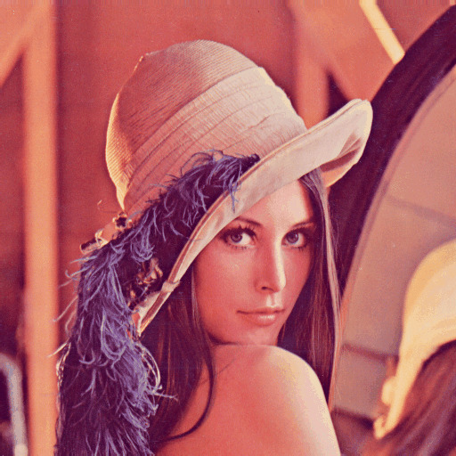

# Tema 1- Introducción a OpenCV

En este tema veremos las funcionalidades básicas de OpenCV: cargar una imagen o un vídeo, mostrarlo por pantalla y guardar ficheros.

<!---
TUTORIAL DE PYTHON: https://colab.research.google.com/github/cs231n/cs231n.github.io/blob/master/python-colab.ipynb#scrollTo=1L4Am0QATgOc
--->

## Carga y visualización de imágenes

Vamos a comprobar que la instalación se ha hecho de forma correcta ejecutando el siguiente programa de ejemplo.

```pyyhon
import cv2 as cv
import argparse

# Gestión de parámetros
parser = argparse.ArgumentParser(description = 'Programa para cargar y mostrar una imagen')
parser.add_argument('--imagen', '-i', type=str, default='lena.jpg')
args = parser.parse_args()

# Cargamos la imagen indicada por el usuario (por defecto, en color)
img = cv.imread(args.imagen)

# Comprobamos que la imagen se ha podido leer
if img is None:
    print("Error al cargar la imagen", args.imagen)
    quit()

# Mostramos la imagen en una ventana con el título "Imagen"
cv.namedWindow('Ventana', cv.WINDOW_AUTOSIZE)
cv.imshow('Ventana', img)

# Esperar a pulsar una tecla en la ventana para cerrarla
cv.waitKey(0)
```

Primero guardamos este fichero con el nombre `lectura.py`. Para probar el código, descargamos esta imagen de ejemplo y ejecutamos el programa de la siguiente forma:



```bash
python3 lectura.py
```

Como puede verse, se crea una ventana con la imagen, por defecto `lena.jpg`. Esta ventana se cerrará cuando pulsemos una tecla.

Podemos ejecutar el programa con otra imagen indicando la opción `--imagen` o alternativamente la versión corta, `-i`:

```bash
python3 lectura.py --imagen otraimagen.jpg
# Equivalente a: python3 lectura.py -i otraimagen.jpg
```

Vamos a analizar este código en detalle. En la primera línea, el programa incluye OpenCV. Esto debemos hacerlo siempre que queramos usar la librería. También es conveniente incluir la librería `numpy`, ya que es la que usa OpenCV para gestionar los arrays y por tanto nos permite acceder directamente a los valores de intensidad de las imágenes. A veces es posible que necesitemos incluir algún fichero de cabecera adicional, como en este caso la librería `argparse` que sirve para gestionar los argumentos del programa.

La librería `argparse` se encarga de comprobar que el usuario ha introducido los parámetros especificados. Si falta algún parámetro se usan unos valores por defecto. Cuando un parámetro es opcional suele indicar que comience por `--`, aunque por defecto todos los parámetros son opcionales a no ser que se añada la opción `required=True`. A los parámetros sin valor por defecto se les asigna `None`, y esto es lo que recibe el programa si el usuario no establece su valor.

A continuación leemos una imagen con `imread` usando el nombre de fichero que se le pasa por parámetro y la guardamos en una matriz llamada `img`. Cada vez que intentemos cargar una imagen es importante comprobar que se ha podido leer  correctamente.

En este punto ya tenemos la imagen cargada en una matriz. Podríamos procesarla, pero de momento sólo vamos a mostrarla en una ventana. Para ello creamos una ventana con el nombre _Ventana_ de tamaño variable, y llamamos al método `imshow` para mostrar la imagen en la ventana.

> En este ejemplo la llamada a `namedWindow` puede omitirse sin consecuencias. Si `imshow` recibe como primer parámetro el nombre de una ventana que todavía no está creada, ésta se crea automáticamente con los parámetros por defecto.

Siempre que mostremos una imagen en pantalla debemos llamar a la función `waitKey(0)` para que la ventana se cierre cuando se pulse una tecla. Si no añadimos esta línea, la ventana no llegará a aparecer (mejor dicho, aparecerá y se cerrará de inmediato).

### Carga de imágenes

La siguiente instrucción carga en una matriz la imagen cuyo nombre recibe por parámetro.

```python
image = cv.imread('lena.jpg')
```

Como sabes, las imágenes digitales se representan con matrices.


Los formatos principales de imágenes soportadas por OpenCV son:

* Windows bitmaps (`bmp`, `dib`)
* Portable image formats (`pbm`, `pgm`, `ppm`)
* Sun rasters (`sr`, `ras`)

También soporta otros formatos a través de librerías auxiliares:

* JPEG (`jpeg`, `jpg`, `jpe`)
* JPEG 2000 (`jp2`)
* Portable Network Graphics (`png`)
* TIFF (`tiff`, `tif`)
* WebP (`webp`).

La función `imread` tiene un parámetro opcional. Cuando carguemos una imagen en escala de grises debemos usar `IMREAD_GRAYSCALE`:

```python
# Cargamos la imagen (tanto si está en color como si no) en escala de grises
img = cv.imread('lena.jpg', cv.IMREAD_GRAYSCALE)
```

Esto es porque la opción por defecto es `IMREAD_COLOR`, y por tanto se cargará la imagen con 3 canales independientemente de que esté o no en escala de grises. Estos son los tres tipos de opciones que podemos usar con `imread`:

* `cv.IMREAD_GRAYSCALE`: Cargamos la imagen en escala de grises.
* `cv.IMREAD_COLOR`: Cargamos la imagen en color. Si tenía canal alpha (transparente), se ignora.
* `cv.IMREAD_UNCHANGED`: Cargamos la imagen tal como es incluyendo el canal alpha si lo tuviera.

> En general, cuando necesites ayuda sobre la sintaxis de cualquier función de OpenCV, puedes escribir desde el mismo código en python: `help(cv.imshow)`, reemplazando `imshow` por el nombre de la función de la que deseas obtener ayuda.

### Imágenes en OpenCV

<!---
https://docs.opencv.org/4.5.1/d5/d98/tutorial_mat_operations.html
--->

En python, OpenCV usa arrays `numpy` para almacenar las imágenes. Para usar esta librería en nuestro código, tenemos que importarla al principio:

```python
import numpy as np
```

Una vez importada podemos crear una matriz de cualquier tamaño, contenga o no los datos de una imagen:

```python
img = np.full((100,100,3), (0,0,255), dtype=np.uint8)
print(img)
```

En este ejemplo hemos creado una matriz de 100x100x3 (podría corresponder con una imagen de 100 filas por 100 columnas con 3 canales), inicializada con el valor rojo (0,0,255), y de tipo `uint8` (8 bits). Este tipo de dato es el estándar para crear imágenes con una profundidad de 8 bits en python (en el caso de C++ es `uchar` en lugar de `uint8`). Con 8 bits se pueden representar valores que van desde 0 a 255.

> Si visualizas esta imagen con `imshow` verás que es roja. Esto es porque el valor rojo se representa en el último canal debido a que OpenCV carga las imágenes en modo **BGR** en lugar del estándar RGB. Es decir, el canal 0 es el azul, el canal 1 el verde, y el canal 2 el rojo. 

Además del tipo `uint8`, que es el más común para imágenes, un array de numpy puede ser de [cualquiera de estos tipos](https://numpy.org/devdocs/user/basics.types.html).


Existen varias alternativas para asignar valores a una matriz que ya está creada, por ejemplo:

```python
img.fill(255) # solo si la imagen es de 1 canal
img[::]=(255,0,0) # Para cambiar todos los valores por (255,0,0)
```

Para más información sobre la sintaxis de acceso a arrays de `numpy` puedes consultar [esta ayuda](https://cs231n.github.io/python-numpy-tutorial/#arrays
).

 <!---   https://numpy.org/doc/stable/reference/arrays.indexing.html).
-->


En caso de que quisiéramos inicializar todos los valores de la matriz a 0, a 1 o a cualquier otro valor también podríamos indicarlo:

```python
img = np.zeros((100,100,3), dtype=np.uint8) # Inicialización con ceros
img = np.ones((100,100,3), dtype=np.uint8) # Inicialización con unos

img = np.array([[[255, 0, 0], [255, 0, 0]],
                [[255, 0, 0], [255, 0, 0]],
                [[255 ,0 ,0], [255, 0, 0]]], dtype=np.uint8) # Inicialización de una matriz de tamaño 3x2x3 con todos los píxeles de color azul
```

En python, para copiar una variable en otra debemos llevar cuidado con usar el símbolo igual. Por ejemplo:

```python
x = img
y = np.copy(img)
```

Si después de ejecutar este código modificamos `img` cambiará también el valor de `x` pero no el de `y`. Esto es porque el operador asignación (`=`) no hace una copia de la matriz, sino que crea un puntero que apunta a la variable. Para hacer una copia es necesario el método `copy`.

Para acceder a valores individuales de una matriz podemos hacer uso de las siguientes opciones:

```python
matrix = np.array([[1,2,3],[4,5,6]])    # Crea una matriz de 2x3
print(matrix[0, 0], matrix[0, 1], matrix[1, 0])   # Imprime "1 2 4"
matrix[0, 0] = 2 # Cambia a 2 el valor de la posición 0,0
```

Si queremos obtener información sobre la estructura de la matriz podemos usar la siguiente instrucción:

```python
print(matrix.dtype) # Imprime el tipo de la matriz
print(matrix.shape) # Imprime las dimensiones "(2, 3)"
print(matrix.ndim)  # Imprime el número total de dimensiones (2)
print(matrix.size)  # Imprime el número de elementos que tenemos en el array (6)
```

Podemos hacer multitud de operaciones con arrays `numpy`, tales como invertir matrices, transponerlas, etc.

En numpy se puede seleccionar parte de un array de forma sencilla, como se puede ver en el siguiente ejemplo extraido de la [ayuda de numpy](https://numpy.org/devdocs/user/absolute_beginners.html): 

```python
data = np.array([1, 2, 3])
print(data[1])  # 2
print(data[0:2]) # (1,2)
print(data[1:])  # (2,3)
print(data[-2:]) # (2, 3)
```


Para acceder de forma iterativa a todos los elementos de un array se puede usar el siguiente bucle:

```python
for x in data:
  print(x)
```

En el caso de una imagen para la que queramos iterar elemento a elemento:

```python
for x in img:
  for y in x:
    print(y)
```

Si queremos acceder a una una imagen usando índices en lugar de iteradores se puede utilizar `range`:

```python
rows,cols = img.shape
for i in range(rows): 
    for j in range(cols):  
      print(img[i,j])
```

También es posible crear una matriz que almacene una región de interés (una zona rectangular) de otra imagen:

```python
r = img[y1:y2, x1:x2]
```

Donde `(x1,y1)` son las coordenadas de la esquina superior izquierda del rectángulo que queremos recortar, y `(x2,y2)` son las coordenadas de la esquina inferior derecha.

Puedes probar este programa de ejemplo para ver cómo se extrae una subimagen, esta vez usando la función `selectROI` que nos permite seleccionar una región de interés mediante el interfaz de OpenCV:

```python
import cv2 as cv

img = cv.imread('lena.jpg')

r = cv.selectROI(img)

imgCrop = img[r[1]:r[1]+r[3], r[0]:r[0]+r[2]]

cv.imshow('Crop', imgCrop)
cv.waitKey(0)
```

A veces es necesario cambiar el tipo de dato de un array o matriz. Podemos hacer este cambio de forma sencilla usando los tipos `numpy`:

```python
dst = np.float32(src) # Conversión a float
dst = np.intc(src) # Conversión a int
dst = np.uint8(src) # Conversión a uint8
```

<!----
dst = src.astype(float) # Para pasar un array a float
dst = src.astype(int) # Para pasar un array a int
dst = src.astype(np.uint8) # Para pasar un array a uint8
---->

Hay veces en las que la conversión de tipos no puede hacerse directamente, por ejemplo cuando convertimos una matriz `float32` en `uint8`, ya que podemos salirnos de rango (en el primer caso representamos la variable con 32 bits, en el segundo con 8). Para evitar esto se suele aplicar normalización. Por ejemplo, si tenemos una matriz `m` de tipo `float32` podemos hacer la conversión de la siguiente forma:

```python
# Normalizamos los valores entre 0 y 255
m = m - m.min()
m = m/m.max() * 255

# Ahora ya se puede convertir a uint8
dst = np.uint8(m)
```

<!----
## Otros tipos básicos

Además de la clase `Mat`, OpenCV define otros tipos básicos. Todos ellos tienen sobrecargado el operador salida, por lo que podemos mostrar su valor usando `<<` como con cualquier otra variable.

* **VecAB**. Se pueden declarar vectores en el formato `VecAB`, donde A (número de dimensiones) es un valor entre 2 y 5, y B es el tipo de dato: b (uchar), s (short), i (int), f (float) o d (double). Por ejemplo:

```cpp
Vec3d v(1.1, 2.2, 3.3);
Vec3b bgr(1, 2, 3);
```

Para vectores de más dimensiones debemos usar la clase `vector` de C++.

* **Scalar**. Nos permite declarar un vector de una dimensión que contiene como máximo 4 valores escalares (reales). Por ejemplo:

```cpp
Scalar s(1, 3);
cout << s[1] << endl; // Imprime 3
```

Hay funciones en OpenCV que necesitan parámetros escalares, como el constructor de `Mat` que hemos visto anteriormente.

* **PointAB**. Se suele usar para representar, por ejemplo, puntos de contorno (la silueta de un objeto). La sintaxis es `PointAB`, donde A es la dimensión (2 o 3), y B es el tipo de dato: i (`int`), f (`float`), o d (`double`). Por ejemplo:

```cpp
Point3d p;
p.x = 0;
p.y = 0;
p.z = 0;
```

* **Size**. Especifica un tamaño (anchura por altura). Por ejemplo:

```cpp
Size s;
s.width = 30;
s.height = 40;
```

* **Rect**. La clase rectángulo es parecida a `Size` pero indicando unas coordenadas de origen. Ejemplo:

```cpp
Rect r;
r.x = r.y = 0;
r.width = r.height = 100;
```


## Acceso a los píxeles

Para recorrer los valores de una matriz que tiene un canal y es de tipo `unsigned char`, podemos usar el método `at`:

```cpp
if (m.channels() == 1) {
  for( int i = 0; i < m.rows; i++)
      for( int j = 0; j < m.cols; j++ )
          uchar value = m.at<uchar>(i,j);
}
```

En el caso de que tengamos una matriz de más canales (por ejemplo, una imagen de color):

```cpp
if (m.channels() == 3) {
  uchar r, g, b;
  for (int i = 0; i < m.rows; i++) {
    for (int j = 0; j < m.cols; j++) {
      Vec3b pixel = m.at<Vec3b>(i,j);
      b = pixel[0];
      g = pixel[1];
      r = pixel[2];
    }
  }
}
```

En OpenCV hay muchas formas de acceder a los píxeles individuales y algunas de ellas son más eficientes que `at`, aunque también hacen el código algo más lioso. El problema de `at` es que necesita calcular la posición exacta de memoria de la fila y columna de un píxel. Una alternativa muy eficiente y frecuentemente usada es esta:

```cpp
if (m.channels == 3) {
  uchar r, g, b;
  for (int i = 0; i < m.rows; i++) {
    Vec3b* pixelRow = m.ptr<Vec3b>(i);
    for (int j = 0; j < m.cols; j++) {
      b = pixelRow[j][0];
      g = pixelRow[j][1];
      r = pixelRow[j][2];
    }
  }
}
```

También podemos usar iteradores (`MatIterator`) para movernos por todos los píxeles, pero en esta asignatura se desaconseja (es limpio, pero más ineficiente que `at`).

-->

## Guardar imágenes

Para guardar una imagen en disco se usa la función `imwrite` de OpenCV. Ejemplo:

```cpp
cv.imwrite('output.jpg', img)
```

Esta función determina el formato del fichero de salida a partir de la extensión proporcionada en su nombre (en este caso, JPG). Existe un tercer parámetro opcional en el que podemos indicar un array con opciones de escritura. Por ejemplo:

```python
cv.imwrite('compress.png', img,  [cv.IMWRITE_PNG_COMPRESSION, 9]) # Compresión PNG de nivel 9
```

Como hemos visto podemos guardar imágenes con `imwrite`, pero hay casos en los que esta operación puede fallar (por ejemplo, cuando intentamos acceder a un directorio sin permisos). Si esto ocurre, el método devolverá `false`. Si queremos saber si se ha guardado correctamente la imagen, tenemos que comprobarlo (es recomendable hacerlo siempre):

```python
writeStatus = cv.imwrite('img.jpg', img)
if writeStatus is True:
    print('Imagen guardada')
else:
    print('Error al guardar la imagen') # Excepción u otro problema de escritura
```

---

### Ejercicio

Haz un programa llamado `grayscale.py` que lea una imagen en color y la guarde en escala de grises. El programa recibirá como argumento el nombre del fichero de la imagen en color y el del fichero en el que vamos a almacenar la misma imagen pero en escala de grises. Se proporciona la sintaxis de `argParse` para este ejercicio:

```python
parser = argparse.ArgumentParser(description = 'Programa para cargar una imagen y guardarla en escala de grises')
parser.add_argument('--entrada', '-i', type=str, default='lena.jpg')
parser.add_argument('--salida', '-o', type=str, default='lenaGray.jpg')
```

Si la imagen no puede cargarse o guardarse, el programa debe imprimir el mensaje `Error al cargar la imagen` o `Error al guardar la imagen` respectivamente.

---

## Persistencia

Además de las funciones específicas para leer y escribir imágenes y vídeo, en OpenCV hay otra forma genérica de guardar o cargar datos. Esto se conoce como persistencia de datos. Los valores de los objetos y variables en el programa pueden guardarse (_serializados_) en disco, lo cual es útil para almacenar resultados y cargar datos de configuración.

Estos datos suelen guardarse en un fichero `xml` mediante un diccionario (en algunos lenguajes de programación como C++, a los diccionarios se les llama también _mapas_) usando pares clave/valor. Por ejemplo, si quisiéramos guardar una variable que contiene el número de objetos detectados en una imagen:

```python
fs = cv.FileStorage('config.xml', cv.FileStorage_WRITE)
# Abrimos el fichero para escritura
fs.write('numero_objetos', num_objetos) # Guardamos el numero de objetos
fs.release() # Cerramos el fichero
```

Asumiendo que nuestra variable contiene el valor 10, se almacenará en disco el siguiente fichero `config.xml`:

```xml
<?xml version="1.0"?>
<opencv_storage>
<numero_objetos>10</numero_objetos>
</opencv_storage>
```

Si posteriormente queremos cargar esta información del fichero, podemos usar el siguiente código:

```cpp
fs = cv.FileStorage('config.xml', cv.FileStorage_READ)
num_objetos = fs.getNode('numero_objetos')
fs.release()
```

## Elementos visuales

Como hemos visto al principio, podemos crear una ventana para mostrar una imagen mediante la función `namedWindow`. El segundo parámetro que recibe puede ser:

* `cv.WINDOW_NORMAL`: El usuario puede cambiar el tamaño de la ventana una vez se muestra por pantalla.
* `cv.WINDOW_AUTOSIZE`: El tamaño de la ventana se ajusta al tamaño de la imagen y el usuario no puede redimensionarla. Es la opción por defecto.
* `cv.WINDOW_OPENGL`: Se crea la ventana con soporte para OpenGL (no es necesario en esta asignatura).

Dentro de la ventana de OpenCV en la que mostramos la imagen podemos añadir _trackbars_, botones, capturar la posición del ratón, etc. En este [enlace](https://docs.opencv.org/4.5.1/d7/dfc/group__highgui.html) podemos ver los métodos y constantes relacionados con la gestión del entorno visual estándar.

Para capturar la posición del ratón podemos usar el método `setMouseCallback`, que recibe tres parámetros:

* El nombre de la ventana en la que se captura el ratón.
* El nombre de la función que se invocará cuando se produzca cualquier evento del ratón (pasar por encima, clickar con el botón, etc).
* Un puntero (opcional) a cualquier objeto que queramos pasarle a nuestra función.

La función `callback` que hemos creado recibe cuatro parámetros: El código del evento, los valores `x` e `y`, unas opciones (_flags_) y el puntero al elemento pasado a la función.

```python
import cv2 as cv

# Función que se invoca cuando se usa el ratón
def mouse_click(event, x, y, flags, param):
	# En caso de que se pulse el botón izquierdo 
	if event == cv.EVENT_LBUTTONDOWN:
		
		mensaje = 'Boton izquierdo (' + str(x) + ',' + str(y) + ')'
		
		# Mostrar texto en la imagen.
		cv.putText(img, mensaje, (x, y), cv.FONT_HERSHEY_TRIPLEX, 0.5, (255, 255, 255), 1) 
		cv.imshow('image', img)
		
# Cargar imagen y mostrarla
img = cv.imread('lena.jpg') 
cv.imshow('image', img) 
		
# Indicar la función a llamar cuando se pulse el ratón sobre la ventana
cv.setMouseCallback('image', mouse_click)

cv.waitKey(0)
```

Se puede encontrar más información sobre los parámetros de `putText` en [este enlace](https://www.geeksforgeeks.org/python-opencv-cv2-puttext-method/).

<!---
El código del evento (`event`) en este ejemplo puede ser:

```cpp
 CV_EVENT_MOUSEMOVE =0,
 CV_EVENT_LBUTTONDOWN =1,
 CV_EVENT_RBUTTONDOWN =2,
 CV_EVENT_MBUTTONDOWN =3,
 CV_EVENT_LBUTTONUP =4,
 CV_EVENT_RBUTTONUP =5,
 CV_EVENT_MBUTTONUP =6,
 CV_EVENT_LBUTTONDBLCLK =7,
 CV_EVENT_RBUTTONDBLCLK =8,
 CV_EVENT_MBUTTONDBLCLK =9,
 CV_EVENT_MOUSEWHEEL =10,
 CV_EVENT_MOUSEHWHEEL =11
```

Los flags pueden tener estos valores:

```cpp
CV_EVENT_FLAG_LBUTTON =1,
CV_EVENT_FLAG_RBUTTON =2,
CV_EVENT_FLAG_MBUTTON =4,
CV_EVENT_FLAG_CTRLKEY =8,
CV_EVENT_FLAG_SHIFTKEY =16,
CV_EVENT_FLAG_ALTKEY =32
```
-->

<!---
EN PYTHON: https://docs.opencv.org/3.4/da/d6a/tutorial_trackbar.html
---->

Mediante el método `createTrackbar` podemos crear un _trackbar_ (también llamado _slider_) para ajustar algún valor en la ventana de forma interactiva. Al igual que ocurre con el método que gestiona el ratón, puede recibir como último parámetro una referencia a una función (en el siguiente ejemplo, `onChange`):

```python
import cv2 as cv
import argparse

# Constante para indicar el valor máximo del slider
alpha_slider_max = 100

# Función que crea el trackbar
def onChange(val):
    alpha = val / alpha_slider_max
    beta = 1.0 - alpha
    # El método addWeighted se encarga de hacer la mezcla
    dst = cv.addWeighted(img1, alpha, img2, beta, 0.0)
    cv.imshow('Linear Blend', dst)

# Procesamos argumentos
parser = argparse.ArgumentParser(description='Código de ejemplo para usar un trackbar')
parser.add_argument('--imagen1', help='Ruta de la primera imagen',  default=cv.samples.findFile('LinuxLogo.jpg'))
parser.add_argument('--imagen2', help='Ruta de la segunda imagen', default=cv.samples.findFile('WindowsLogo.jpg'))
args = parser.parse_args()

# Cargamos las imagenes y comprobamos que han podido abrirse
img1 = cv.imread(args.imagen1)
img2 = cv.imread(args.imagen2)

if img1 is None:
    print('No se ha podido abrir la imagen', args.imagen1)
    quit()
if img2 is None:
    print('No se ha podido abrir la imagen', args.imagen2)
    quit()

# Creamos la ventana
cv.namedWindow('Linear Blend')

# Creamos el trackbar
cv.createTrackbar('Alpha', 'Linear Blend' , 0, alpha_slider_max, onChange)

# Llamamos a la función que gestiona lo que se hace cuando se modifica el trackbar
onChange(0)

# Esperamos a que el usuario pulse una tecla para salir
cv.waitKey()
```

<!---
f ** f
-->

<!---
Necesitarás estas dos imágenes para probar el código:


--->

<!--
Además de los eventos de ratón y los _sliders_, podemos añadir botones con la función `createButton` (sólo si hemos compilado OpenCV con la librería QT), y también existen opciones para dibujar sobre la ventana.
-->

Como alternativa a usar los elementos visuales nativos de la interfaz de OpenCV, puedes usar otras librerías más potentes como [imgui]( https://imgui-datascience.readthedocs.io/en/latest/), aunque en principo no nos hará falta para esta asignatura.

## Vídeo

OpenCV permite cargar ficheros de vídeo o usar una _webcam_ para realizar procesamiento en tiempo real. Veamos un ejemplo de detección de bordes usando una _webcam_ (dará un error al ejecutarlo si el laboratorio no está equipado con cámaras, aunque si tienes un portátil puedes probarlo):

```python
import cv2 as cv

cap = cv.VideoCapture(0)

while(True):
    # Capturar frame a frame
    ret, frame = cap.read()

    # Aquí podemos procesar los frames
    if ret:
        edges = cv.cvtColor(frame, cv.COLOR_BGR2GRAY)
        edges = cv.GaussianBlur(edges, (7,7), 1.5, 1.5);
        edges = cv.Canny(edges, 0, 30, 3);

        # Mostrar el resultado
        cv.imshow('frame',edges)
    else:
        break

    # Parar cuando el usuario pulse 'q'
    if cv.waitKey(1) & 0xFF == ord('q'):
        break

# Cuando terminemos, paramos la captura
cap.release()
```

Como puede verse, el código es bastante sencillo. Simplemente tenemos que inicializar una variable de captura de vídeo, y con `read` podemos obtener los frames para procesarlos. Si `ret` es `True` es porque el frame se ha podido leer correctamente.

En caso de que queramos cargar un fichero de vídeo (por ejemplo, [este](https://github.com/opencv/opencv/blob/master/samples/data/Megamind.avi?raw=true) ), sólo hay que cambiar un par de líneas:

```python
cap = cv.VideoCapture('Megamind.avi')

while(cap.isOpened()):
```

Para **guardar** un fichero de vídeo hay que llamar a la función `VideoWriter` especificando el formato, _fps_ (_frames_ por segundo) y las dimensiones. Por ejemplo:

```python
out = cv.VideoWriter('output.avi', fourcc, 20.0, (640,480)) #  AVI, 20fps, 640x480
```

> Si intentas guardar directamente el vídeo resultante del programa anterior con _VideoWriter_ no funcinará porque los bordes están en escala de grises y todos los formatos admitidos de vídeo necesitan frames en color.

<!---
Para más información puedes consultar [este enlace](https://opencv-python-tutroals.readthedocs.io/en/latest/py_tutorials/py_gui/py_video_display/py_video_display.html). -> DESACTUALIZADO
--->

Estos son algunos de los formatos aceptados, aunque existen [muchos más](https://softron.zendesk.com/hc/en-us/articles/207695697-List-of-FourCC-codes-for-video-codecs):

```python
fourcc = cv.VideoWriter_fourcc('m','j','p','g') # AVI, recomendado en la asignatura
fourcc = cv.VideoWriter_fourcc('d','i','v','3') # DivX MPEG-4 codec
fourcc = cv.VideoWriter_fourcc('m','p','e','g') # MPEG-1 codec
fourcc = cv.VideoWriter_fourcc('m','p','g','4') # MPEG-4 codec
fourcc = cv.VideoWriter_fourcc('d','i','v','x') # DivX codec
```

Para escribir un _frame_ de vídeo podemos usar el método `write`:

```python
out.write(frame)
```


<!---
 Ejercicio 2. Problema: Guardar videos en grayscale es complicado (ultimo parametro del constructor de Videowriter debe ser false y problemas de escritura)

Haz un programa llamado `video2.cpp` modificando el código del ejemplo de detección de bordes para que:

* Se carge [este vídeo](videos/Megamind.mp4) en lugar de usar la cámara.
* Además de mostrar los bordes por pantalla, se guarde un vídeo con los resultados llamado `Megamind-processed` en formato AVI y a 15fps.

> Pista: Este es el código para saber qué dimensiones tiene el vídeo original:

```cpp
int frame_width = cap.get(CV_CAP_PROP_FRAME_WIDTH);
int frame_height = cap.get(CV_CAP_PROP_FRAME_HEIGHT);
```
-->
