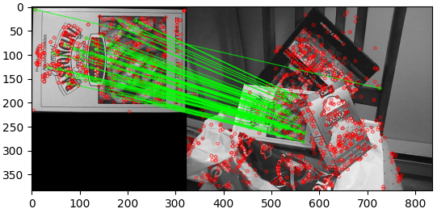
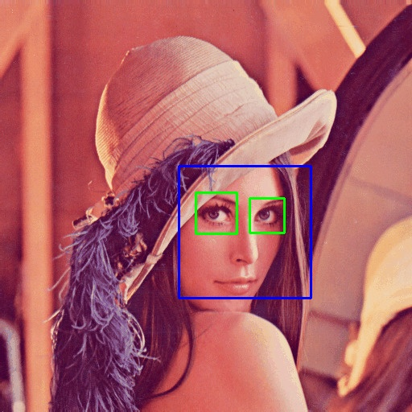

<!-----
ORBBF: Accuracy= 0.24
SIFTBOW: Accuracy= 0.23 con d=50, 0.2 con d=100,  (se puede probar con otros diccionarios, pero con tamaños d=200 y d=1000 no mejora y tarda la vida)
HOGSVM: Rapidísimo y Acc 0.37
---->

# T7- Reconocimiento de imagen

<!---
> OpenCV con CUDA para módulo dnn: https://learnopencv.com/opencv-dnn-with-gpu-support/
> Modelos Pytorch en OpenCV: https://docs.opencv.org/master/dc/d70/pytorch_cls_tutorial_dnn_conversion.html
-->

En este tema aprenderemos a buscar imágenes similares y a reconocer la _clase_ de una imagen.

## Búsqueda por similitud

Como hemos visto en teoría, para encontrar imágenes similares podemos extraer y comparar descriptores usando distintas métricas de distancia.

### Descriptores binarios

En [el tema anterior](https://pertusa.github.io/VisionPorComputador/caracteristicas.html#descriptor) vimos un ejemplo de código para comparar imágenes (`matching`) usando ORB y la distancia de Hamming. Revísalo antes de continuar con este tema. 

La técnica que habíamos usado en ese ejemplo (también llamada _fuerza bruta_) funciona bien con ORB porque es un descriptor binario y la comparación es muy eficiente al ser simplemente una operación XOR.

> Los descriptores binarios se idearon para hacer `matching` y funcionan mucho peor cuando se usan en problemas de reconocimiento (clasificación), aunque a veces se emplean también para esta tarea por eficiencia.

### Descriptores locales basados en puntos de interés

Sin embargo, tal como hemos visto en teoría, comparar descriptores como SIFT o SURF no es rápido, sobre todo si tenemos muchas imágenes en nuestra base de datos.

Para comparar dos imágenes que tienen descriptores basados en puntos de interés (y, por tanto, un número variable de elementos por imagen) se puede usar una técnica de vecinos más cercanos aproximados (en inglés, _Approximate Nearest Neighbors_). Ésta consiste en construir una representación interna para evitar hacer las comparaciones de todos los puntos con todos, mirando sólo aquellos que pueden ser más similares. En OpenCV tenemos una función que hace esta tarea: `FLANN`.

Podemos ver un ejemplo completo de código a continuación: 

```python
import cv2 as cv
import argparse
import numpy as np
from matplotlib import pyplot as plt

parser = argparse.ArgumentParser(description = 'Programa para detectar keypoints con SIFT y compararlos con FLANN')
parser.add_argument('--queryImage', '-q', type=str, default='box.png')
parser.add_argument('--trainImage', '-t', type=str, default='box_in_scene.png')

args = parser.parse_args()

# Cargamos las imágenes en escala de grises
image1 = cv.imread(args.queryImage, cv.IMREAD_GRAYSCALE)
image2 = cv.imread(args.trainImage, cv.IMREAD_GRAYSCALE)

# Comprobamos que se han podido leer
if image1 is None or image2 is None:
    print('Error al cargar la imagen')
    quit()

# Creamos el descriptor SIFT con sus valores por defecto
sift = cv.SIFT_create()

# Usamos SIFT para detectar los keypoints y calcular sus descriptores
keypoints1, descriptors1 = sift.detectAndCompute(image1, None)
keypoints2, descriptors2 = sift.detectAndCompute(image2, None)

# Hacemos el matching con FLANN utilizando 2 vecinos
matcher = cv.FlannBasedMatcher()
matches = matcher.knnMatch(descriptors1, descriptors2, k=2)

# Nos quedamos sólo los matches "buenos" y los guardamos en good
# En el artículo original de SIFT, si dos puntos tienen una distancia menor de 0.7 se consideran un match
good = list()
for m, n in matches:
    if m.distance < 0.7 * n.distance:
        good.append(m)

# Dibujamos el resultado
draw_params = dict(matchColor = (0,255,0), singlePointColor = (255,0,0))

imageMatches = cv.drawMatches(image1, keypoints1, image2, keypoints2, good, None, **draw_params)

plt.imshow(imageMatches)
plt.show()
```

Usando como entrada estas dos imágenes:


Se obtiene el siguiente resultado:



Como puedes ver, el libro de la imagen _query_ se detecta bastante bien en la imagen _train_. 

El código que realiza la comparación de los descriptores correspondientes a cada punto de interés es el siguiente:

```python
matcher = cv.FlannBasedMatcher()
matches = matcher.knnMatch(descriptors1, descriptors2, k=2)
```

En este caso, `descriptors_1` contiene todos los descriptores de la primera imagen y `descriptors_2` los de la segunda. `FlannBasedMatches` construye un sistema de búsqueda de vecinos más cercanos aproximados usando estos descriptores de entrada, y luego usa estos vecinos para encontrar las mejores correspondencias entre los descriptores de ambas imágenes. 

Como puedes ver en el código, se suelen eliminar los pares de puntos cuya distancia es mayor de un cierto umbral.

## Reducción de dimensionalidad

Para hacer que el `matching` sea más eficiente (aunque normalmente a costa de empeorar un poco los resultados) podemos reducir el tamaño de los descriptores usando alguna de las siguientes técnicas que hemos visto en teoría:

### Bag of Words (BoW)

Usar BoW es mucho más eficiente que emplear descriptores completos cuando se trata de características como SIFT, HOG o SURF (no binarias).

<!---
https://github.com/briansrls/SIFTBOW/blob/master/SIFTBOW.py

https://resources.oreilly.com/examples/9781785283840/blob/7d51d357875a18be16e015c527b81f07973128c8/Learning_OpenCV_3_Computer_Vision_with_Python_Second_Edition_Code/Chapter%207_Code/detect_hog_svm.py

https://github.com/techfort/pycv/blob/master/chapter7/bow.py

https://github.com/mgmacias95/Flower-Recognition/blob/master/flower.py

-->

<!--- **No haremos ningún ejercicio con BoW porque sólo se puede usar con descriptores patentados, pero esta información puede ser útil para tu proyecto.**
--->

Usando el siguiente código podemos entrenar un diccionario BoW a partir los descriptores SIFT extraídos de todas las imágenes de un conjunto de entrenamiento:

```python
# Creamos una instancia BOW, en este caso el vocabulario tendrá 100 palabras
BOW = cv.BOWKMeansTrainer(100)
sift = cv.SIFT_create()

# Recorremos todas las imágenes extrayendo descriptores SIFT y añadiéndolos para poder entrenar nuestro BOW.
for file in imagesPath:
    image = cv.imread(file, cv.IMREAD_GRAYSCALE)
    keypoints, descriptors= sift.detectAndCompute(image, None)
    BOW.add(descriptors)

# Entrenamos para obtener el vocabulario
vocabulary = BOW.cluster()
```

Fíjate que deberás incluir la ruta a una o más imágenes en la variable `imagesPath` para poder ejecutar el código. Puedes, por ejemplo, incluir las del ejercicio anterior (_box.png_ y _box_in_scene.png_).

Una vez ejecutado el código, habremos entrenado un diccionario de `k=100` palabras. A continuación podemos extraer un descriptor, y convertirlo en un histograma de palabras (este será nuestro nuevo descriptor). 

```python
# Inicializamos el extractor, que estará basado en SIFT y que asignará clusters por fuerza bruta
BOWExtractor = cv.BOWImgDescriptorExtractor(sift, cv.BFMatcher(cv.NORM_L2))

# Asignamos al extractor declarado el vocabulario que habíamos entrenado
BOWExtractor.setVocabulary(vocabulary)

# Ahora ya podemos extraer el histograma BOW de una imagen
BOWdescriptor = BOWExtractor.compute(image, sift.detect(image))

# Mostramos el histograma:
plt.hist(BOWdescriptor[0], 100)
plt.show()
```

Puedes ver ejemplos de código completos de entrenamiento y reconocimiento con BOW en [este enlace](https://github.com/briansrls/SIFTBOW/blob/master/SIFTBOW.py) y [este otro](https://github.com/mgmacias95/Flower-Recognition/blob/master/flower.py).


### PCA 

<!--- ALTERNATIVAS: https://www.askpython.com/python/examples/principal-component-analysis-for-image-data 

https://github.com/xanmolx/FaceDetectorUsingPCA/blob/master/PCA_Face_Recognition_IIT2016040.ipynb

--->

Podemos ver un ejemplo completo de reducción de dimensionalidad mediante PCA en [este enlace](http://man.hubwiz.com/docset/OpenCV.docset/Contents/Resources/Documents/d1/dee/tutorial_introduction_to_pca.html). La parte interesante está en la función `getOrientation`:

```python
# Perform PCA analysis
mean = np.empty((0))
mean, eigenvectors, eigenvalues = cv.PCACompute2(data_pts, mean)
```

Como ves, PCA es un algoritmo de aprendizaje no supervisado, es decir, no necesita que las muestras estén  etiquetadas. 

Aunque puede usarse OpenCV para calcular PCA, es más recomendable emplear `scikit-learn` como puede verse en [este ejemplo](https://www.askpython.com/python/examples/principal-component-analysis-for-image-data), en el que el código destacable para PCA es el siguiente:

```python
from sklearn.decomposition import PCA
 
pca = PCA(2) # 2 componentes principales.
converted_data = pca.fit_transform(digits.data)
```

> `sklearn` es la forma de indicar en python la librería `scikit-learn`.

Tampoco entraremos en detalles sobre estas técnicas de reducción de dimensionalidad, ya que las veréis en otra asignatura del grado, pero podéis usarlas en vuestro proyecto para extraer descriptores más compactos.

## Detección de caras

A continuación puedes ver un ejemplo para detectar caras y ojos basado en [este código](https://medium.com/dataseries/face-recognition-with-opencv-haar-cascade-a289b6ff042a).

```python
import numpy as np
import cv2 as cv

# Cargamos los modelos
face_cascade = cv.CascadeClassifier('haarcascade_frontalface_default.xml')
eye_cascade = cv.CascadeClassifier('haarcascade_eye.xml')

# Leemos la imagen
img = cv.imread('lena.jpg')
gray = cv.cvtColor(img, cv.COLOR_BGR2GRAY)

# Ejecutamos el detector de caras
faces = face_cascade.detectMultiScale(gray)

for (x,y,w,h) in faces:
    # Dibujamos las caras
    img = cv.rectangle(img,(x,y),(x+w,y+h),(255,0,0),2)

    # Ejecutamos el detector de ojos en la zona de la cara
    roi_gray = gray[y:y+h, x:x+w]
    eyes = eye_cascade.detectMultiScale(roi_gray)

    # Dibujamos los ojos
    roi_color = img[y:y+h, x:x+w]
    for (ex,ey,ew,eh) in eyes:
        cv.rectangle(roi_color,(ex,ey),(ex+ew,ey+eh),(0,255,0),2)

cv.imshow('Caras',img)
cv.waitKey(0)
```

Prueba este programa descargando los [modelos entrenados](https://github.com/opencv/opencv/tree/master/data/haarcascades) con descriptores Haar. El resultado con la imagen `lena.jpg` debería ser el siguiente:




> También puedes usar descriptores LBP descargando sus correspondientes modelos desde [este otro enlace](https://github.com/opencv/opencv/tree/master/data/lbpcascades).

Como puedes ver en los modelos Haar disponibles en el enlace anterior, es posible usar el mismo código para detectar matrículas, peatones, gatos, etc. simplemente cambiando el modelo.

Alternativamente a OpenCV, también puedes usar la librería `scikit-image` para [detectar caras](https://scikit-image.org/docs/dev/auto_examples/applications/plot_face_detection.html).

En OpenCV puedes usar cualquier tipo de imágenes para entrenar tu propio modelo siguiendo los pasos que se indican en [este enlace](https://docs.opencv.org/master/dc/d88/tutorial_traincascade.html), aunque no es fácil. Para esto deberás instalar la versión de C++ de OpenCV y compilar varios programas: `opencv_createsamples`, `opencv_annotation`, `opencv_traincascade` y `opencv_visualisation`.

Sin embargo, también puedes usar la librería `scikit-image`, con la cual se simplifica bastante el entrenamiento como puede verse en [este ejemplo](https://scikit-image.org/docs/dev/auto_examples/applications/plot_haar_extraction_selection_classification.html).

## Reconocimiento de caras

Para reconocer caras (es decir, identificar a qué persona pertenecen) lo más fácil es usar una librería en python llamada [face_recognition](https://github.com/ageitgey/face_recognition) y seguir [este tutorial](https://www.analyticsvidhya.com/blog/2018/12/introduction-face-detection-video-deep-learning-python/).


## Clasificación

Como hemos visto en teoría y al principio de este capítulo una forma fácil de clasificar una imagen es buscando imágenes similares que estén etiquetadas y devolviendo la clase de la imagen más similar.

--------

### Ejercicio

Vamos a hacer un ejercicio en el que extraeremos un descriptor ORB de una imagen y lo compararemos con los de otras imágenes ya etiquetadas para obtener su clase.

Para esto tenemos que [descargar](http://www.dlsi.ua.es/~pertusa/mirbot-exercises.zip) un subconjunto de imágenes etiquetadas de la base de datos MirBot. [MirBot](http://www.mirbot.com) es un proyecto desarrollado en la UA y se trata de un sistema de reconocimiento interactivo de imágenes para móviles. Cuanto más usuarios tiene y más fotos se añaden mejor funciona.

Para este caso sólo vamos a usar un subconjunto de las imágenes enviadas por los usuarios, en concreto algunas pertenecientes a estas 10 clases: _book, cat, cellphone, chair, dog, glass, laptop, pen, remote, tv_. Descomprime el fichero descargado y echa un vistazo para ver los casos que intentamos reconocer.

Ahora se trata de completar los puntos marcados con `TODO` en el siguiente código para realizar la clasificación. Guárdalo con el nombre `orbBF.py` e intenta entender bien todas las instrucciones antes de empezar a modificarlo.

<!--
PreviousWM: etiquetas. (quitado punto)
leídas (ahora leidas)
WM: Cargamos (antes Leemos)
WM: descriptores ORB. (añadido punto al final)
WM: descriptors,labels (sin espacio entre ellos)
PreviousWM: flag
PreviousWM (ya calculados en la fase anterior)
WM: ya calculados en la fase anterior


2023-24
WM: "Matching..." -> "Matching"
WM: "Función que lee" -> "Función para leer"
WM: "calcula el accuracy" -> "calcula la tasa de acierto"
WM: "en la variable "desc"" -> "en "desc""
WM: "Separamos el nombre de la imagen de su etiqueta" -> "Separamos nombre de imagen y etiqueta"
WM: "Hacemos la comparación entre los descriptores de train y de test" -> "Comparamos los descriptores de train y test"
descriptors = [] -> descriptors = list()
labels = [] -> labels = list()
ok = ok + 1 -> ok += 1

--->


```python
import cv2 as cv
import argparse
import numpy as np
import pickle

# Función que lee un fichero de texto con nombres de fichero de imágenes y sus etiquetas
# Devuelve los descriptores calculados y las etiquetas leidas
def readData(filename):

    descriptors = []
    labels = []

    with open(filename,'r') as f:

        print('Cargando', filename,'...')

        # TODO: Creamos el detector ORB con 100 puntos como máximo
        
        for line in f.readlines():
            # Separamos nombre de imagen y etiqueta
            fields = line.split()
            print(fields[0], fields[1])

            # Cargamos la imagen y obtenemos su label
            image = cv.imread(fields[0], cv.IMREAD_GRAYSCALE)
            label = fields[1]

            # TODO: Extraemos los keypoints de la imagen y guardamos los descriptores en "desc"
            desc = None
            
            # Añadimos a data los descriptores y la etiqueta
            descriptors.append(desc)
            labels.append(label)
    
    return descriptors,labels


# Función que recibe descriptores y etiquetas de train y test.
# Hace un matching asignando a cada muestra de test la etiqueta de la muestra de train más cercana y calcula la tasa de acierto
def testORB(descTrain, labelsTrain, descTest, labelsTest):

    print('Matching')
    
    matcher = cv.BFMatcher(cv.NORM_HAMMING)
    
    ok = 0.0

    for dtest, ltest in zip(descTest,labelsTest):
        # En bestLabel guardamos la etiqueta de la imagen más similar que aparece en el conjunto de train (tienes que calcularlo debajo)
        bestLabel = None
 
        for dtrain, ltrain in zip(descTrain, labelsTrain):
        
            if dtrain is not None and dtest is not None:
                  
                # TODO:  Solo consideramos que dos puntos son similares si su distancia es menor o igual a 90.
                # La imagen mas similar sera la que tiene mas keypoints coincidentes. Hay que extraer su etiqueta y guardarla en "bestLabel" (ahora pone 'cat' pero deberías modificarlo)
                bestLabel = 'cat'
  
        if bestLabel == ltest:
            ok = ok + 1
    
    print('Accuracy=', ok/len(labelsTest))

    return 0

# Programa principal
def main(args):

    if args.test:
        # Calculamos los descriptores de test
        descTest, labelsTest = readData('test.txt')
        
        # Cargamos los descriptores de train ya calculados en la fase anterior
        with open('trainData.dat','rb') as storedDescriptors:
            data = pickle.load(storedDescriptors)
  
        # Comparamos los descriptores de train y test
        descTrain = data[0]
        labelsTrain = data[1]
        testORB(descTrain, labelsTrain, descTest, labelsTest)

    else:
        # Calculamos los descriptores de train
        descTrain, labelsTrain = readData('train.txt')

        # Guardamos los descriptores de train en un fichero para poder usarlos en la fase de test
        dataTrain=(descTrain, labelsTrain)
        with open('trainData.dat', 'wb') as storedDescriptors:
            pickle.dump(dataTrain, storedDescriptors)

    return 0
    
if __name__ == '__main__':
    parser = argparse.ArgumentParser(description = 'Programa para reconocer objetos usando descriptores ORB.')
    parser.add_argument('--test', action = 'store_true')     # Si se indica test será true, si no se indica entonces se asume train
    args = parser.parse_args()
    main(args)
```

Para ejecutar el programa, debes hacerlo sin opciones (para entrenamiento) o con la opción `test` para validación. Ejemplo de uso para entrenamiento:

```bash
python orbBF.py
```

Para test:
```bash
python orbBF.py --test
```

Una vez completes el código, la primera fase es ejecutar extraer el fichero de características ORB de todas las imágenes que hay en el fichero `train.txt`. Después se puede ejecutar en modo `test` para reconocer todas las imágenes del conjunto de test y compararlas con las etiquetas del conjunto `train`.

El resultado final tras la fase de test debería ser el siguiente:

```bash
Accuracy= 0.24
```

--------

### Ejercicio

Con el ejercicio anterior hemos hecho una primera aproximación para reconocer objetos pero, como hemos visto en teoría, es mucho más eficiente entrenar un clasificador específico para nuestros datos. De esta forma no es necesario consultar todas las imágenes de entrenamiento para buscar la imagen más cercana como se hace con vecinos más cercanos.

En la asignatura no hemos visto cómo funcionan internamente los algoritmos de aprendizaje supervisado, pero usaremos uno en modo "caja negra" para mejorar el porcentaje de acierto que hemos obtenido en el ejercicio anterior.

Partimos de este otro código, que como verás tiene partes comunes con el anterior. Guárdalo con el nombre `HOGSVM.py` y complétalo con los comentarios marcados con `TODO`:


<!--

Previous WM: flag
WM: "Programa para reconocer objetos" -> "Reconocimiento de objetos"
WM: "Entrenando SVM" -> "Entrenando SVM..."
WM: "Extrayendo descriptores HOG" -> "Extrayendo descriptores HOG..."
labelNames = ['book', 'cat', 'chair', 'dog', 'glass', 'laptop', 'pen', 'remote', 'cellphone', 'tv'] (antes como tupla)
descriptors = [] -> descriptors = list()
labels = [] -> labels = list()
labelsIndex = [] -> labelsIndex = list()
ok = ok + 1 -> ok += 1
i = i + 1 -> i += 1
import pickle -> Desaparece
-->

<!---
Too easy...
--->
```python
import cv2 as cv
import argparse
import numpy as np

labelNames = ['book', 'cat', 'chair', 'dog', 'glass', 'laptop', 'pen', 'remote', 'cellphone', 'tv']

# Función que lee un fichero de texto y calcula sus descriptores HOG
# Devuelve los descriptores y las etiquetas leídas
def extractHOGFeatures(filename):

    print('Extrayendo descriptores HOG')
    
    hog = cv.HOGDescriptor()
    
    descriptors = []
    labels = []

    with open(filename, 'r') as f:
        for line in f.readlines():
    
            # Separamos el nombre de la imagen de su etiqueta
            fields = line.split()
            print(fields[0], fields[1])

            # Leemos la imagen y obtenemos su etiqueta
            image = cv.imread(fields[0], cv.IMREAD_GRAYSCALE)
            label = fields[1]

            # Extraemos el descriptor HOG
            # TODO: Para que todas las imagenes tengan el mismo tamaño de descriptor, las debemos escalar a 128x128
            # TODO: Ahora debemos calcular el descriptor HOG con un stride de 128x128 (asumimos que el objeto ocupa toda la imagen) y un padding (0,0).
            # TODO: Añadimos el descriptor obtenido de la imagen al vector descriptors, y la etiqueta al vector labels

    return descriptors, labels


# https://answers.opencv.org/question/183596/how-exactly-does-bovw-work-for-python-3-open-cv3/
def trainSVM(descriptors, labels):
    print('Entrenando SVM')

    # Configuramos el clasificador SVM (lo guardamos en la variable svm)
    svm = cv.ml.SVM_create()

    # TODO: Debemos indicar que el clasificador es de tipo C_SVC
    # TODO: Su kernel debe ser LINEAR
    # TODO: El criterio de finalización debe ser MAX_ITER con 100 iteraciones máximas y EPS=1e-5.
    # Ayuda para los puntos anteriores: https://docs.opencv.org/3.4/d1/d73/tutorial_introduction_to_svm.html

    # Convertimos las etiquetas a valores numéricos (necesario para entrenar SVM con la librería de OpenCV)
    labelsIndex = []
    for l in labels:
        labelsIndex.append(labelNames.index(l))
        
    # Entrenamos el SVM
    svm.train(np.array(descriptors, dtype='float32'), cv.ml.ROW_SAMPLE, np.array(labelsIndex, dtype='int'))

    # Guardamos el modelo
    svm.save('modelSVM.xml')


# Función para evaluar los resultados
def testHOGSVM(descriptors, labels):

    # Cargamos el modelo
    svm = cv.ml.SVM_load('modelSVM.xml')
    
    # Clasificamos
    npDescriptors = np.array(descriptors, dtype='float32')
    results = svm.predict(npDescriptors)
    
    # Calculamos el resultado
    ok = 0.0
    i = 0
    for pred in results[1]:
        if pred[0] == labelNames.index(labels[i]):
            ok = ok + 1
        i = i + 1

    print('Accuracy=', ok/len(labels)) 


def main(args):

    if args.test:
        # Calculamos los descriptores
        descriptors, labels = extractHOGFeatures('test.txt')

        # Hacemos la comparación entre los descriptores de train y de test
        testHOGSVM(descriptors, labels)

    else:
        # Calculamos los descriptores
        descriptors, labels = extractHOGFeatures('train.txt')

        # Entrenamos y guardamos el modelo
        trainSVM(descriptors, labels)

    return 0
    

if __name__ == '__main__':
    parser = argparse.ArgumentParser(description = 'Reconocimineto de objetos usando descriptores HOG y SVM')
    parser.add_argument('--test', action = 'store_true')     # Si se indica "test" args.test será true, si no se indica entonces se asume train
    args = parser.parse_args()
    main(args)
```

En este caso se trata de extraer los descriptores HOG de las imágenes del conjunto `train` para entrenar un clasificador supervisado de tipo _Support Vector Machine_ (SVM). Una vez entrenado el modelo, se guardará en el fichero `modelSVM.xml`. De esta forma, en la la fase de reconocimiento (`test`) se cargará el modelo para predecir la clase de una imagen desconocida, en lugar de comparar la imagen con todas las del conjunto de entrenamiento.

El resultado tras comprobar el conjunto de test debe ser este:

```python
Accuracy= 0.37
```

Como ves, esta técnica, además de ser mucho más rápida, mejora claramente el resultado respecto al  ejercicio anterior.

<!---
## TrainSVM
https://www.learnopencv.com/handwritten-digits-classification-an-opencv-c-python-tutorial/
--->

----

## Reconocimiento con redes neuronales

En el ejercicio anterior, en lugar de HOG podríamos haber usado características neuronales extraidas de una de las últimas capas de una red convolucional de la forma que vimos [aquí](https://pertusa.github.io/VisionPorComputador/caracteristicas.html#descriptores-neuronales). Si tienes curiosidad puedes probarlo, verás como el porcentaje de acierto mejora significativamente. 

Adicionalmente OpenCV también incorpora muchos [ejemplos de clasificación](https://github.com/opencv/opencv/tree/master/samples/dnn) usando redes neuronales para tareas como reconocimiento de caras, texto, etc. Es recomendable echar un vistazo a estos ejemplos porque probablemente te ayuden para el proyecto. 
