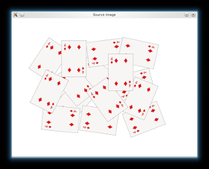
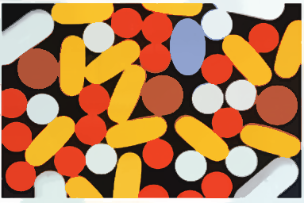

# Tema 5- Procesamiento de imagen: Segmentación

En este tema veremos cómo segmentar imágenes, detectando los píxeles pertenecientes a los objetos de interés.

## Umbralización

<!---
Pedir que implementen el "Algoritmo sencillo"?
-->

Como puede verse en [este enlace](https://docs.opencv.org/master/d7/d4d/tutorial_py_thresholding.html), OpenCV proporciona muchos métodos para realizar umbralización básica mediante la función `threshold`.

La umbralización de **Otsu** también se puede implementar mediante esta misma función, indicando como parámetro el flag `cv.THRES_OTSU`:

```python
dst, th = cv.threshold(img, 0, 255, cv.THRESH_BINARY+cv.THRESH_OTSU)
```

La umbralización **adaptativa** se implementa usando la función [adaptiveThreshold](https://opencv-python-tutroals.readthedocs.io/en/latest/py_tutorials/py_imgproc/py_thresholding/py_thresholding.html#adaptive-thresholding).

El método de **Chow-Kaneko** no está en OpenCV, aunque en realidad se puede implementar de forma sencilla.

Tal como hemos visto en teoría, podemos usar un algoritmo de detección de bordes para poder estimar posteriormente los **contornos** de los objetos (y de esta forma segmentarlos). En OpenCV existe una función para realizar esta tarea llamada `findContours` que sólo puede usarse para extraer contornos a partir de los bordes detectados con otro algoritmo (es decir, trabaja con una imagen binaria como entrada). En [este enlace](https://docs.opencv.org/master/d4/d73/tutorial_py_contours_begin.html) puedes ver un ejemplo de un programa que usa `findContours` y también la función `drawContours` para dibujar el resultado usando colores aleatorios.

 

A continuación podemos ver un ejemplo de [sintaxis](https://docs.opencv.org/2.4/modules/imgproc/doc/structural_analysis_and_shape_descriptors.html?highlight=moments#findcontours) de `findContours`:

```python
contours, hierarchy = cv.findContours(image, cv.RETR_LIST, cv.CHAIN_APPROX_NONE)
```

Esta función devuelve una lista de contornos detectados en la imagen `image` junto con su jerarquía. La [jerarquía](https://docs.opencv.org/master/d9/d8b/tutorial_py_contours_hierarchy.html) hace referencia a la relación de los contornos entre sí, ya que a veces tenemos unas figuras dentro de otras (en ese caso, las primeras serán "hijas" de las segundas, que son las figuras "padre"). 

El segundo parámetro de la función es el tipo de algoritmo usado para devolver los contornos. El más simple es `cv.RETR_LIST`, que devuelve simplemente un listado e ignora la jerarquía. Alternativamente se puede usar, por ejemplo, `cv.RETR_TREE`, que contiene la jerarquía completa. 

El tercer parámetro es el método de aproximación. `cv.CHAIN_APPROX_NONE` devuelve todos los puntos del contorno, pero como esto es bastante ineficiente para algunos algoritmos como veremos en el siguiente tema, a veces se usan [técnicas de reducción de puntos](https://docs.opencv.org/master/d4/d73/tutorial_py_contours_begin.html) para simplificar los contornos, por ejemplo con el flag `cv.CHAIN_APPROX_SIMPLE`.


## Crecimiento y división de regiones

OpenCV no tiene ningún método de **crecimiento de regiones**, aunque existen algunos [ejemplos de código](https://github.com/Panchamy/RegionGrowing) que lo implementan siguiendo la metodología que hemos visto en clase. Tampoco existen métodos de **división y unión**, pero en [este enlace](http://vgg.fiit.stuba.sk/2016-06/split-and-merge/) puedes consultar un ejemplo sencillo.

<!---
http://www.lengrand.fr/2011/11/simple-region-growing-implementation-in-python
-->

## Watershed

En OpenCV tenemos el algoritmo `Watershed`. Puedes ver ejemplos de uso de un programa [interactivo](https://github.com/opencv/opencv/blob/master/samples/python/watershed.py) y también [no interactivo](https://docs.opencv.org/trunk/d2/dbd/tutorial_distance_transform.html), es decir, deduciendo de forma automática los marcadores iniciales.
<!---
https://github.com/callaunchpad/OpenCV-Samples/blob/master/watershed.py
--->

En el ejemplo no interactivo se segmenta la siguiente imagen:

 

En este [otro enlace](https://github.com/callaunchpad/OpenCV-Samples/blob/master/watershed.py) puedes encontrar un ejemplo de Watershed que usa la webcam en tiempo real.

## Clustering

<!---
https://opencv-python-tutroals.readthedocs.io/en/latest/py_tutorials/py_video/py_meanshift/py_meanshift.html
---->

El algoritmo **Mean-shift** está implementado tanto en la librería `sklearn`, para [uso general de clustering de datos](https://scikit-learn.org/stable/modules/generated/sklearn.cluster.MeanShift.html), como en OpenCV. 

En OpenCV tenemos dos opciones: El [método](https://docs.opencv.org/master/d7/d00/tutorial_meanshift.html) `meanshift`, que suele usarse para tracking como veremos en el tema de vídeo, o `pyrMeanShiftFiltering`, que se usa directamente para segmentar imágenes en color:

```python
dst = cv.pyrMeanShiftFiltering(img, 25, 60)
```

En este caso, el segundo parámetro de la función (25) es el radio de la ventana espacial, y el segundo (60) el radio de la ventana de color. La segmentación de esta función es piramidal, es decir, se hace a distintas resoluciones y se combinan los resultados. A continuación se muestra una imagen de entrada y el resultado obtenido.


<!---
se implementa medianta la función `meanShift`, cuya ayuda puedes consultar [aquí](https://docs.opencv.org/3.0-alpha/modules/imgproc/doc/filtering.html#pyrmeanshiftfiltering). Aquí puedes ver un ejemplo de código que usa este algoritmo:

```cpp
#include <opencv2/opencv.hpp> // Incluimos OpenCV
#include <iostream>

using namespace cv;
using namespace std;

int main(int argc, char* argv[])
{
   Mat src = imread(argv[1]);
   Mat dst;

   TermCriteria t(TermCriteria::MAX_ITER, 100, 1);
   pyrMeanShiftFiltering(src, dst, 25, 60, 1, t);
   imwrite("pills2.png", dst);

   waitKey(0);
}
```
--->




<!---

La **segmentación Mean-shift** es algo distinta al filtrado, ya que segmenta la imagen en regiones que tienen aproximadamente el mismo color. Por tanto, mapea cada píxel con su segmento correspondiente. Para obtener contornos de objetos debes usar la segmentación Mean-shift.

**Mean-shift** también está implementado en OpenCV mediante la función
https://github.com/daviddoria/Examples/blob/master/c%2B%2B/OpenCV/MeanShiftSegmentation/MeanShiftSegmentation.cxx
https://stackoverflow.com/questions/31429342/difference-between-meanshiftfiltering-and-meanshiftsegmentation-in-opencv
http://answers.opencv.org/question/175486/meanshift-sample-code-in-c/
https://stackoverflow.com/questions/4831813/image-segmentation-using-mean-shift-explained

void pyrMeanShiftFiltering(InputArray src, OutputArray dst, double sp, double sr, int maxLevel = 1, TermCriteria termcrit = TermCriteria (TermCriteria::MAX_ITER + TermCriteria::EPS, 5, 1)): This implements the  filtering stage of the mean-shift segmentation, obtaining an image, dst, with color gradients and  ne-grain texture  attened. The sp and sr parameters indicate the spatial window and the color window radii.

<!---
Para retina, spatialRad=4; colorRad=8; maxPyrLevel=1

Para retina también:
http://www.pittnuts.com/2015/12/image-segmentation-by-opencv/
--->

El algoritmo **k-means** se implementa en OpenCV mediante la función `kmeans`. En [este enlace](https://docs.opencv.org/master/d1/d5c/tutorial_py_kmeans_opencv.html) puedes ver un ejemplo de uso. Tal como hemos visto en teoría, a nivel práctico la principal diferencia con _Mean-shift_ es que con _k-means_ debemos indicar el número de clusters _K_, mientras que con _mean-shift_ no podemos indicar la cantidad de elementos distintos que queremos encontrar.


Este algoritmo también puede encontrarse para [uso general](https://scikit-learn.org/stable/modules/generated/sklearn.cluster.KMeans.html) en la librería `sklearn`. 

> La librería [sklearn](https://scikit-learn.org/stable/) (en realidad `scikit`) es la más usada en python para algoritmos de aprendizaje automático tradicional, y la utilizan muchos programas que también usan OpenCV.

## Métodos basados en grafos

El método basado en grafos más común en OpenCV es `GrabCut`. Puedes ver un ejemplo de esta función usada de forma interactiva en [este enlace](https://docs.opencv.org/3.4/d8/d83/tutorial_py_grabcut.html).


## Métodos de saliency

OpenCV implementa algunos algoritmos de `saliency`, entre los que se encuentra `Spectral Residual`. Este algoritmo es sencillo y también se puede implementar [a mano](https://learning.oreilly.com/library/view/opencv-4-with/9781789801811/93d4b0f1-f938-4c81-8ee6-5b14f622e98c.xhtml), pero a continuación puedes ver un ejemplo de código que usa la implementación de OpenCV basado en [este código](https://www.cronj.com/blog/finding-region-of-interest-roi-saliency/):


<!----
https://www.cronj.com/blog/finding-region-of-interest-roi-saliency/
---->

> TODO: EXPLICAR FINEGRAINED QUE APARECE EN ESE EJEMPLO? FUNCIONA MUCHO MEJOR QUE SR!


```python
import cv2 as cv
import argparse
import numpy as np

parser = argparse.ArgumentParser(description = 'Programa para calcular Meanshift')
parser.add_argument('--imagen', '-i', type=str, default='giraffe.jpg')
args = parser.parse_args()

# Cargamos la imagen
img = cv.imread(args.imagen)

# Comprobamos que la imagen se ha podido leer
if img is None:
    print('Error al cargar la imagen')
    quit()

# Calculamos el saliency map
saliency = cv.saliency.StaticSaliencySpectralResidual_create()
(success, saliencyMap) = saliency.computeSaliency(img)

# Convertimos el resultado (float32) a una imagen uint8
saliencyMap = (saliencyMap * 255).astype('uint8')

# Umbralizamos para obtener una imagen binaria
binaryMap = cv.threshold(saliencyMap, 0, 255, cv.THRESH_BINARY | cv.THRESH_OTSU)[1]

# Mostramos los resultados
cv.imshow('original', img)
cv.imshow('saliency', saliencyMap)
cv.imshow('binary', binaryMap)

cv.waitKey(0)
```


La mayoría de métodos recienten que estiman una función `saliency` suelen ser bastante más complejos y se basan en técnicas de aprendizaje automático. Si quieres ver un ejemplo de otro método puedes mirar [el algoritmo GMR](https://github.com/ruanxiang/mr_saliency), que está basado en grafos (no usa aprendizaje automático).


<!---
Saliency? BING implementado fuera de contrib, creo (probar en el lab!->NO ES SEGMENTACION!
http://docs.opencv.org/3.2.0/d8/d65/group__saliency.html
https://github.com/fpuja/opencv_contrib/blob/saliencyModuleDevelop/modules/saliency/samples/computeSaliency.cpp
-->

<!---
Segmentación (TODO)
http://www.bogotobogo.com/python/OpenCV_Python/python_opencv3_Image_Global_Thresholding_Adaptive_Thresholding_Otsus_Binarization_Segmentations.php

http://docs.opencv.org/2.4/doc/tutorials/imgproc/threshold/threshold.html UMBRALIZACION ADAPTATIVA!!
Add Otsu’s Binarization: http://docs.opencv.org/3.2.0/d7/d4d/tutorial_py_thresholding.html-->

<!---
```cpp
findContours
```

http://acodigo.blogspot.com.es/2016/04/seguimiento-de-objetos-por-color.html
Se puede con este código (findContours) marcar el contorno y buscar el centroide de las piezas de las damas. También está la función drawContours. findContours implementa el algoritmo http://download.xuebalib.com/xuebalib.com.17233.pdf basado en detección de bordes.
-->

---

## Ejercicio

<!----
Elegido primero: https://conservancy.umn.edu/handle/11299/206575 (no me gusta, hay muchos errores de etiquetado!)
Flores (Mejor el dataset de peras): https://data.nal.usda.gov/dataset/data-multi-species-fruit-flower-detection-using-refined-semantic-segmentation-network
Limones: https://github.com/softwaremill/lemon-dataset
Grietas: https://www.irit.fr/~Sylvie.Chambon/Crack_Detection_Database.html
More: https://homepages.inf.ed.ac.uk/rbf/CVonline/Imagedbase.htm
--->

PERAS:
Imágenes: https://data.nal.usda.gov/system/files/Pear_1.zip
Etiquetas: https://data.nal.usda.gov/system/files/PearLabels_2.zip


Nos encargan diseñar un robot para recoger manzanas de los árboles, y el primer paso es detectarlas con las cámaras que equipa. El sistema de manipulación y recogida lo dejaremos para otro momento.

> 

Dada una fotografía, el objetivo es identificar los píxeles donde hay manzanas, por lo que se trata de un problema de segmentación binaria. Llamaremos a este ejercicio `manzanopower.py`, y el programa debe recibir dos parámetros:

```bash
python manzanopower.py <entrada> <salida>
```

* `entrada` es la imagen de entrada, una foto del árbol.
* `salida` es el nombre del fichero en el que vamos a guardar el resultado de la segmentación, que será una imagen binaria.


Se proporcionan una serie de imágenes de entrada junto con sus imágenes correctamente segmentadas para comprobar los resultados de la segmentación, y el script de evaluación.


Para empezar descarga todos los materiales de este ejercicio, que se encuentran en el fichero [ejercicioRetinas.zip](images/segmentacion/ejercicioRetinas.zip). En la carpeta `retinas` tenemos las imágenes a procesar. Estas imágenes son un subconjunto sacado de la base de datos [DRIVE](http://www.isi.uu.nl/Research/Databases/DRIVE/). Cuando descomprimas este archivo, podrás ver en el directorio `retinas` las siguientes carpetas:

* `images`: imágenes de entrada que debe segmentar tu algoritmo.
* `output`: directorio inicialmente vacío  donde se almacenarán los resultados de segmentación de tu método.
* `labeled`: imágenes correctamente etiquetadas para evaluar los resultados del programa.

En el directorio principal también hay un programa `iou.cpp` que se usará para evaluar los resultados. Este programa calcula la intersección sobre la unión de dos imágenes (en otras palabras, devuelve cuánto se parece una imagen obtenida y una segmentada correctamente). 

Debes implementar el programa `retinaSegment.cpp` y guardarlo en el directorio `ejercicioRetinas`. Después puedes compilarlo y evaluar sus resultados ejecutando desde el terminal:

```bash
./evaluate.sh
```

El script `evaluate.sh` compila `retinaSegment.cpp` y el programa de evaluación (`iou.cpp`), y devuelve el porcentaje de acierto de vuestro método con las imágenes de test. La nota de este ejercicio será más alta cuanto mayor sea el valor de la Media IoU.

Para resolver este problema puedes usar cualquier técnica que hayamos visto en la asignatura.

<!---
Para los algoritmos de umbralización:
http://www.isi.uu.nl/Research/Databases/DRIVE
Métrica: Intersection over union: https://stackoverflow.com/questions/11262312/opencv-intersection-between-two-binary-images

Para el resto:
https://docs.opencv.org/3.0-rc1/d3/d2d/group__datasets__is.html
-->

---
