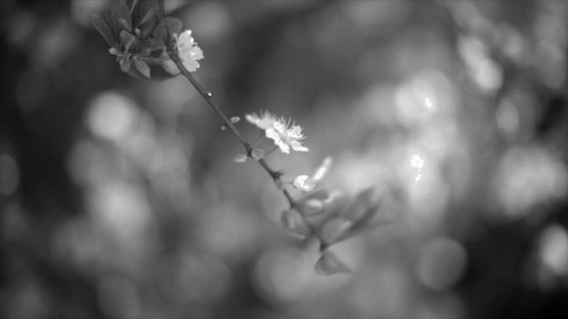
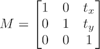
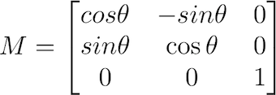
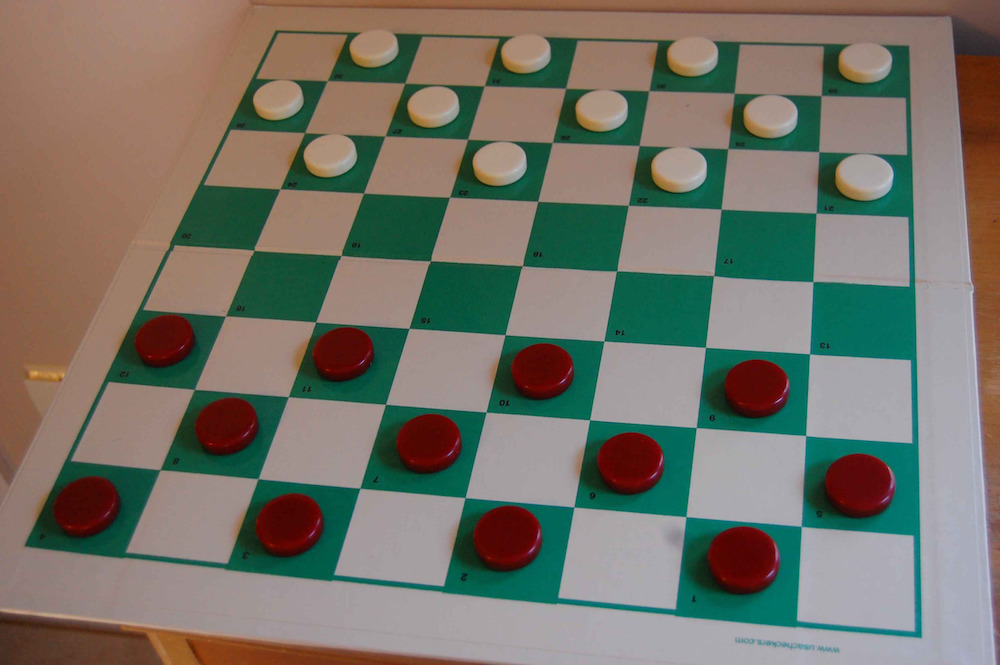
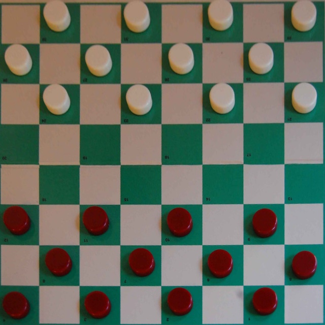
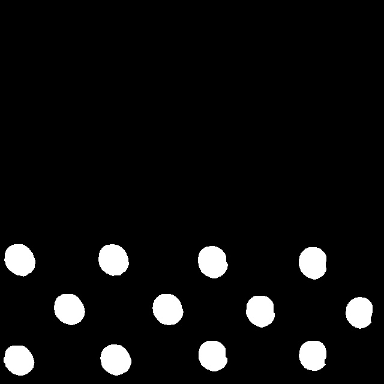

# Tema 3- Procesamiento de imagen: Transformaciones

En este tema comenzaremos a modificar imágenes mediante transformaciones de varios tipos.

## Transformaciones puntuales

Como hemos visto anteriormente, en OpenCV se pueden realizar operaciones directas con matrices mediante la librería `numpy`. Por ejemplo, podemos multiplicar por 4  todos los píxeles de una imagen esta forma:

```python
dst = src * 4
```

Tal como puedes ver, en las operaciones aritméticas se pueden usar indistintamente tanto números como arrays o matrices. 

Además de las operaciones aritméticas básicas (suma, resta, multiplicación y división), también podemos usar _AND_, _OR_, _XOR_ y _NOT_ mediante las siguientes funciones de `numpy`:

```python
dst = np.bitwise_and(src1, src2)
dst = np.bitwise_or(src2, src2)
dst = np.bitwise_xor(src1, src2)
dst = np.bitwise_not(src1) # Alternativa: dst = np.invert(src1)
```

Por ejemplo, para invertir una imagen (transformar lo blanco a negro y lo negro a blanco) podemos usar la instrucción `bitwise_not`. Este método es un alias de `np.invert`.

Ecualizar histogramas en escala de grises es muy sencillo con la función `equalizeHist`:

```python
equ = cv.equalizeHist(img)
```

También podemos umbralizar una imagen en escala de grises mediante la función [`threshold`](https://docs.opencv.org/master/d7/d4d/tutorial_py_thresholding.html), obteniendo como resultado una imagen binaria (también llamada máscara) que puede resaltar información relevante para una tarea determinada. La umbralización consiste en poner a 0 los píxeles que tienen un valor inferior al umbral indicado y es la forma más básica de realizar segmentación (como veremos en detalle en el tema 5). Ejemplo de llamada a `threshold`:

```python
# Ponemos a 0 los píxeles cuyos valores estén por debajo de 128, y a 255 los que estén por encima
th, dst = cv.threshold(src, 128, 255, cv.THRESH_BINARY) 
```

El último parámetro es el tipo de umbralización. En OpenCV tenemos 5 tipos de umbralización que pueden consultarse [aquí](https://docs.opencv.org/master/d7/d4d/tutorial_py_thresholding.html), aunque el valor más usado es `cv.THRESH_BINARY` (umbralización binaria).

Este método sólo funciona con imágenes en escala de grises. Para umbralizar imágenes en color, OpenCV ofrece la función `inrange`. Dada una imagen en 3 canales, esta función devuelve otra imagen de un canal con aquellos píxeles que están en un determinado rango coloreados en blanco, y los que quedan fuera del mismo en negro. Por tanto, puede usarse para realizar una segmentación básica por color, tal como veremos en detalle en el tema 5.

```python
# Dejamos en blanco los píxeles que están entre (0,10,20) y (40,40,51)
dst = cv.inRange(src, (0, 10, 20), (40, 40, 51)) 
```

En OpenCV existen técnicas alternativas de binarización como el umbralizado adaptativo o el método de Otsu, que también veremos en el tema de segmentación porque no se pueden considerar transformaciones puntuales al tener en cuenta los valores de intensidad de los píxeles vecinos.

### Ejercicio

Haz un programa llamado `ecualizar.py` que realice una ecualización de histograma, como el que hace la función `equalizeHist` de OpenCV, pero de forma manual. El algoritmo para ecualizar un histograma puede consultarse en las transparencias de teoría.

Para resolver este ejercicio puedes partir del siguiente esqueleto de código, completando las partes que se indican con `TODO`. 

<!--
# 2023/24
WM: sin usar calcHist. (añadido ".")
description='Programa (quitar espacios en los argumentos)

# 2024/25
WM: default = 'flor.jpg' (antes, "default='flor.jpg'")
WM: default = 'florEq.jpg' (antes, "default='florEq.jpg'")
WM: Cargamos la imagen (antes, "Abrimos la imagen")
WM: se ha podido cargar (antes, "se ha podido leer")
-->


```python
import cv2 as cv
import numpy as np
import argparse
from collections import Counter # Necesario para el acumulador

# Gestión de parámetros
parser = argparse.ArgumentParser(description='Programa para ecualizar histogramas (sin usar calcHist).')
parser.add_argument('--imagen', '-i', type=str, default = 'flor.jpg')
parser.add_argument('--salida', '-r', type=str, default = 'florEq.jpg')
args = parser.parse_args()

# Cargamos la imagen
img = cv.imread(args.imagen, cv.IMREAD_GRAYSCALE)

#img = np.array([52, 55, 61, 62, 59, 55, 63, 62, 55]) # Puedes descomentar esto para ver si el resultado es correcto usando los datos de ejemplo de teoría

# Comprobamos que la imagen se ha podido cargar
if img is None:
    print("No se ha podido abrir la imagen", args.imagen)
    quit()
  
# 1- Calculamos el histograma. Para esto, en lugar de usar calcHist creamos un vector x con los 
#    valores únicos de los píxeles, y otro vector h con la cantidad de elementos para cada valor.
x, h  = np.unique(img, return_counts=True)

# 2- Calculamos la CDF (la guardamos en c).
c = np.cumsum(h)

# 3- TODO: Ya tenemos x, h y c. Ahora debemos calcular x', que guardamos en la variable xp.
xp = None

# 4- TODO: Establecemos el nuevo valor de cada píxel (es decir, cambiamos en la imagen todos los valores x por los valores xp)

# 5- TODO: Guardamos la imagen resultante en el fichero indicado en args.salida

```

Usando como entrada la siguiente imagen:


La salida debería ser:



---

## Transformaciones globales

Una de las transformaciones globales más usadas en imagen es la transformada de Fourier. En OpenCV tenemos la función `dft` que calcula esta transformada, aunque necesitamos hacer un preproceso para preparar la entrada a esta función, y un postproceso para calcular la magnitud y la fase a partir de su resultado. En Visión por Computador no entraremos en detalles sobre cómo usar la transformada de Fourier en OpenCV, pero si quieres saber más puedes consultar [este enlace](https://docs.opencv.org/3.4/d8/d01/tutorial_discrete_fourier_transform.html).

## Transformaciones afines

En OpenCV la mayoría de transformaciones geométricas se implementan creando una matriz de transformación y aplicándola a la imagen original con `warpAffine`.

Esta función requiere como entrada una matriz de tamaño 2x3, ya que implementa las transformaciones afines mediante matrices aumentadas. Como hemos visto en teoría, la última fila de la matriz aumentada en una transformación afín es siempre (0,0,1) por lo que no hay que indicarla (por este motivo se indica una matriz de 2x3 en lugar de 3x3).

La función `warpAffine` tiene también parámetros para indicar el tipo de interpolación (`flags`) y el comportamiento en los bordes, tal como puede verse en su [documentación](https://docs.opencv.org/2.4/modules/imgproc/doc/geometric_transformations.html#void%20warpAffine(InputArray%20src,%20OutputArray%20dst,%20InputArray%20M,%20Size%20dsize,%20int%20flags,%20int%20borderMode,%20const%20Scalar&%20borderValue)).

En general, podemos usar `warpAffine` para implementar cualquier transformación afín. Por ejemplo, podríamos implementar la siguiente traslación...



...con este código:

```python
import cv2 as cv
import numpy as np

img = cv.imread('lena.jpg', cv.IMREAD_GRAYSCALE)

# Valores de translación
tx = 100
ty = 50

# Definimos la matriz
M = np.float32([[1, 0, tx],
                [0, 1, ty]]) 

# El parámetro flags puede omitirse, por defecto es INTER_LINEAR          
rows, cols = img.shape
dst = cv.warpAffine(img, M, (cols, rows), flags=cv.INTER_CUBIC)

cv.imshow('traslacion', dst)
cv.waitKey(0)
```


Alternativamente a usar las matrices de transformación afín con `warpAffine` existen funciones específicas para ayudar a gestionar las transformaciones de rotación, reflexión y escalado como vamos a ver a continuación:

### Rotación

<!---
M=\begin{bmatrix}
cos\theta & -sin\theta & 0 \\
sin\theta & \cos\theta & 0 \\
0 & 0 & 1 \\
\end{bmatrix}
--->

<!---
Idea ejercicio próximo curso. Implementar transformación geométrica proyectiva mediante multiplicación de matrices. Una vez calculada la transformación tendrán que copiar todos los puntos <x,y> a su nueva posición en la imagen destino teniendo en cuenta los bordes. OJO: INTERPOLACION PUEDE SER JODIDA
---->

La rotación sobre un ángulo se define con la siguiente matriz de transformación:



Sin embargo, OpenCV también permite rotar indicando un centro de rotación ajustable para poder usar cualquier punto de referencia como eje. Para esto se usa la función `getRotationMatrix2D`, que recibe como primer parámetro el eje de rotación:

```python
rows, cols = img.shape

# Obtenemos la matriz de rotación con 90 grados usando como referencia el centro de la imagen 
M = cv.getRotationMatrix2D((cols/2,rows/2), 90, 1) # El último parámetro (1) es la escala
dst = cv.warpAffine(img, M, (cols,rows))
```

### Reflexión

Existe una función específica (`flip`) que implementa la reflexión sin necesidad de usar `warpAffine`.

```python
flipVertical = cv.flip(img, 0)
```

El tercer parámetro de `flip` puede ser 0 (reflexión sobre el eje x), positivo (por ejemplo, 1 es reflexión sobre el eje y), o negativo (por ejemplo, -1 es sobre los dos ejes).

### Escalado

El escalado también se implementa mediante una [función específica](https://www.tutorialkart.com/opencv/python/opencv-python-resize-image/) llamada `resize`, que permite indicar unas dimensiones concretas o una proporción entre la imagen origen y destino.


```python
# 1- Especificando un tamaño determinado (en este ejemplo, 20x30):
dim = (20, 30)
dst = cv.resize(src, dim, interpolation = cv.INTER_LINEAR) # El último parámetro de interpolación es opcional

# 2- Especificando una escala, por ejemplo el 75% de la imagen original:
dst = cv.resize(src, (0,0), fx=0.75, fy=0.75, cv.INTER_LINEAR) # El último parámetro de interpolación es opcional
```


## Transformaciones proyectivas

Como hemos visto en teoría, la transformación proyectiva no es afín, por lo que no conserva el paralelismo de las líneas de la imagen original.

Para hacer una transformación proyectiva debemos indicar una matriz de 3x3 y usar la función `warpPerspective`. Por ejemplo:

```python
# Definimos la matriz
M = np.float32([[1, 0, 0],
                [0.5, 1, 0],
                [0.2, 0, 1]])

# Implementamos la transformación proyectiva
rows, cols = img.shape
dst = cv.warpPerspective(img, M, (cols, rows))
```

La lista completa de parámetros de esta función puede verse en [este enlace](https://docs.opencv.org/4.5.2/da/d54/group__imgproc__transform.html#gaf73673a7e8e18ec6963e3774e6a94b87).

También tenemos otra opción muy práctica para implementar una transformación de este tipo, ya que suele ser muy complicado estimar a priori los valores de la matriz para realizar una transformación concreta. Esta alternativa consiste en proporcionar dos arrays de 4 puntos (siendo cada punto un vector de dos dimensiones que representa las coordenadas del mismo en el plano XY): El primero será de la imagen original, y el segundo contiene la proyección de esos puntos (dónde van a quedar finalmente) en la imagen destino. Con estos datos podemos usar `getPerspectiveTransform` para calcular los valores de la matriz de transformación.

<!----
https://docs.opencv.org/4.5.2/da/d6e/tutorial_py_geometric_transformations.html
---->

```python
# Los dos parámetros que recibe getPerspectiveTransform deben ser arrays de puntos, y cada punto es un array de dos elementos float. 
M = cv.getPerspectiveTransform(input_pts, output_pts)

# Aplicamos la transformacion usando interpolación lineal. Los valores widthDst y heightDst indican el tamaño de la imagen destino.
dst = cv.warpPerspective(src, M, (widthDst, heightDst), flags=cv.INTER_LINEAR)
```

Siendo un ejemplo de vector `input_pts` el que sigue:
```python
input_pts = np.float32([[120, 13], [610, 24], [2, 491], [622, 500]])
```

---

## Transformaciones en entorno de vecindad

En esta sección veremos cómo implementar transformaciones en entorno de vecindad usando OpenCV, en particular convoluciones y filtros de mediana.

### Filtros de convolución

Las convoluciones se implementan con la función `filter2D`.


Esta función recibe los siguientes parámetros:

* `src`: Imagen de entrada
* `ddepth`: Resolución radiométrica (_depth_) de la matriz `dst`. Un valor negativo indica que la resolución es la misma que tiene la imagen de entrada.
* `kernel`: El _kernel_ a convolucionar con la imagen.
* `anchor` (opcional): La posición de anclaje del kernel (como puede verse en la figura) relativa a su origen. El punto (-1,-1) indica el centro del kernel (es el valor por defecto).
* `delta` (opcional): Un valor para añadir a cada píxel durante la convolución. Por defecto, 0.
* `borderType` (opcional): El método a seguir en los bordes de la imagen para interpolación, ya que en estos puntos el filtro se sale de la imagen. Puede ser `cv.BORDER_REPLICATE`, `cv.BORDER_REFLECT`, `cv.BORDER_REFLECT_101`, `cv.BORDER_WRAP`,  `cv.BORDER_CONSTANT`, o `cv.BORDER_DEFAULT` (que es el valor por defecto).

Ejemplos de llamadas a esta función:

```python
# Esta forma es la más habitual
dst = cv.filter2D(src, -1, kernel) 
# Indicando qué hacer en los bordes
dst = cv.filter2D(src, -1, kernel, borderType=cv.BORDER_CONSTANT)
```

<!----
dst = cv.filter2D(src, -1 , kernel, Point(-1,-1)) # Indicando ancla desplazada
---->

Evidentemente hay que crear antes un _kernel_ para convolucionarlo con la imagen. Por ejemplo, podría ser el siguiente:


```python
kernel = numpy.array([[-1, -1, -1, -1, -1],
                      [-1, -1, -1, -1, -1],
                      [-1, -1, 24, -1, -1],
                      [-1, -1, -1, -1, -1],
                      [-1, -1, -1, -1, -1]])
```

> Pregunta: ¿Qué tipo de filtro acabamos de crear?

<!---
Ejemplo de ejercicio:
Haz un programa que reciba como parámetro una imagen, la lea en escala de grises y la convolucione con un filtro gaussiano de 5x5 (https://en.wikipedia.org/wiki/Kernel_(image_processing), o con media x y desviación y (por parámetro?). Guardar en otra imagen.
-->


### Filtro de mediana

El filtro de mediana se implementa de forma muy sencilla en OpenCV:

```python
dst = cv.medianBlur(src, 5)
```

El último parámetro indica el tamaño del _kernel_, que siempre será cuadrado (en este ejemplo, 5x5 píxeles).

## Transformaciones morfológicas

OpenCV proporciona una serie de funciones predefinidas para realizar transformaciones morfológicas.

### Erosión y dilatación

La sintaxis de estas operaciones morfológicas básicas es sencilla:

```python
dst = cv.erode(src, element)
dst = cv.dilate(src, element)
```

Ambas funciones necesitan un elemento estructurante, llamado `element` en el código anterior. Al igual que en el caso de `filter2D` se pueden añadir opcionalmente los parámetros `anchor`, `delta` y `borderType`.

Para crear el elemento estructurante se usa la función `getStructuringElement`:

```python
# Forma del filtro
erosion_type = cv.MORPH_ELLIPSE 

# El último parámetro es el tamaño del filtro, en este caso 5x5
element = cv.getStructuringElement(erosion_type, (5,5)) 
```

El elemento estructurante puede tener forma de caja (`MORPH_RECT`), de cruz (`MORPH_CROSS`) o de elipse (`MORPH_ELLIPSE`).

### Apertura, cierre y Top-Hat

El resto de funciones de transformación morfológica se implementan mediante la función `morphologyEx`. Por ejemplo:

```cpp
dst = cv.morphologyEx(src, cv.MORPH_OPEN, element)
```

Esta función se invoca con los mismos parámetros que `erode` o `dilate` añadiendo el parámetro que indica el tipo de operación:

* Apertura: `MORPH_OPEN`
* Cierre: `MORPH_CLOSE`
* Gradiente: `MORPH_GRADIENT`
* White Top Hat: `MORPH_TOPHAT`
* Black Top Hat: `MORPH_BLACKHAT`

En [este enlace](https://docs.opencv.org/4.5.2/d3/dbe/tutorial_opening_closing_hats.html) puedes ver código de ejemplo para implementar un interfaz que permite probar estas operaciones modificando sus parámetros.

---

### Ejercicio

Implementa un programa llamado `detectarFichas.py` que cargue la siguiente imagen `damas.jpg`, corrija la perspectiva del tablero y detecte las fichas blancas y rojas.



Los parámetros del programa deben ser los siguientes:

<!--
# 2023/24
WM: de las damas. (añadido ".")
description='Programa (quitar espacios en los argumentos)

# 2024/25
WM: de las fichas. (antes, "de las damas.")
WM: default = 'damas.jpg' (antes, "default='damas.jpg'")
-->


```python
parser = argparse.ArgumentParser(description='Programa para obtener la posición de las fichas.')
parser.add_argument('--imagen', '-i', type=str, default = 'damas.jpg')
parser.add_argument('--salidaPerspectiva', '-p', type=str, default = 'corrected.jpg')
parser.add_argument('--salidaRojas', '-r', type=str, default = 'rojas.jpg')
parser.add_argument('--salidaBlancas', '-b', type=str, default = 'blancas.jpg')
```

Primero vamos a corregir la perspectiva. Para esto se proporcionan los 4 puntos de las esquinas del tablero en la imagen original:

```python
278, 27  # Esquina superior izquierda.
910, 44  # Esquina superior derecha.
27, 546  # Esquina inferior izquierda.
921, 638 # Esquina inferior derecha.
```

El programa debe aplicar una transformación proyectiva y guardar el resultado en otra imagen de **tamaño 640x640 píxeles** cuyo nombre se ha pasado por parámetro (por defecto, `corrected.jpg`). La imagen resultado debería ser como la siguiente:




<!---
Si ves que se queda corto, que marquen los puntos con el interfaz de OpenCV
-->

A continuación se detallan los pasos para obtener las fichas rojas y blancas a partir de esta imagen.

#### Fichas rojas

A continuación se muestra el resultado de detectar las fichas rojas:



Para realizar esta detección el programa debe seguir los siguientes pasos:

* Realizar una umbralización quedándonos sólo con los píxeles que tengan un color dentro de un rango BGR entre (0,0,50) y (40,30,255). Podemos visualizar el resultado con `imshow`. Deberíamos tener los píxeles de las fichas rojas resaltados, aunque la detección es todavía imperfecta y existen huecos.
* Crear un elemento estructurante circular de tamaño 10x10 píxeles y aplicar un operador de cierre para perfilar mejor los contornos de las fichas y eliminar estos huecos.
* Guardar la imagen resultante en el fichero pasado por parámetro (por defecto, `rojas.jpg`). Debería dar el mismo resultado que se muestra en la imagen anterior.

#### Fichas blancas

* Ahora debes intentar resaltar sólo las fichas blancas lo mejor que puedas, guardando el resultado en el fichero `blancas.jpg`. Para esto puedes usar filtrado de color (en cualquier espacio, como HSV) y realizar transformaciones morfológicas o de cualquier otro tipo. Probablemente no te salga demasiado bien pero es un problema mucho más complicado que la detección de las fichas rojas al confundirse el color de las damas con el de las casillas blancas. 

---
