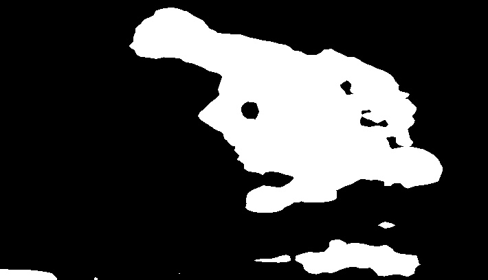

# Tema 5- Procesamiento de imagen: Segmentación

En este tema veremos cómo segmentar imágenes, extrayendo los píxeles de interés pertenecientes a los objetos a detectar.

## Umbralización

<!---
Pedir que implementen el "Algoritmo sencillo"?
-->

Como puede verse en [este enlace](https://docs.opencv.org/2.4/doc/tutorials/imgproc/threshold/threshold.html), OpenCV proporciona muchos métodos para realizar umbralización básica mediante la función `threshold`.

La umbralización de **Otsu** también se puede implementar mediante esta misma función, [indicando](https://docs.opencv.org/2.4/modules/imgproc/doc/miscellaneous_transformations.html#double%20threshold\(InputArray%20src,%20OutputArray%20dst,%20double%20thresh,%20double%20maxval,%20int%20type) como parámetro el flag `CV_THRES_OTSU`:

```cpp
threshold(src, dst, 0, 255, CV_THRESH_BINARY | CV_THRESH_OTSU);
```

La umbralización **adaptativa** se implementa usando la función   [adaptiveThreshold](http://docs.opencv.org/2.4/modules/imgproc/doc/miscellaneous_transformations.html).

El método de **Chow-Kaneko** no está en OpenCV, aunque en realidad se puede implementar de forma sencilla.

Tal como hemos visto en teoría, podemos usar un algoritmo de detección de bordes para poder estimar posteriormente los **contornos** de los objetos (y de esta forma segmentarlos). En OpenCV existe una función para realizar esta tarea llamada `findContours` que sólo puede usarse para extraer contornos a partir de los bordes detectados con otro algoritmo (es decir, trabaja con una imagen binaria como entrada). En [este enlace](https://docs.opencv.org/2.4/doc/tutorials/imgproc/shapedescriptors/find_contours/find_contours.html) puedes ver un ejemplo de un programa que usa `findContours` y también la función `drawContours` para dibujar el resultado usando colores aleatorios.

 

## Crecimiento y división de regiones

OpenCV no tiene ningún método de **crecimiento de regiones**, aunque existen algunos [ejemplos de código](https://github.com/ankitdhall/imageSegmentation) que lo implementan siguiendo la metodología que hemos visto en clase. Tampoco existen métodos de **división y unión**, pero en [este enlace](http://vgg.fiit.stuba.sk/2016-06/split-and-merge/) puedes consultar un ejemplo sencillo (en python).

<!---
http://www.lengrand.fr/2011/11/simple-region-growing-implementation-in-python
-->

## Watershed

En OpenCV tenemos el algoritmo `Watershed`. Puedes ver ejemplos de uso de un programa   [interactivo](https://docs.opencv.org/trunk/d8/da9/watershed_8cpp-example.html) y también [no interactivo](https://docs.opencv.org/trunk/d2/dbd/tutorial_distance_transform.html), es decir, deduciendo de forma automática los marcadores iniciales.

En el ejemplo no interactivo se segmenta la siguiente imagen:

 

## Clustering

El algoritmo **Mean-shift** se implementa medianta la función `pyrMeanShiftFiltering`, cuya ayuda puedes consultar [aquí](https://docs.opencv.org/3.0-alpha/modules/imgproc/doc/filtering.html#pyrmeanshiftfiltering). Aquí puedes ver un ejemplo de código que usa este algoritmo:

```cpp
#include <opencv2/opencv.hpp> // Incluimos OpenCV
#include <iostream>

using namespace cv;
using namespace std;

int main(int argc, char* argv[])
{
   Mat src = imread(argv[1]);
   Mat dst;

   TermCriteria t(TermCriteria::MAX_ITER, 100, 1);
   pyrMeanShiftFiltering(src, dst, 25, 60, 1, t);
   imwrite("pills2.png", dst);

   waitKey(0);
}
```


<!---

La **segmentación Mean-shift** es algo distinta al filtrado, ya que segmenta la imagen en regiones que tienen aproximadamente el mismo color. Por tanto, mapea cada píxel con su segmento correspondiente. Para obtener contornos de objetos debes usar la segmentación Mean-shift.

**Mean-shift** también está implementado en OpenCV mediante la función
https://github.com/daviddoria/Examples/blob/master/c%2B%2B/OpenCV/MeanShiftSegmentation/MeanShiftSegmentation.cxx
https://stackoverflow.com/questions/31429342/difference-between-meanshiftfiltering-and-meanshiftsegmentation-in-opencv
http://answers.opencv.org/question/175486/meanshift-sample-code-in-c/
https://stackoverflow.com/questions/4831813/image-segmentation-using-mean-shift-explained

void pyrMeanShiftFiltering(InputArray src, OutputArray dst, double sp, double sr, int maxLevel = 1, TermCriteria termcrit = TermCriteria (TermCriteria::MAX_ITER + TermCriteria::EPS, 5, 1)): This implements the  filtering stage of the mean-shift segmentation, obtaining an image, dst, with color gradients and  ne-grain texture  attened. The sp and sr parameters indicate the spatial window and the color window radii.

<!---
Para retina, spatialRad=4; colorRad=8; maxPyrLevel=1

Para retina también:
http://www.pittnuts.com/2015/12/image-segmentation-by-opencv/
--->

El algoritmo **k-means** se implementa en OpenCV mediante la función `kmeans`. En [este enlace](http://docs.opencv.org/3.1.0/de/d63/kmeans_8cpp-example.html) puedes ver un ejemplo de uso. A nivel práctico, la principal diferencia con _Mean-shift_ es que con _k-means_ debemos indicar el número de clusters _K_, mientras que con _mean-shift_ no podemos indicar la cantidad de elementos distintos que queremos encontrar.


En [este enlace](https://docs.opencv.org/3.1.0/de/d63/kmeans_8cpp-example.html) puedes encontrar un ejemplo completo de código que usa _k-means_.

## Métodos basados en grafos

El método basado en grafos más común en OpenCV es `GrabCut`. Puedes ver un ejemplo de esta función usada de forma interactiva en [este enlace](https://docs.opencv.org/3.4.1/de/dd0/grabcut_8cpp-example.html).


## Métodos de saliency

OpenCV implementa algunos algoritmos de `saliency`, entre los que se encuentra `Spectral Residual`. Veamos un ejemplo de código:

```cpp
#include <opencv2/opencv.hpp>
#include <opencv2/saliency.hpp>
#include <iostream>

using namespace std;
using namespace cv;
using namespace saliency;

int main( int argc, char* argv[])
{
  if (argc!=2) {
      cerr << "Syntax: " << argv[0] << " <image>" << endl;
      return -1;
  }

  Mat image = imread(argv[1]);
  Mat binaryMap;
  Mat saliencyMap;

  //Inicializamos el algoritmo de saliency
  StaticSaliencySpectralResidual saliencyAlgorithm;

  // Calculamos "saliency map"
  if (saliencyAlgorithm.computeSaliency(image, saliencyMap)) {

      // Calculamos "binary map"
      StaticSaliencySpectralResidual spec;
      spec.computeBinaryMap(saliencyMap, binaryMap);

      // Mostramos el resultado
      imshow("Saliency Map", saliencyMap);
      imshow("Original Image", image);
      imshow("Binary Map", binaryMap);
      waitKey( 0 );
  }
}
```




La mayoría de métodos recienten que estiman una función `saliency` suelen ser bastante más complejos y se basan  en técnicas de aprendizaje automático. Si quieres ver un ejemplo de otro método puedes mirar [el algoritmo GMR](https://github.com/the-grid/gmr-saliency), que está basado en grafos (no usa aprendizaje automático).


<!---
Saliency? BING implementado fuera de contrib, creo (probar en el lab!->NO ES SEGMENTACION!
http://docs.opencv.org/3.2.0/d8/d65/group__saliency.html
https://github.com/fpuja/opencv_contrib/blob/saliencyModuleDevelop/modules/saliency/samples/computeSaliency.cpp
-->

<!---
Segmentación (TODO)
http://www.bogotobogo.com/python/OpenCV_Python/python_opencv3_Image_Global_Thresholding_Adaptive_Thresholding_Otsus_Binarization_Segmentations.php

http://docs.opencv.org/2.4/doc/tutorials/imgproc/threshold/threshold.html UMBRALIZACION ADAPTATIVA!!
Add Otsu’s Binarization: http://docs.opencv.org/3.2.0/d7/d4d/tutorial_py_thresholding.html-->

<!---
```cpp
findContours
```

http://acodigo.blogspot.com.es/2016/04/seguimiento-de-objetos-por-color.html
Se puede con este código (findContours) marcar el contorno y buscar el centroide de las piezas de las damas. También está la función drawContours. findContours implementa el algoritmo http://download.xuebalib.com/xuebalib.com.17233.pdf basado en detección de bordes.
-->

---

###Ejercicio

Dada la imagen de una retina, se pide hacer un programa que segmente lo mejor posible los vasos sanguíneos.  Se trata de detectar si un píxel pertenece al fondo de ojo o a un vaso, por lo que es un problema de umbralización binaria. Llamaremos a este ejercicio `retinaSegment.cpp`, y el programa debe recibir tres parámetros:

```bash
Syntax: ./retinaSegment <image> <mask> <output>
```

* `image` es la imagen de entrada, una foto de la retina en color.
* `mask` es otra imagen de entrada que indica la máscara, es decir, qué parte de la imagen inicial hay que procesar. Para borrar aquellos elementos de una imagen que no estén dentro de la máscara puedes usar el operador `&`, por ejemplo `Mat masked = image & mask;`
* `output` es el nombre del fichero en el que vamos a guardar el resultado de la segmentación.


Se proporcionan los datos de las retinas y las imágenes correctamente segmentadas para evaluar el resultado. También está disponible el sistema de evaluación.

Descarga todos los materiales de este ejercicio que se encuentran en el  fichero [ejercicioRetinas.zip](https://pertusa.gitbooks.io/vision-por-computador/content/images/segmentacion/ejercicioRetinas.zip). En la carpeta `retinas` tenemos las imágenes a procesar. Estas imágenes son un subconjunto sacado de la base de datos [DRIVE](http://www.isi.uu.nl/Research/Databases/DRIVE/). Cuando descomprimas este archivo, podrás ver en el directorio `retinas` lo siguiente:

* `images`: imágenes de entrada que debe segmentar tu algoritmo.
* `mask`: máscaras de las imágenes originales.
* `output`: directorio vacío (de momento).
* `1st_manual`: imágenes correctamente etiquetadas para evaluar los resultados del programa.

En el directorio principal que se descomprime también hay un programa `iou.cpp`. Compílalo con OpenCV, generando el ejecutable `iou`. Este programa calcula la intersección sobre la unión de dos imágenes (en palabras simples, devuelve cuánto se parece una imagen obtenida y una segmentada correctamente). Este programa lo usa el script `evaluate.sh` que calcula el porcentaje de acierto de vuestro programa.

En el directorio `ejercicioRetinas` debes implementar el programa `retinaSegment.cpp`, compilarlo, y evaluarlo  ejecutando desde el terminal:

```bash
./evaluate.sh
```

Para resolver este ejercicio puedes usar cualquier algoritmo de los que hemos visto en la asignatura.

<!---
Para los algoritmos de umbralización:
http://www.isi.uu.nl/Research/Databases/DRIVE
Métrica: Intersection over union: https://stackoverflow.com/questions/11262312/opencv-intersection-between-two-binary-images

Para el resto:
https://docs.opencv.org/3.0-rc1/d3/d2d/group__datasets__is.html
-->

---
